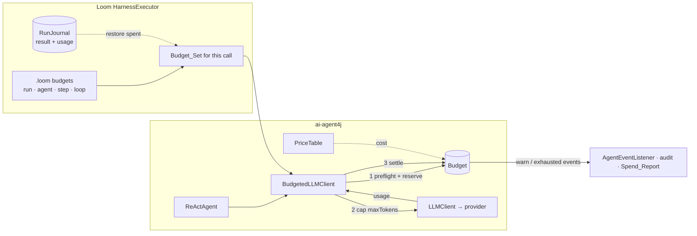

# Design Document: Cost Budgets

## Overview

Every token an agent system spends passes through one method: `LLMClient.chat()`. Cost Budgets enforces
limits there, in **ai-agent4j**, and lets **Loom** scripts declare those limits symbolically. Enforcement
has three steps around each call:

1. **Preflight.** Estimate the call and reserve that amount from every applicable budget, or refuse
   without calling the model.
2. **Cap.** Lower the request's `maxTokens` so that the answer itself can't break the budget.
3. **Settle.** Replace the reservation with the provider's actual usage (or an estimate, marked as such).

What already exists and is reused:
- `LLMResponse.TokenUsage` on every response (Google, Ollama and Sarvam providers fill it in);
- `AgentResult.Usage`, accumulated by `ReActAgent`;
- `LLMRequest.maxTokens`;
- Loom's single `LLMClientFactory`, `RunJournal`, `on_failure`, `on_exhausted` and `AgentInterrupt`.

Decided defaults:
- **Tokens by default; money optional**, and only with a developer-supplied price table.
- **Partial answers by default** when an agent runs out mid-task.

---

## Architecture



Loom never meters anything itself. It decides *which* budgets apply to a call (the Budget_Set) and what
happens when one runs out. ai-agent4j does all the metering, so plain Java users get the same guarantees
without Loom.

---

## Components and Interfaces

### 1. `io.github.llm4j.budget.Budget` (ai-agent4j)

```java
public final class Budget {
    public static Builder builder();              // .name("run").tokens(200_000).calls(150)
                                                  // .cost(new BigDecimal("0.50")).warnAt(0.8)
    public String name();
    public Limits limits();                       // Optional long tokens, calls; Optional BigDecimal cost
    public Spent spent();                         // tokens, calls, cost, estimated (boolean)
    public Remaining remaining();                 // per dimension; empty = unlimited
    public boolean exhausted();

    // package-private, used by BudgetSet
    Reservation reserve(long tokens, BigDecimal cost);       // throws BudgetExceeded
    void settle(Reservation r, Charge actual);
    void restore(Spent alreadySpent);                        // durable runs
}

public record Charge(long promptTokens, long completionTokens, int calls, BigDecimal cost, boolean estimated) { }
```

- **Concurrency.** One `ReentrantLock` per budget; `reserve` and `settle` are short critical sections.
  The totals `spent + reserved` never exceed the limit at reservation time (Requirements 1.3, 2.7).
  Output is capped to its reservation, so an overdraw can only come from prompt estimates that were
  too low, summed over the calls in flight, or from a provider ignoring `maxTokens` (Requirement 2.8).
- **Warning.** The threshold is checked on `settle`. The first crossing fires one `BudgetEvent.WARNING`.
- **Unset limits** are unlimited. A budget with no limits only counts spend (useful for reports).

### 2. `BudgetSet`

```java
public final class BudgetSet {
    public static BudgetSet of(Budget... budgets);           // nulls ignored, duplicates collapsed
    public BudgetSet with(Budget more);
    Lease reserve(long tokens, BigDecimal cost);             // all-or-nothing across members
}
```

`reserve` locks the member budgets **in a fixed order (by name, then identity)** to avoid deadlock
between parallel branches. If any member refuses, reservations already taken are released and
`BudgetExceeded` names the first budget that refused. A `Lease` settles or releases all members together.

### 3. `BudgetedLLMClient`

```java
public final class BudgetedLLMClient implements LLMClient {
    public BudgetedLLMClient(LLMClient delegate, Supplier<BudgetSet> budgets, TokenEstimator estimator,
                             PriceTable prices, String modelId, BudgetListener listener);
    public LLMResponse chat(LLMRequest request);
    public Stream<LLMResponse> chatStream(LLMRequest request);   // settles when the stream closes
}
```

The `Supplier<BudgetSet>` is read on every call, so Loom can change which budgets apply per step
without rebuilding clients.

**Algorithm for one call:**

```
promptEst  = estimator.prompt(request)                       // chars/4 × 1.1 over all messages
wanted     = request.maxTokens ?? perCallCap ?? DEFAULT_OUTPUT (1024)
affordable = min over budgets of (remainingTokens - promptEst)
if affordable < min(wanted, MIN_OUTPUT)  → throw BudgetExceeded(first short budget)   // nothing sent
                                                              // MIN_OUTPUT = 64
output     = min(wanted, affordable)
lease      = budgets.reserve(promptEst + output, price(promptEst, output))            // may throw
request'   = request with maxTokens = output
try:
    response = delegate.chat(request')
    usage    = response.tokenUsage ?? estimate(promptEst, response.content)     (estimated = true)
    lease.settle(Charge(usage, calls = 1, cost = price(usage)))
    return response
catch provider error:
    lease.settle(Charge(promptEst, 0, calls = 1, price(promptEst, 0), estimated = true))   // Req 2.6
    rethrow
```

The call dimension is checked the same way: one call is reserved and settled.

### 4. `TokenEstimator` and `PriceTable`

- **`TokenEstimator`** is an interface with a default `CharsPerTokenEstimator` (4 chars ≈ 1 token, ×1.1
  safety margin). Providers with a real tokenizer can plug one in later.
- **`PriceTable`** maps a model id to per-million input and output prices:
  - `PriceTable.load(Path)` reads a `.properties` file: `gemini/gemini-2.5-flash = 0.30 / 2.50`;
  - `PriceTable.of(Map)` builds one in code;
  - `ollama/*` defaults to zero;
  - `price(model)` returns `Optional.empty()` for unknown models (Requirement 3.4 turns that into a
    startup error when a cost limit is set).

### 5. `BudgetExceeded`

```java
public final class BudgetExceeded extends AgentInterrupt {
    public String budget();           // "run", "agent Writer", "step Main/3", "loop Main/5"
    public Dimension dimension();     // TOKENS, CALLS, COST
    public Spent spent();  public Limits limits();
}
```

Extending `AgentInterrupt` means `ReActAgent`'s existing catch sites rethrow it and nothing retries it
(Requirements 4.4, 6.2).

### 6. `ReActAgent` changes

- **Builder options:**
  - `.budget(Budget)`
  - `.maxTokensPerCall(int)`
  - `.onBudgetExhausted(BudgetPolicy.RETURN_PARTIAL | FAIL)`, with RETURN_PARTIAL as the default.
- **Wiring:** when a budget or per-call cap is set, the agent wraps its client in a `BudgetedLLMClient`.
  When Loom supplies an already-budgeted client, the agent doesn't wrap it again.
- **Catching the refusal:** the loop catches `BudgetExceeded` around the LLM call.
  - With `RETURN_PARTIAL`, it returns an `AgentResult` with:
    - `finalAnswer` = the last parsed thought, or the last observation, or `""`;
    - `completed = false`;
    - the new `StepOutcome.BUDGET_EXHAUSTED` on the last step;
    - `budgetExhausted() = true`;
    - `usage` so far.
  - With `FAIL`, it rethrows.
- **Usage:** `AgentResult.Usage` gains `estimated` (boolean) and `cost` (nullable `BigDecimal`). The
  existing fields are unchanged.
- **Events:** `AgentEventListener` gains a `default void onBudget(BudgetEvent e) {}` method, with kinds
  WARNING and EXHAUSTED.

### 7. Loom syntax

```ebnf
budget_block   = "budget" "{" { budget_field } "}" ;
budget_field   = ("tokens" | "calls" | "per_call") ":" INT
               | "cost" ":" STRING            (* "$0.50" — currency symbol required *)
               | "warn_at" ":" INT "%" ;
budget_mod     = "budget" ( INT ("tokens" | "calls") | STRING ) ;   (* on delegate, broadcast, loop, for each *)
```

- A top-level `budget_block` sets the run budget. Inside `agent { }` it sets the agent budget, and there
  `per_call` is allowed.
- `budget` is contextual: it is only a keyword where a block or modifier can appear (as with
  `temperature`).

**AST changes:**
- `BudgetDef(tokens, calls, cost, perCall, warnAt)` on `LoomScript` (run) and `AgentDef`.
- `BudgetLimit budget` field on `DelegateStmt`, `BroadcastStmt`, `LoopStmt` and `ForEachStmt`.

Example:

```text
budget { tokens: 200000  calls: 150  warn_at: 80% }

agent Writer {
    model: "gemini/gemini-2.5-flash"
    budget { tokens: 20000  per_call: 2000 }
}

workflow Main(topic) {
    delegate "Draft {topic}" to Writer -> draft budget 5000 tokens
        on_failure { note "Out of budget: {_error}" }

    loop until (review.verdict == "OK") max 5 budget 30000 tokens {
        delegate "Review {draft}" to Critic -> review
    } on_exhausted {
        note "Stopped by {_loopExhaustedBy} after {_loopRounds} rounds"
    }

    alt (_budget.remaining < 20000) {
        delegate "Polish {draft}" to CheapWriter -> final
    } else {
        delegate "Polish {draft}" to Writer -> final
    }
}
```

### 8. `HarnessExecutor` changes

**Budget scopes.** The executor keeps:
- the **run budget** (from the script, the CLI or the API; always present, possibly unlimited, so spend
  is always counted);
- one **agent budget** per agent that declares one;
- a thread-local **scope stack** of step, loop and for-each budgets, pushed by `runBlock` and the
  statement executors, and inherited by `parallel` branches when they fork (same mechanism as the
  existing step path).

**Client wiring.** `initialize()` wraps every client from the `LLMClientFactory`, including routing
tiers, in a `BudgetedLLMClient`. Its `Supplier<BudgetSet>` returns run + the calling agent's budget +
the current thread's scope stack. Clients are wrapped only if the script, the CLI or the API declared
any budget (Requirement 9.1).

**Outcomes:**

| Situation | Behaviour |
|---|---|
| Preflight refuses a step's call | Step failed; `_error` = "budget exhausted: step Main/3 (tokens 5000/5000)"; run `on_failure` or propagate; never retried |
| Agent returns a Partial_Result | Bind the partial value, set `_budget.exhausted = true`, run `on_failure` if present, else continue |
| A loop or for-each budget refuses | Stop iterating; `_loopExhaustedBy = "budget"`; run `on_exhausted` or propagate |
| `BudgetExceeded` reaches the workflow | `executeWorkflow` ends by throwing `BudgetExceeded` (an `AgentInterrupt`); the context and `spend()` stay readable; hosts map it to their own status (GetViral: `BUDGET_EXCEEDED`) |

**Variables.** `_budget.*` variables are computed on read from the run budget: `spent`, `remaining`
(tokens, or `unlimited`), `calls` and `exhausted`. That makes them valid in `ConditionEvaluator` paths
and in payload substitution.

### 9. Durability

- Each journaled step also writes `stepId + "#usage"` →
  `{prompt, completion, calls, cost, estimated, agent}` (a new `RunJournal.Entry` kind, `usage`).
- On `executeWorkflow` with a non-empty journal, the executor sums the usage entries into the run
  budget and the per-agent budgets via `Budget.restore`. Replayed steps skip the client entirely, so
  they are never charged again.
- A refused step writes nothing. After resuming with a larger limit, execution continues at that step
  (Requirement 7.3). Limits always come from the current script or overrides (Requirement 7.4).

### 10. Reporting

- `SpendReport executor.spend()` returns the totals, `byAgent`, `byStep` and whether any charge was
  estimated. It is built from settled charges, each tagged with the step path and agent at settle time.
- The audit logger gets `budget_warning` and `budget_refused` events through the existing
  `AuditLogger`.
- `WeaveCLI run`:
  - takes `--max-tokens`, `--max-calls`, `--max-cost` and `--prices <file>` flags; these replace the
    corresponding run limits;
  - prints a spend table at the end: agent | calls | prompt | completion | cost.

---

## Error Handling

| Condition | Result |
|---|---|
| Cost limit set, model unpriced | `IllegalStateException` at `initialize()` naming the model and the price file expected |
| `budget` field with non-positive value, or `cost` without currency symbol | `ParseError` with the line |
| Provider returns no usage | Settle with estimate; `estimated = true` in results and reports |
| Provider call throws | Settle estimated prompt + 1 call; rethrow (normal retry rules apply to non-budget errors) |
| Stream abandoned mid-way | Settle what was received on close, estimated |

---

## Testing Strategy

Unit tests use a scripted `LLMClient` that returns fixed content and fixed `TokenUsage`, so every
expected number is exact.

**ai-agent4j:**
- A refused call never reaches the delegate client (a call counter stays 0).
- `maxTokens` is lowered to what can be afforded.
- Parent and child budgets are both charged.
- Missing usage is estimated and flagged.
- A failed call charges its prompt estimate.
- Concurrency: 32 threads × 100 calls against one budget never overdraw by more than one call's
  estimate error, and `spent` equals the sum of the charges.
- `ReActAgent` returns a partial result by default, and propagates under the FAIL policy.
- Nothing is retried after `BudgetExceeded`.

**Loom:**
- Parser: every new form, contextual keyword compatibility, and error messages.
- Step budget: refused → `on_failure` (no retry).
- Partial result: bound and `_budget.exhausted` set.
- Loop budget: `on_exhausted` with `_loopExhaustedBy`.
- An unhandled refusal gives `BUDGET_EXCEEDED` with the context kept.
- `parallel` branches share one run budget exactly.
- `_budget.remaining` routes an `alt`.

**Durable:**
- Resuming charges nothing for replayed steps.
- A run stopped at its cap, resumed with a bigger cap, finishes and the total equals one uninterrupted
  run.

**Documentation:** the README example is added to `docs/readme_examples.loom`, which
`DocumentedExamplesTest` keeps parseable.
