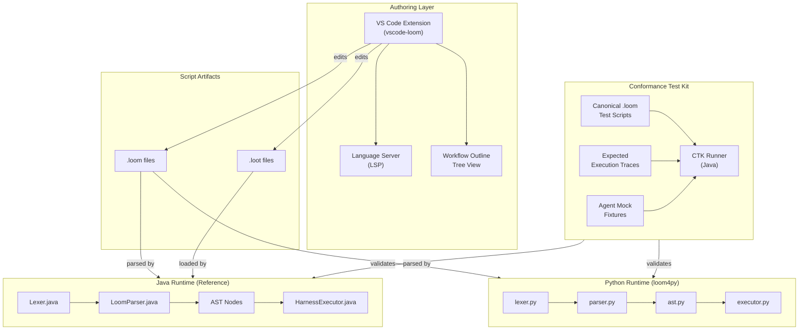
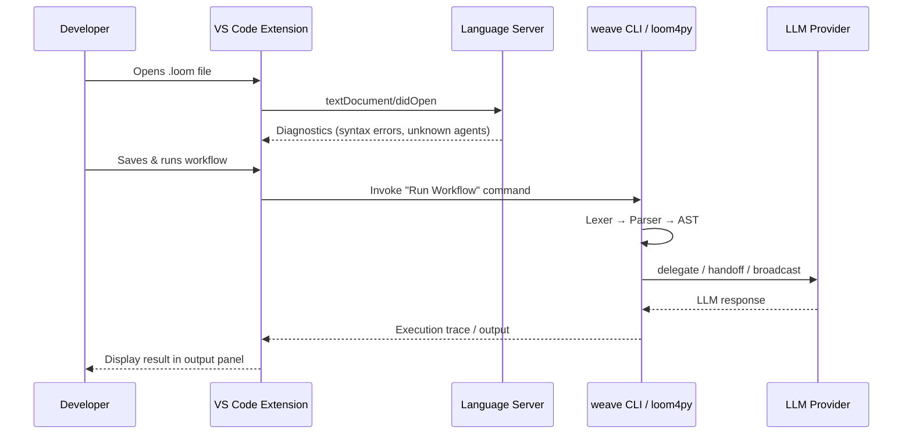
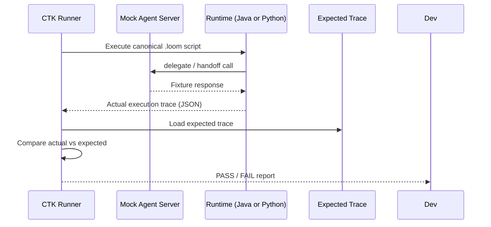

# Design Document: Loom Enhancement Roadmap

## Overview

The Loom Enhancement Roadmap is a three-pronged initiative to grow the Loom DSL ecosystem beyond its current Java-only runtime. It introduces a **VS Code Extension** for first-class authoring of `.loom` and `.loot` files, a **Conformance Test Kit (CTK)** to standardize and validate runtime behavior across implementations, and a **Python Runtime (loom4py)** to bring Loom's neuro-symbolic orchestration to the Python AI/ML community.

These three components are designed to be independently deliverable but mutually reinforcing: the CTK defines the behavioral contract that both the Java and Python runtimes must satisfy, the VS Code extension improves the authoring experience for scripts that both runtimes execute, and loom4py expands the addressable audience for the entire Loom ecosystem.

The existing Java runtime (`ai-agent4j-loom`) serves as the reference implementation. All new components are additive — no breaking changes are made to the existing `Lexer`, `LoomParser`, `HarnessExecutor`, or `LoomEngine` interface.

---

## Architecture

### System-Level Overview



### Component Interaction for Script Execution



### CTK Validation Flow



---

## Components and Interfaces

### Component 1: VS Code Extension (`vscode-loom`)

**Purpose**: Provide syntax highlighting, language configuration, LSP-backed diagnostics, and a navigable workflow outline for `.loom` and `.loot` files.

**Interface** (TypeScript):

```typescript
// src/extension.ts — activation entry point
export function activate(context: vscode.ExtensionContext): void

// Registers:
//   - TextMate grammar for .loom and .loot
//   - Language configuration (brackets, comments, folding)
//   - LSP client connected to the language server
//   - "Run Workflow" command
//   - WorkflowOutline tree view provider
```

**Responsibilities**:
- Register `.loom` and `.loot` as VS Code language IDs
- Start and manage the lifecycle of the Language Server process
- Provide the "Run Workflow" command that invokes `weave run`
- Render the `WorkflowOutline` tree view showing agents and workflows

---

### Component 2: Language Server (`src/lsp/`)

**Purpose**: Provide real-time language intelligence for `.loom` files via the Language Server Protocol.

**Interface** (TypeScript, using `vscode-languageserver-node`):

```typescript
interface LoomLanguageServer {
  // Triggered on every file open/change
  onDidChangeTextDocument(params: DidChangeTextDocumentParams): Diagnostic[]

  // Triggered on hover
  onHover(params: HoverParams): Hover | null

  // Triggered on go-to-definition
  onDefinition(params: DefinitionParams): Location | null

  // Triggered on completion request
  onCompletion(params: CompletionParams): CompletionItem[]
}
```

**Responsibilities**:
- Parse `.loom` source and report syntax errors as `Diagnostic` objects
- Resolve agent/workflow references for go-to-definition
- Provide keyword and identifier completion
- Report undefined agent references as warnings

---

### Component 3: Workflow Outline Tree View (`src/views/WorkflowOutline.ts`)

**Purpose**: Render a navigable tree of all agents, workflows, and schedules defined in the active `.loom` file.

**Interface** (TypeScript):

```typescript
class WorkflowOutlineProvider implements vscode.TreeDataProvider<OutlineNode> {
  getTreeItem(element: OutlineNode): vscode.TreeItem
  getChildren(element?: OutlineNode): Thenable<OutlineNode[]>
  refresh(): void
}

interface OutlineNode {
  kind: 'agent' | 'workflow' | 'schedule' | 'routing'
  name: string
  range: vscode.Range
}
```

**Responsibilities**:
- Parse the active document on every save
- Display a tree: Agents → Workflows → Schedules → Routing Policies
- Navigate to the definition on click

---

### Component 4: Conformance Test Kit (`ctk/`)

**Purpose**: Define a canonical set of `.loom` scripts and expected execution traces that any compliant Loom runtime must produce.

**Interface** (Java, CTK Runner):

```java
interface ConformanceRunner {
  // Execute a single canonical test case
  ConformanceResult run(Path scriptPath, Path tracePath, MockAgentServer mocks);

  // Execute all test cases in a directory
  List<ConformanceResult> runAll(Path ctkDir, MockAgentServer mocks);
}

record ConformanceResult(
  String testName,
  boolean passed,
  List<String> differences  // JSON diff lines if failed
) {}
```

**Responsibilities**:
- Load canonical `.loom` scripts from `ctk/scripts/`
- Inject mock agent responses from `ctk/mocks/`
- Execute scripts against the target runtime
- Capture the execution trace as JSON
- Diff the actual trace against `ctk/traces/*.json`
- Report pass/fail per test case

---

### Component 5: Python Runtime (`loom4py`)

**Purpose**: A faithful port of the Java Loom runtime to Python, enabling `.loom` script execution in Python environments.

**Interface** (Python):

```python
# loom4py/executor.py
class HarnessExecutor:
    def __init__(
        self,
        script: LoomScript,
        tool_registry: ToolRegistry,
        llm_client_factory: LLMClientFactory
    ) -> None: ...

    def initialize(self) -> None: ...
    def execute_workflow(self, workflow_name: str, initial_context: dict[str, str]) -> None: ...
    def shutdown(self) -> None: ...
    def get_context(self) -> VariableContext: ...
```

**Responsibilities**:
- Tokenize `.loom` source via `Lexer`
- Parse token stream into an AST via `LoomParser`
- Execute AST nodes via `HarnessExecutor`
- Dispatch `delegate`/`handoff`/`broadcast` to LLM clients
- Manage variable context and scoping for `call` sub-workflows

---

## Data Models

### Execution Trace (CTK)

```typescript
interface ExecutionTrace {
  scriptName: string
  workflowName: string
  steps: TraceStep[]
}

interface TraceStep {
  kind: 'delegate' | 'handoff' | 'broadcast' | 'note' | 'call' | 'parallel' | 'observe'
  agentName?: string
  payload?: string
  outputVariable?: string
  outputValue?: string
  subSteps?: TraceStep[]   // for parallel / call
  timestamp?: string
}
```

**Validation Rules**:
- `steps` must be non-empty for any executed workflow
- `kind` must be one of the defined statement types
- `outputVariable` must be present when `kind` is `delegate`, `broadcast`, or `call`

---

### VS Code Extension Manifest (`package.json`)

```typescript
interface ExtensionManifest {
  name: 'vscode-loom'
  displayName: 'Loom'
  activationEvents: ['onLanguage:loom', 'onLanguage:loot']
  contributes: {
    languages: LanguageContribution[]
    grammars: GrammarContribution[]
    commands: CommandContribution[]
    views: ViewContribution[]
  }
}

interface LanguageContribution {
  id: 'loom' | 'loot'
  extensions: string[]           // ['.loom'] or ['.loot']
  configuration: string          // path to language-configuration.json
}
```

---

### Python AST Nodes (`loom4py/ast.py`)

```python
from dataclasses import dataclass, field
from typing import Optional

@dataclass
class AgentDef:
    name: str
    model: str
    system: Optional[str] = None
    tools: list[str] = field(default_factory=list)
    skills: list[str] = field(default_factory=list)
    persona: Optional[str] = None
    routing: Optional[str] = None
    output_schema: Optional['SchemaDef'] = None

@dataclass
class WorkflowDef:
    name: str
    params: list[str]
    body: list['Statement']

@dataclass
class DelegateStmt:
    payload: str
    agent_name: str
    output_var: str
    retry_count: int = 0
    on_failure: list['Statement'] = field(default_factory=list)

@dataclass
class LoomScript:
    agents: list[AgentDef] = field(default_factory=list)
    workflows: list[WorkflowDef] = field(default_factory=list)
    schedules: list['ScheduleDef'] = field(default_factory=list)
    routing_policies: list['RoutingPolicyDef'] = field(default_factory=list)
    imports: list[str] = field(default_factory=list)
```

---

## Algorithmic Pseudocode

### Loom4py Lexer Algorithm

```pascal
ALGORITHM tokenize(source: String) -> List<Token>
INPUT: source — raw .loom script text
OUTPUT: ordered list of Token objects

PRECONDITIONS:
  - source is a non-null string (may be empty)

POSTCONDITIONS:
  - Every character in source is consumed exactly once
  - The last token in the result is always EOF
  - STRING_LITERAL tokens have surrounding quotes stripped
  - KEYWORD tokens are resolved from the KEYWORDS map; unrecognized identifiers become IDENTIFIER

BEGIN
  tokens ← []
  pos ← 0
  line ← 1
  col_start ← 0

  WHILE pos < len(source) DO
    // Loop invariant: all characters before pos have been tokenized
    start ← pos
    c ← source[pos]; pos ← pos + 1

    MATCH c WITH
      | '{', '}', '(', ')', '[', ']', ',', ':', '+' →
          tokens.append(Token(SYMBOL_MAP[c], c, line, start - col_start))

      | '-' →
          IF pos < len(source) AND source[pos] = '>' THEN
            pos ← pos + 1
            tokens.append(Token(ARROW, "->", line, start - col_start))
          ELSE
            RAISE LexError("Unexpected '-'", line)
          END IF

      | '=' →
          IF pos < len(source) AND source[pos] = '=' THEN
            pos ← pos + 1; tokens.append(Token(EQUALS, "==", line, ...))
          ELSE
            tokens.append(Token(ASSIGN, "=", line, ...))
          END IF

      | '<', '>', '!' → // similar two-char lookahead for <=, >=, !=

      | '/' →
          IF source[pos] = '/' THEN
            WHILE pos < len(source) AND source[pos] ≠ '\n' DO pos ← pos + 1 END
          ELSE
            RAISE LexError("Unexpected '/'", line)
          END IF

      | '"' → tokens.append(scanString(source, pos, line))

      | '\n' → line ← line + 1; col_start ← pos

      | ' ', '\t', '\r' → // skip whitespace

      | digit → tokens.append(scanNumber(source, start, pos))

      | alpha or '_' → tokens.append(scanIdentifierOrKeyword(source, start, pos))

      | _ → RAISE LexError("Unexpected character", line)
    END MATCH
  END WHILE

  tokens.append(Token(EOF, "", line, pos - col_start))
  RETURN tokens
END
```

**Loop Invariant**: At the start of each iteration, all characters at indices `[0, pos)` have been consumed and their corresponding tokens appended to `tokens`.

---

### Loom4py Parser Algorithm (Recursive Descent)

```pascal
ALGORITHM parseScript(tokens: List<Token>) -> LoomScript
INPUT: tokens — output of tokenize()
OUTPUT: LoomScript AST root

PRECONDITIONS:
  - tokens is non-empty and ends with EOF
  - tokens was produced by a valid tokenize() call

POSTCONDITIONS:
  - All top-level declarations (agent, workflow, routing, schedule, mcp, audit, import) are parsed
  - Circular imports are detected and raise ParseError
  - Returns a LoomScript with all definitions populated

BEGIN
  script ← LoomScript()
  visited_imports ← Set()

  WHILE NOT isAtEnd() DO
    MATCH peek().type WITH
      | IMPORT   → script.imports.add(parseImport())
      | AGENT    → script.agents.add(parseAgent())
      | WORKFLOW → script.workflows.add(parseWorkflow())
      | ROUTING  → script.routing_policies.add(parseRoutingPolicy())
      | SCHEDULE → script.schedules.add(parseSchedule())
      | MCP      → script.mcp_servers.add(parseMcpServer())
      | AUDIT    → script.audit_config ← parseAuditConfig()
      | _        → RAISE ParseError("Unexpected token", peek())
    END MATCH
  END WHILE

  // Resolve imports (depth-first, cycle detection)
  FOR each import_path IN script.imports DO
    IF import_path IN visited_imports THEN
      RAISE ParseError("Circular import detected: " + import_path)
    END IF
    visited_imports.add(import_path)
    child_script ← parseScript(tokenize(readFile(import_path)))
    script.merge(child_script)
  END FOR

  RETURN script
END
```

---

### CTK Trace Comparison Algorithm

```pascal
ALGORITHM compareTraces(actual: ExecutionTrace, expected: ExecutionTrace) -> ConformanceResult
INPUT:
  actual   — trace produced by executing the script against the runtime
  expected — canonical trace loaded from ctk/traces/*.json

PRECONDITIONS:
  - Both traces reference the same scriptName and workflowName
  - Both traces have a non-null steps list

POSTCONDITIONS:
  - Returns ConformanceResult with passed=true iff traces are semantically equivalent
  - Differences list is empty when passed=true
  - Differences list contains human-readable diff lines when passed=false

BEGIN
  differences ← []

  IF actual.workflowName ≠ expected.workflowName THEN
    differences.add("workflowName mismatch: " + actual.workflowName + " vs " + expected.workflowName)
    RETURN ConformanceResult(passed=false, differences)
  END IF

  IF len(actual.steps) ≠ len(expected.steps) THEN
    differences.add("step count mismatch: " + len(actual.steps) + " vs " + len(expected.steps))
  END IF

  FOR i ← 0 TO min(len(actual.steps), len(expected.steps)) - 1 DO
    // Loop invariant: all steps at indices [0, i) have been compared
    a ← actual.steps[i]
    e ← expected.steps[i]

    IF a.kind ≠ e.kind THEN
      differences.add("[step " + i + "] kind: " + a.kind + " vs " + e.kind)
    END IF
    IF a.agentName ≠ e.agentName THEN
      differences.add("[step " + i + "] agentName: " + a.agentName + " vs " + e.agentName)
    END IF
    IF a.outputVariable ≠ e.outputVariable THEN
      differences.add("[step " + i + "] outputVariable: " + a.outputVariable + " vs " + e.outputVariable)
    END IF
    // Note: outputValue is NOT compared — mock responses are deterministic but
    // real LLM responses are not. Only structural shape is validated.
  END FOR

  RETURN ConformanceResult(passed=(len(differences) = 0), differences)
END
```

---

## Key Functions with Formal Specifications

### `Lexer.tokenize()` / `lexer.tokenize()` (Python)

**Signature**:
```python
def tokenize(self) -> list[Token]: ...
```

**Preconditions**:
- `self.source` is a string (may be empty)

**Postconditions**:
- Result is non-empty (always contains at least `EOF`)
- `result[-1].type == TokenType.EOF`
- Every `STRING_LITERAL` token value has surrounding quotes stripped
- Every keyword in `KEYWORDS` map is resolved to its `TokenType`; all other identifiers become `IDENTIFIER`
- No character in `source` is skipped or double-counted

**Loop Invariant**: At the start of each scan iteration, `pos` equals the number of characters consumed, and `tokens` contains exactly the tokens for those characters.

---

### `LoomParser.parse_script()` (Python)

**Signature**:
```python
def parse_script(self) -> LoomScript: ...
```

**Preconditions**:
- `self.tokens` is non-empty and `tokens[-1].type == TokenType.EOF`

**Postconditions**:
- All top-level declarations are parsed into the returned `LoomScript`
- Circular imports raise `ParseError` before returning
- The parser position is at `EOF` upon successful return

---

### `HarnessExecutor.execute_workflow()` (Python)

**Signature**:
```python
def execute_workflow(self, workflow_name: str, initial_context: dict[str, str]) -> None: ...
```

**Preconditions**:
- `initialize()` has been called
- `workflow_name` exists in `self.script.workflows`
- `initial_context` keys match the workflow's declared parameters

**Postconditions**:
- All statements in the workflow body are executed in order
- `parallel` blocks execute concurrently and join before the next statement
- `call` sub-workflows execute in an isolated variable scope; only the output variable is written back to the parent scope
- `handoff` raises `HandoffSignal` to terminate the current execution branch
- On `retry` exhaustion, `on_failure` block is executed if present; otherwise exception propagates

**Loop Invariant** (for `loop until`): At the start of each iteration, the loop condition has been evaluated against the current variable context.

---

### `ConformanceRunner.run()` (Java)

**Signature**:
```java
ConformanceResult run(Path scriptPath, Path tracePath, MockAgentServer mocks);
```

**Preconditions**:
- `scriptPath` points to a readable `.loom` file
- `tracePath` points to a readable JSON file conforming to `ExecutionTrace` schema
- `mocks` is initialized with fixture responses for all agents referenced in the script

**Postconditions**:
- Returns `ConformanceResult` with `passed=true` iff actual trace matches expected trace structurally
- `differences` is empty when `passed=true`
- Mock server is not mutated by the run

---

## Error Handling

### Error Scenario 1: Lexer — Unexpected Character

**Condition**: The Lexer encounters a character that is not part of any valid token (e.g., `@`, `#`, bare `-`).
**Response**: Raise `LexError` with the offending character, line number, and column.
**Recovery**: The VS Code LSP catches this and reports it as a `Diagnostic` with severity `Error`. The parser does not proceed.

---

### Error Scenario 2: Parser — Undefined Agent Reference

**Condition**: A `delegate`/`handoff`/`broadcast` statement references an agent name not defined in the script (after import resolution).
**Response**: Raise `ParseError` with the undefined name and source location.
**Recovery**: In the VS Code LSP, this is reported as a `Diagnostic` warning (not error) to allow incremental authoring. At runtime, it is a fatal error.

---

### Error Scenario 3: Circular Import

**Condition**: Import resolution detects a cycle (File A → File B → File A).
**Response**: Raise `ParseError("Circular import detected: <path>")`.
**Recovery**: Fatal — execution cannot proceed. The VS Code LSP reports this as an error on the `import` line.

---

### Error Scenario 4: Runtime — Delegate Retry Exhaustion

**Condition**: A `delegate` statement with `retry N` fails on all N+1 attempts (LLM API error, timeout, or malformed JSON response).
**Response**: If `on_failure` block is present, execute it and continue. Otherwise, propagate the exception.
**Recovery**: The `on_failure` block may use `note`, `handoff`, or `delegate` to a fallback agent.

---

### Error Scenario 5: CTK — Trace Shape Mismatch

**Condition**: The actual execution trace has a different number of steps or different step kinds than the expected trace.
**Response**: `ConformanceResult.passed = false` with a human-readable diff in `differences`.
**Recovery**: The CTK runner continues to the next test case. A summary report is printed at the end.

---

### Error Scenario 6: Python Runtime — Missing LLM Client

**Condition**: `HarnessExecutor.execute_workflow()` is called but `initialize()` was not called first, or the LLM client factory returns `None` for the requested model.
**Response**: Raise `LoomRuntimeError("LLM client not initialized for model: <model>")`.
**Recovery**: Caller must ensure `initialize()` is called and the factory supports the model.

---

## Testing Strategy

### Unit Testing Approach

Each component is unit-tested in isolation:

- **Lexer (Java & Python)**: Parameterized tests for every `TokenType`. Edge cases: empty input, unterminated strings, multi-line strings, all operators, all keywords, unknown characters.
- **Parser (Java & Python)**: Round-trip tests — parse a known `.loom` script and assert the AST structure. Tests for every statement type (`delegate`, `handoff`, `broadcast`, `parallel`, `loop`, `alt`, `call`, `guardrail`, `observe`, `schedule`). Negative tests for malformed input.
- **HarnessExecutor (Java & Python)**: Unit tests with a mock `LLMClientFactory` that returns deterministic responses. Tests for variable interpolation, `call` scope isolation, `retry` + `on_failure`, `parallel` join semantics, `HandoffSignal` propagation.
- **CTK Runner**: Unit tests for `compareTraces()` with hand-crafted actual/expected pairs covering pass, step-count mismatch, kind mismatch, and agent-name mismatch.

### Property-Based Testing Approach

**Property Test Library**: `hypothesis` (Python), `junit-quickcheck` (Java)

Key properties to verify:

1. **Lexer round-trip**: For any valid `.loom` source string `s`, `detokenize(tokenize(s)) == normalize(s)` — i.e., reconstructing the source from tokens preserves all meaningful content.
2. **Lexer token count monotonicity**: `len(tokenize(s)) >= 1` for all inputs (always at least `EOF`).
3. **Parser idempotency**: Parsing a script, serializing it back to source, and re-parsing produces an equivalent AST.
4. **CTK symmetry**: `compareTraces(t, t).passed == true` for any valid trace `t` (a trace always matches itself).
5. **Variable context isolation**: After a `call` sub-workflow completes, no variables from the sub-workflow's internal scope leak into the parent context (only the declared output variable is written back).

### Integration Testing Approach

- **VS Code Extension**: Integration tests using `@vscode/test-electron` that open a `.loom` file and assert that diagnostics, completions, and the outline tree are populated correctly.
- **CTK End-to-End**: The CTK runner is executed against the Java runtime using all canonical scripts in `ctk/scripts/`. All tests must pass before a Java runtime release.
- **loom4py End-to-End**: The same CTK runner (or a Python-native equivalent) is executed against loom4py. Parity with the Java runtime is the acceptance criterion.
- **"Run Workflow" Command**: Manual verification that the VS Code command correctly invokes `weave run` and displays output in the VS Code output panel.

---

## Performance Considerations

- **Lexer/Parser**: Both are O(n) in source length. No performance concerns for typical `.loom` files (< 1000 lines). The Python lexer should avoid regex-based tokenization to match the Java implementation's character-by-character approach and maintain O(n) complexity.
- **Parallel Execution**: The `parallel {}` block in `HarnessExecutor` uses Java's `ExecutorService` (Java) and `asyncio` / `concurrent.futures.ThreadPoolExecutor` (Python). LLM API calls are I/O-bound, so thread-based parallelism is appropriate.
- **CTK Runner**: Test cases are independent and can be run in parallel. The runner should support a `--parallel` flag for CI speed.
- **VS Code LSP**: The language server re-parses the document on every change. For large files, debouncing (300ms) should be applied before triggering a full re-parse.

---

## Security Considerations

- **`.loot` Tool Mapping (Java)**: The `LootLoader` maps logical tool names to Java class names and instantiates them via reflection. Only classes on the classpath can be loaded — no arbitrary code execution from the `.loot` file is possible beyond what is already on the classpath.
- **Python Tool Registry**: The Python equivalent should use an explicit registration API (`registry.register("ToolName", my_tool_instance)`) rather than dynamic `importlib` loading from `.loot` files, to avoid arbitrary module execution.
- **CTK Mock Server**: Mock fixtures must not contain real API keys or PII. The `mocks/` directory should be reviewed before committing.
- **VS Code Extension**: The "Run Workflow" command invokes `weave` as a child process. The command must sanitize the script path to prevent shell injection. Use `child_process.spawn` with an argument array (not a shell string).
- **loom4py LLM Clients**: API keys must be sourced from environment variables, never hardcoded in `.loom` scripts or `pyproject.toml`.

---

## Dependencies

### VS Code Extension (`vscode-loom`)
| Dependency | Purpose |
|---|---|
| `vscode` (peer) | VS Code Extension API |
| `vscode-languageclient` | LSP client implementation |
| `vscode-languageserver` | LSP server implementation |
| `vscode-languageserver-textdocument` | Text document utilities |

### Conformance Test Kit (CTK)
| Dependency | Purpose |
|---|---|
| `ai-agent4j-loom` (Java, local) | Reference runtime under test |
| `jackson-databind` | JSON trace serialization/deserialization |
| `junit-jupiter` | Test runner for CTK assertions |

### Python Runtime (`loom4py`)
| Dependency | Purpose |
|---|---|
| `httpx` | Async HTTP client for LLM API calls |
| `pydantic` | Data validation for AST nodes and config |
| `hypothesis` | Property-based testing |
| `pytest` | Unit and integration test runner |

> **Parser Strategy Note**: loom4py will use a **hand-written recursive descent parser** (mirroring `LoomParser.java`) rather than a parser generator like ANTLR. This ensures structural parity with the Java reference implementation, simplifies debugging, and avoids an additional build-time dependency. The grammar is simple enough (LL(1) with one token of lookahead for most productions) that a hand-written parser is the right tradeoff.

---

## Correctness Properties

*A property is a characteristic or behavior that should hold true across all valid executions of a system — essentially, a formal statement about what the system should do. Properties serve as the bridge between human-readable specifications and machine-verifiable correctness guarantees.*

---

### Property 1: Lexer EOF Invariant

*For any* string input (including the empty string), calling `tokenize()` on the Lexer SHALL return a non-empty list whose last element has `TokenType.EOF`.

**Validates: Requirements 11.1, 11.2**

---

### Property 2: Lexer Keyword Resolution

*For any* source string containing a recognized Loom keyword, the Lexer SHALL produce a token with the keyword's corresponding `TokenType`; and *for any* identifier that is not in the `KEYWORDS` map, the Lexer SHALL produce a token with `TokenType.IDENTIFIER`.

**Validates: Requirements 11.3, 11.4**

---

### Property 3: Lexer String Literal Quote Stripping

*For any* source string containing a double-quoted string literal, the Lexer SHALL produce a `STRING_LITERAL` token whose value does not include the surrounding double-quote characters.

**Validates: Requirements 11.5**

---

### Property 4: Lexer Comment Skipping

*For any* source string containing a `//` line comment, the Lexer SHALL produce no token for any character between `//` and the end of that line.

**Validates: Requirements 11.6**

---

### Property 5: Lexer Error on Unrecognized Character

*For any* source string containing a character that is not part of any valid Loom token pattern, calling `tokenize()` SHALL raise a `LexError` identifying the offending character, line number, and column.

**Validates: Requirements 11.8, 21.1**

---

### Property 6: Lexer Character Consumption Completeness

*For any* source string, every character in the string is consumed by the Lexer exactly once — no character is skipped and no character is tokenized more than once.

**Validates: Requirements 11.9**

---

### Property 7: Lexer Line Number Monotonicity

*For any* source string containing newline characters, the line number assigned to each token SHALL be greater than or equal to the line number of all preceding tokens, and SHALL increment by exactly one for each newline character encountered.

**Validates: Requirements 11.10**

---

### Property 8: Parser Round-Trip (Parse → Print → Parse)

*For any* valid `.loom` source string, tokenizing and parsing it into a `LoomScript`, then serializing that `LoomScript` with the `PrettyPrinter`, then tokenizing and parsing the serialized output SHALL produce a `LoomScript` that is structurally equivalent to the original.

**Validates: Requirements 18.2, 18.3, 12.1, 12.5**

---

### Property 9: Parser Error on Invalid Token Sequence

*For any* token stream that contains an unexpected token at the top level or within a workflow body, calling `parse_script()` SHALL raise a `ParseError` that identifies the unexpected token and its source location.

**Validates: Requirements 12.6**

---

### Property 10: CTK Trace Reflexivity

*For any* valid `ExecutionTrace` object `t`, calling `compareTraces(t, t)` SHALL return a `ConformanceResult` with `passed` equal to `true` and an empty `differences` list.

**Validates: Requirements 10.1, 10.2, 10.3, 10.4, 10.5, 10.8, 10.9**

---

### Property 11: CTK Output Value Independence

*For any* two `ExecutionTrace` objects that are structurally identical (same `workflowName`, same step count, same `kind`, `agentName`, and `outputVariable` for every step) but differ only in `outputValue` fields, calling `compareTraces()` SHALL return a `ConformanceResult` with `passed` equal to `true`.

**Validates: Requirements 10.6**

---

### Property 12: CTK Differences Non-Empty on Mismatch

*For any* two `ExecutionTrace` objects that are structurally different (differing `workflowName`, step count, step `kind`, `agentName`, or `outputVariable`), calling `compareTraces()` SHALL return a `ConformanceResult` with `passed` equal to `false` and a non-empty `differences` list containing at least one human-readable description of the mismatch.

**Validates: Requirements 10.7**

---

### Property 13: CTK Mock Server Immutability

*For any* CTK test run, the state of the `Mock_Agent_Server` (its registered fixture responses) SHALL be identical before and after the `ConformanceRunner.run()` call.

**Validates: Requirements 9.6**

---

### Property 14: HarnessExecutor Call Scope Isolation

*For any* `call` sub-workflow execution, no variable written inside the sub-workflow's `VariableContext` (other than the single declared output variable) SHALL appear in or modify the parent `VariableContext` after the `call` completes.

**Validates: Requirements 15.6, 16.1, 16.2, 16.3**

---

### Property 15: HarnessExecutor Output Variable Population

*For any* `delegate`, `broadcast`, or `call` statement that completes successfully, the `VariableContext` SHALL contain a binding for the statement's declared `output_var` after execution.

**Validates: Requirements 15.2, 15.3, 22.3**

---

### Property 16: Execution Trace Step Kind Validity

*For any* `ExecutionTrace` produced by the `HarnessExecutor`, every step in the `steps` array SHALL have a `kind` field whose value is one of: `delegate`, `handoff`, `broadcast`, `note`, `call`, `parallel`, or `observe`.

**Validates: Requirements 22.2**

---

### Property 17: Execution Trace Non-Empty Steps

*For any* workflow execution that completes (successfully or via `HandoffSignal`), the resulting `ExecutionTrace` SHALL have a `steps` array containing at least one entry.

**Validates: Requirements 22.1**

---

### Property 18: LSP Diagnostics for Syntax Errors

*For any* `.loom` document containing at least one syntax error (lexer or parser), the `Language_Server` SHALL produce at least one `Diagnostic` with severity `Error` whose source range overlaps the location of the error.

**Validates: Requirements 3.1, 3.2, 3.3**

---

### Property 19: LSP No Diagnostics for Valid Documents

*For any* syntactically valid `.loom` document with all agent references resolved, the `Language_Server` SHALL produce zero `Diagnostic` objects.

**Validates: Requirements 3.4**

---

### Property 20: LSP Warning for Undefined Agent References

*For any* `.loom` document containing a `delegate`, `handoff`, or `broadcast` statement that references an agent name not defined in the script, the `Language_Server` SHALL produce exactly one `Diagnostic` with severity `Warning` per undefined reference, and the diagnostic message SHALL contain the undefined agent name.

**Validates: Requirements 4.1, 4.2**

---

### Property 21: Workflow Outline Tree Hierarchy

*For any* parsed `.loom` file, the `WorkflowOutline` tree view SHALL display all agents before all workflows, all workflows before all schedules, and all schedules before all routing policies, with no items from a later category appearing before items from an earlier category.

**Validates: Requirements 6.3**

---

### Property 22: LSP Completion Includes All Keywords and Identifiers

*For any* `.loom` document, a completion request at any position SHALL return `CompletionItem` objects that include every Loom keyword and every agent/workflow identifier defined in the current script.

**Validates: Requirements 5.4**

---

### Property 23: Run Workflow Command Path Safety

*For any* script file path (including paths containing spaces, quotes, semicolons, or other shell-special characters), the VS Code Extension SHALL pass the path as a discrete element in the `child_process.spawn` argument array and SHALL NOT construct a shell command string by interpolating the path.

**Validates: Requirements 7.4**
