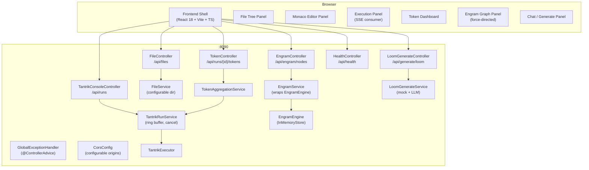

# Design Document: Tantrik IDE Console

## Overview

The Tantrik IDE Console replaces the existing minimal MVP with a full IDE-like web application. It is a multi-panel, dark-themed development environment for authoring Loom workflow scripts, executing them against the Tantrik orchestration engine, and inspecting the results through live trace views, token dashboards, and an Engram knowledge graph visualisation.

The system is split into two deployable units:

- **Backend** — Spring Boot 3.2.1 / Java 17, expanded from the existing `tantrik-console-server`. New controllers handle files, engram nodes, token aggregation, Loom generation, and health. The existing `TantrikRunService` is extended with cancellation and a 50-run ring buffer.
- **Frontend** — React 18 + Vite + TypeScript, migrated from the existing plain-JS MVP. New panels are added for the file tree, Monaco editor, token dashboard, Engram graph, and chat. Radix UI primitives provide accessible dialogs, tooltips, and dropdowns.

The two units communicate over HTTP REST and Server-Sent Events (SSE). The frontend is built as a static bundle that can be served from Spring Boot's `static/` resources directory.

---

## Architecture



### Key Design Decisions

1. **In-process EngramEngine** — The console server instantiates a single `EngramEngine` (backed by `InMemoryStore`) as a Spring bean. This avoids a separate process while still exposing the full node graph via REST. A `storagePath` property can be set to persist nodes to disk across restarts.

2. **Ring buffer for run history** — `TantrikRunService` keeps at most 50 `RunSummary` records in a `LinkedHashMap` with access-order eviction. This satisfies Requirement 4.8 without a database.

3. **Cancellation via interrupt** — `DELETE /api/runs/{runId}` sets a `CancellationToken` flag that the trace monitor thread checks. The `TantrikExecutor` does not yet expose a native stop hook, so the monitor thread is interrupted and the run is marked `CANCELLED` after the next poll cycle (≤ 200 ms latency).

4. **Token aggregation on demand** — `GET /api/runs/{runId}/tokens` scans the `RunSummary.events` list for `TRACE_PRE_TURN` events and aggregates per-agent token counts. No separate storage is needed.

5. **Loom DSL syntax highlighting** — A custom Monaco language definition is registered client-side. The keyword list is derived from the Loom grammar (`agent`, `workflow`, `delegate`, `parallel`, `loop`, `handoff`, `broadcast`, `observe`, `guardrail`, `note`, `alt`).

6. **TypeScript migration** — New files are `.tsx` / `.ts`. Existing `App.jsx` is replaced by a new `App.tsx` shell. No legacy JS files are retained in the migrated codebase.

7. **Static serving** — The Vite build output (`dist/`) is copied to `src/main/resources/static/` in the Spring Boot module. A `SpaController` catches all non-API routes and returns `index.html` for client-side routing.

---

## Components and Interfaces

### Backend Components

#### `FileController` (`/api/files`)

| Method | Path | Description |
|--------|------|-------------|
| GET | `/api/files` | List all `.loom` files under the configured root directory |
| GET | `/api/files/{encodedPath}` | Return raw text content of a file |
| PUT | `/api/files/{encodedPath}` | Persist updated content to disk |

`encodedPath` is URL-encoded relative path (e.g., `examples%2Fmain.loom`).

`FileService` resolves paths against the configured root, rejects path traversal attempts (any path that resolves outside the root returns HTTP 400).

#### `EngramController` (`/api/engram/nodes`)

| Method | Path | Description |
|--------|------|-------------|
| GET | `/api/engram/nodes` | List all non-shadow nodes (content truncated to 200 chars) |
| GET | `/api/engram/nodes/{id}` | Return full content of a single node |
| DELETE | `/api/engram/nodes/{id}` | Remove a node from the store |

`EngramService` wraps the `EngramEngine` bean. Because `VectorStore` only exposes `removeByContent`, the service maintains a secondary `ConcurrentHashMap<String, MemoryObject>` index keyed by `id` to support `GET /id` and `DELETE /id` without scanning the full store.

#### `TokenController` (`/api/runs/{runId}/tokens`)

| Method | Path | Description |
|--------|------|-------------|
| GET | `/api/runs/{runId}/tokens` | Return aggregated token breakdown for a run |

`TokenAggregationService` iterates `RunSummary.events`, filters for events whose `metadata` map contains `inputTokensEstimate > 0`, and groups by `executionTier` (agent name is in the event's `executionTier` field — actually the agent name is in the `message` field; the service parses it from the event metadata).

**Correction**: Looking at `TantrikRunService.startTraceMonitor`, the `RunEvent` is constructed with `executionTier` = the tier string (LOCAL/CLOUD/SYSTEM) and the agent name is embedded in the `message` field as `"Agent {name} phase {phase}"`. The metadata map contains `inputTokensEstimate`, `squeezed`, `compressionRatio`. The `TokenAggregationService` will parse agent name from the message field for `TRACE_PRE_TURN` events.

#### `LoomGenerateController` (`/api/generate/loom`)

| Method | Path | Description |
|--------|------|-------------|
| POST | `/api/generate/loom` | Generate a Loom script from a natural-language prompt |

`LoomGenerateService` builds a system prompt and calls the configured LLM client. When `mockMode=true` it returns a deterministic template without any LLM call.

#### `HealthController` (`/api/health`)

Returns `{"status": "UP", "version": "<app version>"}`. Version is read from `application.properties` or the Maven manifest.

#### `GlobalExceptionHandler` (`@ControllerAdvice`)

Catches all unhandled exceptions, logs them at ERROR level (URI, method, message), and returns a JSON body `{"error": "<message>"}` with an appropriate HTTP status. Handles `MethodArgumentNotValidException` (400), `NoSuchElementException` (404), and `Exception` (500).

#### `CorsConfig`

Replaces the existing `WebConfig`. Reads allowed origins from `tantrik.console.cors.origins` (comma-separated list, default `http://localhost:5173,http://localhost:3000`).

### Frontend Components

#### `App.tsx` — Shell

Top-level component. Renders:
- `TopBar` — title, global run controls, secondary panel tab switcher
- `PanelLayout` — resizable split using `react-resizable-panels`
- `ToastProvider` — global toast notifications (Radix UI `Toast`)
- `OfflineBanner` — listens to `navigator.onLine` / `online`/`offline` events
- `KeyboardShortcutModal` — triggered by `?` key

#### `PanelLayout.tsx`

Uses `react-resizable-panels` (`PanelGroup`, `Panel`, `PanelResizeHandle`). Persists sizes to `localStorage` under key `tantrik-panel-sizes`. Collapses `FileTree` panel when viewport < 900 px.

#### `FileTree.tsx`

- Fetches `GET /api/files` on mount and on manual refresh.
- Renders a tree of file descriptors.
- Highlights files with unsaved changes (tracked in a `Set<string>` in the editor store).
- Animated collapse via CSS transition on the panel width.
- Displays inline error if the fetch fails.

#### `LoomEditor.tsx`

- Wraps `@monaco-editor/react`.
- Registers a custom `loom` language with token rules for DSL keywords.
- Binds `Ctrl+S` / `Cmd+S` to `PUT /api/files/{encodedPath}`.
- Shows a status bar below the editor listing detected agent and workflow names (parsed with a simple regex over the editor content).
- Displays a transient "Saved" toast on success, error toast on failure.

#### `ExecutionPanel.tsx`

- Manages `EventSource` lifecycle.
- Renders each SSE event as a row with timestamp, event type badge, agent name, tier badge, token estimate.
- Auto-scroll with a "Pause scroll" toggle.
- Shows green/red status banner on `RUN_COMPLETED` / `RUN_FAILED`.

#### `TokenDashboard.tsx`

- Fetches `GET /api/runs/{runId}/tokens` when a run is selected.
- Renders a horizontal bar chart (using `recharts` `BarChart` with `layout="vertical"`).
- Amber color for bar segments where `squeezedCount > 0`.
- Updates in real time by re-fetching on each incoming SSE event (debounced to 1 s).

#### `EngramPanel.tsx`

- Fetches `GET /api/engram/nodes` on mount and on "Refresh".
- Renders a force-directed graph using `d3-force` (D3 v7).
- Node radius proportional to `importance`; color by tier (WORKING = `#3b82f6`, EPISODIC = `#22c55e`, SEMANTIC = `#f97316`).
- Click opens `NodeDetailDrawer` (Radix UI `Sheet`).
- Search input filters nodes with 300 ms debounce.
- "Delete" in drawer calls `DELETE /api/engram/nodes/{id}` and removes node from local state.

#### `ChatPanel.tsx`

- Maintains a `messages: ChatMessage[]` array in local state.
- Submits `POST /api/generate/loom` on form submit.
- Shows loading spinner during request.
- Each history entry has a "Use in Editor" button that pushes the script to the editor store.
- Displays error messages inline in history on failure.

#### `useEditorStore.ts` (Zustand store)

Central state for:
- `currentFile: FileDescriptor | null`
- `content: string`
- `savedContent: string`
- `isDirty: boolean` (derived: `content !== savedContent`)
- `setContent`, `setSavedContent`, `loadFile`

#### `useRunStore.ts` (Zustand store)

Central state for:
- `activeRunId: string | null`
- `runs: RunSummary[]`
- `events: RunEvent[]`
- `startRun`, `stopRun`, `selectRun`

---

## Data Models

### Backend DTOs

```java
// GET /api/files response item
record FileDescriptor(String path, String name, Instant lastModified) {}

// GET /api/runs/{runId}/tokens response
record TokenBreakdown(
    int totalInputTokens,
    List<AgentTokenStat> agentBreakdown,
    long runDurationMs
) {}

record AgentTokenStat(
    String agentName,
    int inputTokens,
    int squeezedCount,
    double avgCompressionRatio
) {}

// POST /api/generate/loom request
record GenerateLoomRequest(String prompt, boolean mockMode) {}

// POST /api/generate/loom response
record GenerateLoomResponse(String script, String workflowName) {}

// GET /api/health response
record HealthResponse(String status, String version) {}

// Error response (all 4xx/5xx)
record ErrorResponse(String error) {}

// GET /api/engram/nodes response item
record EngramNodeDescriptor(
    String id,
    String content,   // truncated to 200 chars
    String tier,      // WORKING | EPISODIC | SEMANTIC
    double importance,
    String topicKey
) {}
```

### Frontend TypeScript Types

```typescript
interface FileDescriptor {
  path: string;
  name: string;
  lastModified: string; // ISO-8601
}

interface RunSummary {
  runId: string;
  status: 'PENDING' | 'RUNNING' | 'SUCCESS' | 'FAILED' | 'CANCELLED';
  startedAt: string;
  completedAt?: string;
  workflowName: string;
  error?: string;
}

interface RunEvent {
  type: string;
  message: string;
  executionTier: 'LOCAL' | 'CLOUD' | 'SYSTEM';
  timestamp: string;
  metadata: Record<string, unknown>;
}

interface TokenBreakdown {
  totalInputTokens: number;
  agentBreakdown: AgentTokenStat[];
  runDurationMs: number;
}

interface AgentTokenStat {
  agentName: string;
  inputTokens: number;
  squeezedCount: number;
  avgCompressionRatio: number;
}

interface EngramNode {
  id: string;
  content: string;
  tier: 'WORKING' | 'EPISODIC' | 'SEMANTIC';
  importance: number;
  topicKey: string;
}

interface ChatMessage {
  id: string;
  prompt: string;
  script?: string;
  workflowName?: string;
  error?: string;
  timestamp: string;
}
```

### Configuration Properties

```properties
# application.properties additions
tantrik.console.cors.origins=http://localhost:5173,http://localhost:3000
tantrik.console.loom-scripts.dir=./loom-scripts
tantrik.console.engram.storage-path=./engram-memory.json
```

---

