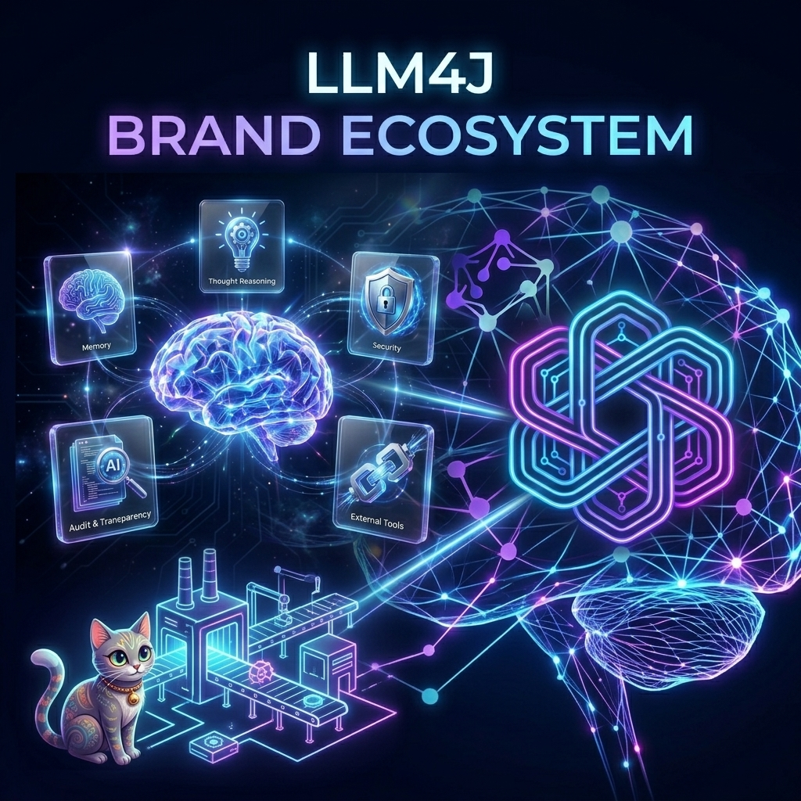

# llm4j: The Pure Java AI Stack

> **Build intelligent, reasoning applications from the ground up.**

**llm4j** is a monorepo dedicated to exploring the future of AI engineering in Java. Unlike Python-heavy ecosystems or heavy abstractions, this project proves that you can build sophisticated, production-ready AI solutions using pure, idiomatic Java.

It provides a complete stack: from a low-level Gemini client to a high-level ReAct agent framework, and fully fledged multi-agent applications.

---

## 🏗️ The Core: [AI Agent4J](ai-agent4j/)

The heart of this repository is **ai-agent4j**, a lightweight yet powerful Java library for building LLM-powered applications.

* **Multi-Provider**: Native support for **Google Gemini**, **Sarvam AI**, and **Local models via Ollama (Gemma, Llama)**, with an extensible architecture for others.
* **Voice-Native**: First-class support for Speech-to-Text (STT) and Text-to-Speech (TTS) pipelines.
* **Zero Magic**: No confusing "magic" abstractions. Just clean, typed Java code.
* **ReAct Agents**: Implements the **Re**asoning + **Act**ing paradigm, allowing agents to solve complex problems by thinking and using tools.
* **Autonomous Foundations**: Built-in support for **Agent Delegation** (Manager/Worker patterns), **Background Task Scheduling**, and **Semantic Long-Term Memory**.
* **Model Routing**: Cost-aware and fallback routing strategies to automatically switch between LLM providers (e.g., Gemini Flash vs Pro) based on task complexity.
* **Tooling**: Includes ready-to-use tools (Calculator, Web Search) and an **OpenAPI Tool** that can turn any REST API into an AI function instantly.
* **MCP Support**: Full support for the **Model Context Protocol (MCP)**, enabling connection to any external MCP server (Python, Node, etc.).
* **Structured Output**: Native support for JSON modes and structured object mapping.
* **Skill Injection & Discovery**: Inject domain knowledge dynamically using **AgentSkill** (Markdown-based instructions) and automatically discover available skills.
* **xAI Compliant**: Industry-leading **95% xAI compliance** with built-in PII masking, confidence scoring, and transparent reasoning audit trails.
* **AI-Optimized**: Includes comprehensive `llms.txt` and specialized documentation optimized for AI scrapers and crawlers.

## 🧵 The Orchestrator: [Loom](loom/ai-agent4j-loom/)

**Loom** is the **Neuro-Symbolic** orchestration layer of the llm4j stack. It provides a specialized DSL (`.loom`) to manage complex, multi-agent workflows with deterministic precision.

* **Neuro-Symbolic**: Combines the reasoning power of LLMs with the rigid reliability of symbolic logic.
* **DSL-Driven**: Define agents and workflows in a human-readable script; boot systems without Java recompilation.
* **Deterministic Routing**: Native support for `handoff`, `delegate`, `parallel` execution, and `loop until` patterns.
* **Enterprise Governance**: Integrated PII guardrails, cost-aware routing policies, and background task scheduling.

👉 **[Master Loom Orchestration](loom/ai-agent4j-loom/LOOM_GUIDE.md)**

## 🧠 The Memory: [Engram](engram/engram-core/)

**Engram** is a **Neuro-Symbolic Memory Engine** that solves the "Context Bloat" problem. It replaces naive transcript accumulation with a smart, synthesized retrieval-synthesis loop.

*   **Context Intelligence**: Automatically extracts key facts and synthesizes task-specific briefings.
*   **Constant Context**: Maintains high-signal prompts regardless of conversation length.
*   **Self-Correction**: Features an Introspection Loop that retroactively updates and shadows memories.

👉 **[Building Agentic Workflows with Loom & Engram](docs/AGENTIC_WORKFLOWS_GUIDE.md)**

### 🧩 The Extensions: [RAG Addons](ai-agent4j-addons/)

For advanced use-cases, the **RAG Addons** module brings heavy-lifting capabilities while keeping the core light:

* **Local Embeddings**: Run **ONNX** and **DJL** models locally (no API costs).
* **Persistent Storage**: Store vectors in **PostgreSQL (pgvector)** or **Pinecone**.

👉 **[Read the Documentation](ai-agent4j/README.md)**

---

## 🚀 The Showcase: [Hexamind Hub](examples/hexamind-hub/)

**Hexamind Hub** demonstrates what `ai-agent4j` can do. It is a "Digital Boardroom" where 6 specialized AI agents (including a Cynical Skeptic and a Creative Thinker) collaborate to solve your problems.

* **Multi-Agent Orchestration**: See how different personas debate, critique, and build consensus.
* **Real-Time**: Built with Spring Boot and WebSockets for a live, streaming experience.
* **Visual**: A stunning, modern UI to watch the AI thought process unfold.

👉 **[Launch Hexamind Hub](examples/hexamind-hub/README.md)**

---

## 🏭 The Factory: [Nirmaan Yantra](examples/nirmaan-yantra/)

**Nirmaan Yantra** is an autonomous software factory where a team of AI agents builds entire applications from a single-line prompt.

* **Autonomous Workflow**: Spec -> Test -> Code -> QA -> Release.
* **Self-Healing**: Automatically fixes compilation errors and missing dependencies.
* **Loop Prevention**: Detects dead-ends and "reboots" the implementation process.
* **Real-Time Dashboard**: Watch Vihaan (Dev), Dhruv (QA), and others collaborate live.

👉 **[Enter the Factory](examples/nirmaan-yantra/README.md)**

---

## 🐈 The Companion: [Kingini](examples/kingini/)

**Kingini** is a voice-first AI agent designed for children, featuring a wise and whimsical Kerala cat persona.

*   **Voice-First**: Talk naturally in Malayalam.
*   **Persona**: A character-driven AI with a unique backstory and voice ("Ritu").
*   **Tech**: Spring Boot + Sarvam AI (STT/LLM/TTS) + Web Audio API.

👉 **[Meet Kingini](examples/kingini/README.md)**

---

## 📧 The Connector: [Gmail MCP App](examples/gmail-mcp-app/)

**Gmail MCP App** demonstrates the power of the **Model Context Protocol**. It connects your LLM directly to your Gmail inbox, allowing agents to read, draft, and send emails securely.

*   **MCP Server**: Implements the Model Context Protocol for email.
*   **Secure**: Uses OAuth2 for authentication.
*   **Agent-Ready**: Plug-and-play with any MCP-compliant client (like Claude or `ai-agent4j` agents).

---

> [!TIP]
> **[Why AI Agent4J? Read our comparison against LangChain4j and Spring AI](ai-agent4j/wiki/WHY_AI_AGENT4J.md)**
>
> **[xAI Beyond Black Boxes: Our 95% Compliance Guide](ai-agent4j/wiki/xAI_BEYOND_BLACK_BOXES.md)**
>
> **[Version Matrix](VERSION_MATRIX.md)** for canonical coordinates and compatibility.
>
> **[Migration Guide 5.0](MIGRATION_GUIDE_5_0.md)** for legacy coordinate upgrades.

## 📐 Project Standards

- [Testing Strategy](TESTING_STRATEGY.md)
- [API Compatibility Policy](API_COMPATIBILITY.md)
- [Contributing Guide](CONTRIBUTING.md)

## 💡 Our Philosophy

1. **Java First**: AI isn't just for Python. Java's strong typing, concurrency, and ecosystem make it perfect for building robust AI systems.
2. **Ground Up**: We minimize dependencies. By building our own ReAct loop and provider clients, we gain full control and understanding of the LLM's behavior.
3. **Transparency**: We believe in "glass-box" AI. You should be able to see exactly what your agent is thinking and why it made a decision.

---

MIT License
