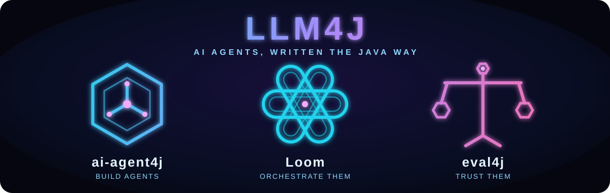
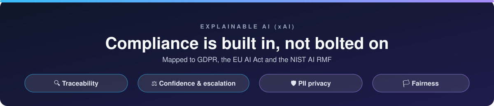

<p align="center">
  
</p>

<h1 align="center">llm4j</h1>

<p align="center">
  <b>AI agents, written the Java way.</b><br>
  Typed, testable, observable: from a single tool call to autonomous workflows that run for days.
</p>

<p align="center">
  <a href="https://central.sonatype.com/artifact/io.github.srijithunni7182/ai-agent4j"></a>
  <a href="https://www.oracle.com/java/technologies/downloads/#java17"></a>
  <a href="LICENSE"></a>
  
</p>

<p align="center">
  <a href="src/ai-agent4j/wiki/Getting-Started.md">Get started</a> ·
  <a href="docs/THE_STACK.md">The stack</a> ·
  <a href="docs/EXAMPLES.md">Examples</a> ·
  <a href="docs/README.md">Docs</a> ·
  <a href="src/ai-agent4j/wiki/WHY_AI_AGENT4J.md">Why ai-agent4j?</a> ·
  <a href="src/loom/ai-agent4j-loom/WHY_LOOM.md">Why Loom?</a> ·
  <a href="SECURITY.md"><b>Security</b></a>
</p>

<p align="center">
  <a href="src/ai-agent4j/wiki/xAI_BEYOND_BLACK_BOXES.md"></a>
</p>

> [!IMPORTANT]
> **The most complete explainable-AI toolkit for Java agents.** Every agent step is recorded as an immutable audit event (**traceability**),
> each run carries a **confidence score** with `shouldEscalateToHuman()`, **PII is masked** before it reaches a model
> or a log, and **bias monitors** can flag or block a response. The four pillars are mapped to GDPR, the EU AI Act and
> the NIST AI RMF in **[xAI: Beyond Black Boxes](src/ai-agent4j/wiki/xAI_BEYOND_BLACK_BOXES.md)**.
>
> These ship in the box. With Spring AI or LangChain4j you get observability and PII guardrails, but you build confidence scoring, bias monitoring and the audit trail yourself.

---

## Why llm4j

Java runs the systems that can't go down, and its strengths (types, interfaces, a compiler that reviews for you) are what
agents need too. llm4j is a complete AI stack in idiomatic Java with no vendor SDKs: **an agent is as ordinary as a
`PaymentService`**, built with a builder, tested with JUnit, and bounded by a budget.
[More on the idea](docs/AGENTS_AS_OBJECTS.md).

```java
ReActAgent support = ReActAgent.builder()
        .llmClient(client)                                   // Gemini, Claude, Sarvam or Ollama: one contract
        .addSkill(AgentSkill.fromClasspath("skills/refund-policy.md"))
        .addTool(new RefundTool(payments))                   // requiresApproval(args) puts a person in the loop
        .budget(Budget.builder().tokens(20_000).build())     // it cannot overspend
        .build();

assertThat(support.run(question)).usesTool("refund").completedSuccessfully();   // eval4j, in plain JUnit
```

## Get started

```xml
<dependency>
    <groupId>io.github.srijithunni7182</groupId>
    <artifactId>ai-agent4j</artifactId>
    <version>5.0</version>
</dependency>
```

```java
LLMClient client = new DefaultLLMClient(new GoogleProvider(LLMConfig.builder()
        .apiKey(System.getenv("GEMINI_API_KEY")).defaultModel("gemini-2.5-flash").build()));

AgentResult result = ReActAgent.builder().llmClient(client).addTool(new CalculatorTool()).build()
        .run("What is 1234 * 5678?");
```

Keys can come from the environment, your own vault, or an encrypted file, and components fetch them per request:
see [API keys in the Quick Start](src/ai-agent4j/wiki/Getting-Started.md#set-up-your-api-key) and the
[Secret Store](src/ai-agent4j/wiki/Secret-Store.md). Next: the [Quick Start Guide](src/ai-agent4j/wiki/Getting-Started.md), or
[build a multi-agent workflow step by step](docs/guide/README.md).

## The stack

| Module | Answers | |
|---|---|---|
| 🏗️ [**ai-agent4j**](src/ai-agent4j/) | How do I build an agent? | ReAct agents, tools, skills, memory, RAG, budgets, one contract over Gemini, Claude, Sarvam and Ollama |
| 🧵 [**Loom**](src/loom/ai-agent4j-loom/) | How do many agents work together, reliably, for days? | A small workflow language: journaled, resumable, budgeted, scheduled, with deterministic tasks and earned autonomy ([why](src/loom/ai-agent4j-loom/WHY_LOOM.md)) |
| 🧠 [**Engram**](src/engram/engram-core/) | How does an agent remember without drowning in context? | Retrieve-and-synthesise memory that keeps prompts small |
| 🧩 [**Addons**](src/ai-agent4j-addons/) | How do I keep data private and costs at zero? | Local ONNX/DJL embeddings, pgvector and Pinecone |
| 🔧 [**Tools**](src/ai-agent4j-tools/) | How do I let an agent act safely? | `webhook`, `email`, `http`, `file`, `shell`, read-only `sql`, with allow-lists and journals |
| 🧪 [**eval4j**](src/eval4j/) | How do I know it works? | AssertJ assertions on agent behaviour, LLM judges, golden datasets, a [local dashboard](src/eval4j-report/docs/USER-GUIDE.md) ([why](src/ai-agent4j/wiki/WHY_EVAL4J.md)) |

[Module details and diagram](docs/THE_STACK.md)

## Secure by construction

The model reasons; **the code holds the authority**. What an agent may touch, spend, send and decide is declared in Java
or a Loom script and enforced on every call: per-agent tools, approvals before anything leaves, budgets checked before
each model call, journaled effects that a crash never repeats, secrets that never become text, PII masking, and
`weave audit` mapped to the OWASP Top 10 for LLM Applications.
[The risks and the controls](docs/security/secure-by-construction.md) · [**Security guide**](SECURITY.md)

## Examples

[**GetViral**](src/examples/getviral/) turns one idea into a ready-to-post pack: twelve agents, one Loom workflow, every
module here, and no API key needed to try it. Also a [boardroom of debating agents](src/examples/hexamind-hub/README.md), an
[autonomous software factory](src/examples/nirmaan-yantra/README.md), a [Malayalam voice companion](src/examples/kingini/README.md)
and a [Gmail MCP app](src/examples/gmail-mcp-app/). [All examples](docs/EXAMPLES.md)

## Documentation

[**Docs index**](docs/README.md) ·
[Quick Start](src/ai-agent4j/wiki/Getting-Started.md) ·
[Loom guide](src/loom/ai-agent4j-loom/LOOM_GUIDE.md) ·
[Secret Store](src/ai-agent4j/wiki/Secret-Store.md) ·
[Security](SECURITY.md) ·
[eval4j](src/eval4j/README.md) ·
[Contributing](CONTRIBUTING.md)

> [!TIP]
> How it compares: [vs LangChain4j and Spring AI](src/ai-agent4j/wiki/WHY_AI_AGENT4J.md) ·
> [Loom vs LangGraph](src/loom/ai-agent4j-loom/WHY_LOOM.md) · [eval4j vs deepeval](src/ai-agent4j/wiki/WHY_EVAL4J.md)

**Philosophy:** Java first. Ground up, with minimal dependencies. Glass-box AI you can see inside. Authority in code, not in prompts.

---

Apache License 2.0 - see [LICENSE](LICENSE) and [NOTICE](NOTICE).
