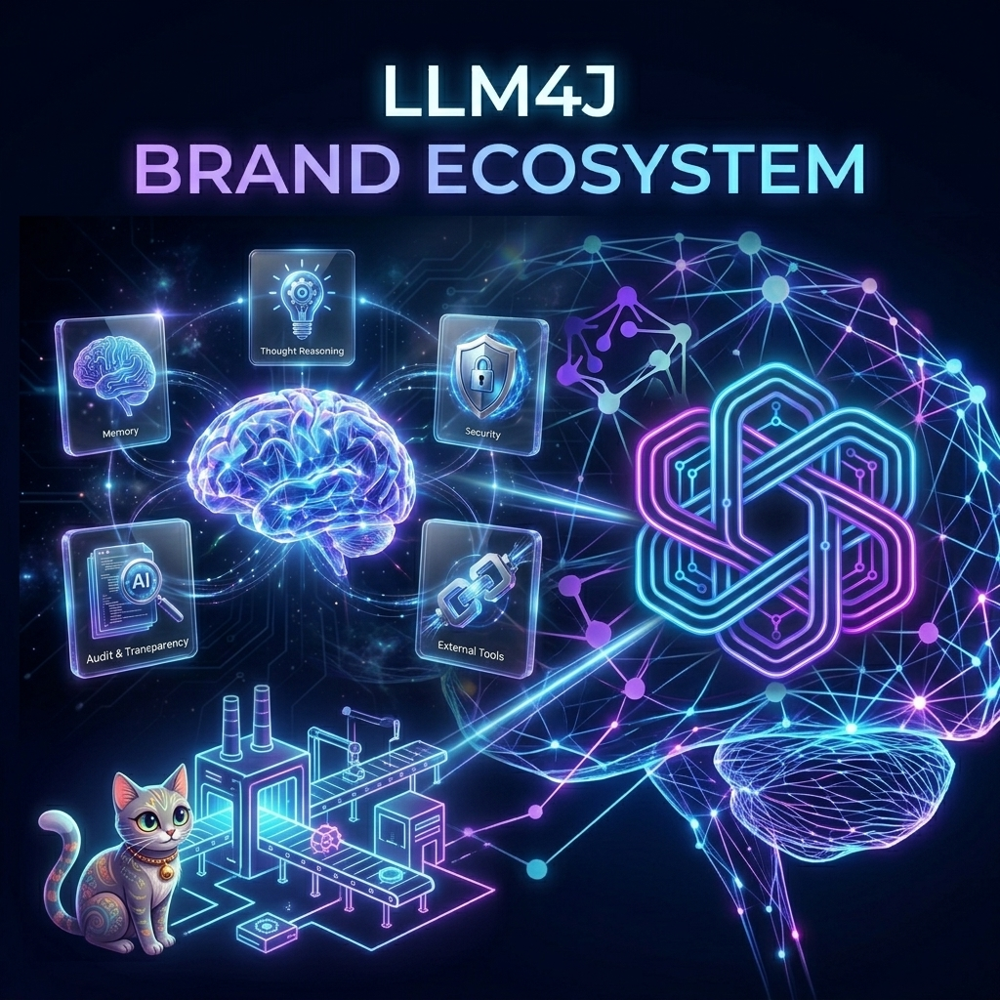
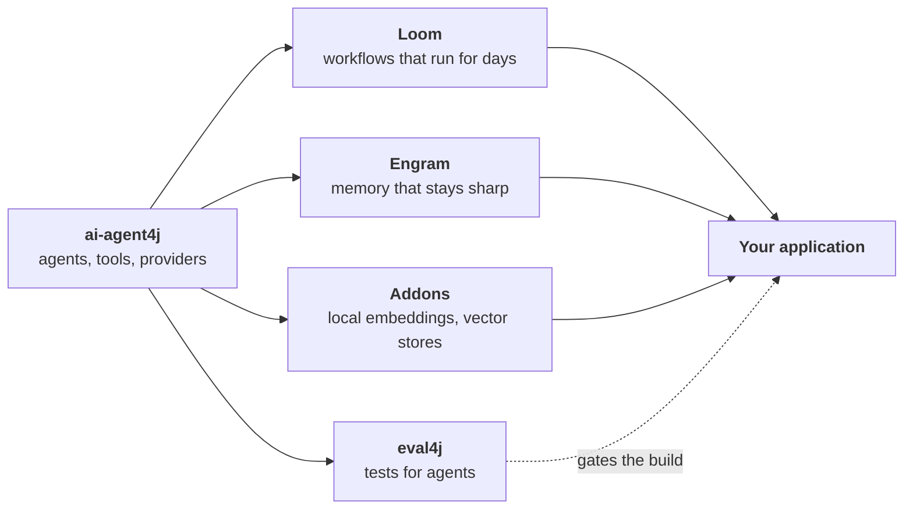

<h1 align="center">llm4j</h1>

<p align="center">
  <b>AI agents, written the Java way.</b><br>
  Typed, testable, observable: from a single tool call to autonomous workflows that run for days.
</p>

<p align="center">
  <a href="https://central.sonatype.com/artifact/io.github.srijithunni7182/ai-agent4j"></a>
  <a href="https://www.oracle.com/java/technologies/downloads/#java17"></a>
  <a href="LICENSE"></a>
  
</p>

<p align="center">
  <a href="ai-agent4j/wiki/Getting-Started.md">Get started</a> ·
  <a href="#the-stack">The stack</a> ·
  <a href="#see-it-built">Showcases</a> ·
  <a href="#explore-the-docs">Docs</a> ·
  <a href="ai-agent4j/wiki/WHY_AI_AGENT4J.md">Why ai-agent4j?</a> ·
  <a href="loom/ai-agent4j-loom/WHY_LOOM.md">Why Loom?</a>
</p>

---

## Java deserves first-class AI

For twenty-five years Java has run the systems that can't go down: banks, airlines, telecoms, the
back offices of the world. Java developers have strong reasons to trust it:

- **Types** catch mistakes before the program runs.
- **Interfaces** keep contracts honest.
- **Objects** own their state and their behaviour.
- **The compiler is the first reviewer**, the IDE refactors a thousand call sites safely, and the JVM
  runs for months without a restart.

Then AI arrived, and the ecosystem went mostly to Python: dictionaries passed between untyped
functions, prompts in string templates, and agents you can't unit test.

**llm4j is the other path.** It is a complete AI stack written from the ground up in idiomatic Java,
with no vendor SDKs, where an agent is as ordinary as a `PaymentService`. It's no less capable; it's
built the way Java developers already build everything else.

---

## An agent is just an object

In llm4j, every part of an AI system maps onto something a Java developer already knows:

| AI concept | In llm4j, it's… |
|---|---|
| A language model | An `LLMClient` interface. Gemini, Sarvam, Ollama and Claude sit behind [one contract](ai-agent4j/wiki/Providers-and-the-Uniform-Contract.md), so switching is one line. |
| A tool the model can use | A class that implements `Tool`, with a name, a description and an `execute` method. |
| A prompt | A versioned resource in a [`PromptRegistry`](ai-agent4j/wiki/Prompt-Registry-Guide.md), or a Markdown [skill](ai-agent4j/wiki/Agent-Skills-Guide.md) on the classpath. Not a string buried in code. |
| An agent | An immutable object built with a builder, from a client, tools, skills, memory and a budget. |
| A risky action | `requiresApproval(args)` on the tool, and an `ApprovalCallback` that a person answers. |
| A spending limit | A `Budget` value object, checked before every model call. |
| Something going wrong | A typed exception: `AuthenticationException`, `RateLimitException` with the exact reset time, `ContentBlockedException`. |
| A test | An AssertJ assertion, in JUnit, in your normal build. |

Here is what that looks like. A tool is a class:

```java
public class RefundTool implements Tool {
    private final Payments payments;

    public RefundTool(Payments payments) { this.payments = payments; }

    @Override public String getName()        { return "refund"; }
    @Override public String getDescription() { return "Refund an order. Args: orderId, amount"; }

    @Override
    public String execute(Map<String, Object> args) {
        return payments.refund((String) args.get("orderId"), ((Number) args.get("amount")).doubleValue());
    }

    @Override
    public boolean requiresApproval(Map<String, Object> args) {
        return ((Number) args.get("amount")).doubleValue() > 100;     // big refunds need a person
    }
}
```

An agent is composed like any other object:

```java
ReActAgent support = ReActAgent.builder()
        .llmClient(client)                                            // any provider
        .addSkill(AgentSkill.fromClasspath("skills/refund-policy.md"))  // domain knowledge, in Markdown
        .addTool(new RefundTool(payments))
        .approvalCallback((tool, args, plan) -> supervisor.confirm(tool, args))
        .budget(Budget.builder().tokens(20_000).build())              // it cannot overspend
        .build();

AgentResult result = support.run("Customer 42 was charged twice for order A-17.");
```

And it's tested like any other object, with [eval4j](eval4j/):

```java
assertThat(support.run(question))
        .usesTool("refund")
        .completedSuccessfully()
        .is(presets.taskCompletion(question));    // an LLM judge, as an AssertJ Condition
```

No framework magic, no annotation processors, no hidden global state. Just classes, interfaces and a
builder, and a compiler that has your back.

---

<a id="the-stack"></a>

## The stack: one agent to a whole organisation of them

Each module answers the question the previous one raises.


```mermaid
flowchart LR
    A["<b>ai-agent4j</b><br/>agents, tools, providers"] --> L["<b>Loom</b><br/>workflows that run for days"]
    A --> E["<b>Engram</b><br/>memory that stays sharp"]
    A --> X["<b>Addons</b><br/>local embeddings, vector stores"]
    A --> V["<b>eval4j</b><br/>tests for agents"]
    L --> G["<b>Your application</b>"]
    E --> G
    X --> G
    V -.->|gates the build| G
```

### 🏗️ [ai-agent4j](ai-agent4j/): *"How do I build an agent?"*

The core library, about 440 KB with no vendor SDKs.

- **Reasoning and acting.** ReAct agents reason, call tools, and correct themselves.
- **Where tools come from.**
  - your own classes;
  - built-ins such as a calculator and web search;
  - any REST API, via its [OpenAPI spec](ai-agent4j/wiki/OpenAPI-Tool.md);
  - any [MCP server](ai-agent4j/wiki/MCP-Integration.md).
- **Building blocks.**
  - Memory: [short-term and semantic](ai-agent4j/wiki/Memory-and-Persistence.md).
  - Knowledge: [RAG](ai-agent4j/wiki/RAG-Support.md) and [knowledge graphs](ai-agent4j/wiki/Knowledge-Graphs.md).
  - Behaviour: [personas](ai-agent4j/wiki/Agent-Personas.md), delegation between agents, and scheduling.
- **Voice.** Speech-to-text and text-to-speech in Indian languages, through Sarvam.
- **Built to see inside.** Every agent explains itself, with audit trails, PII masking and confidence
  scores ([xAI](ai-agent4j/wiki/xAI_BEYOND_BLACK_BOXES.md)).
- **Built for production.** [Budgets and rate limits](ai-agent4j/wiki/Budgets-and-Rate-Limits.md) keep
  a runaway loop from becoming a runaway bill.

### 🧵 [Loom](loom/ai-agent4j-loom/): *"How do many agents work together, reliably, for days?"*

One agent is a function call. A business process is many agents, people and hours of waiting.
Loom is a small language for exactly that. The agents reason; **the script governs**:

```text
budget { tokens: 100000 per day  when_exhausted: suspend }

workflow Digest(topic) {
    delegate "Find today's news on {topic}" to Researcher -> findings expecting { items: list }
    for each item in findings.items { delegate "Summarise {item.url}" to Writer -> summary }
    human_prompt "Publish today's digest? (yes/no)" -> go
    alt (go == "yes") { handoff "Publish" to Publisher }
}

schedule Morning { cron: "0 7 * * *"  run: Digest(topic="AI agents") }
```

What the runtime does for you:

- journals every step, so runs survive restarts;
- waits for people without holding a thread;
- pauses on rate limits and resumes when they lift;
- enforces budgets before each call;
- runs on schedules without a hosted platform;
- ships six generic tools usable from the script with no Java: `webhook`, `email`, `http`, `file`, `shell` and read-only `sql`, with a journal so a crash never sends the same message twice ([Generic Tools](loom/ai-agent4j-loom/LOOM_GUIDE.md#generic-tools), [daily digest sample](loom/ai-agent4j-loom/samples/digest/));
- finds problems with `weave check` before anything runs.

👉 [Loom overview](loom/ai-agent4j-loom/README.md) · [**Why Loom?**](loom/ai-agent4j-loom/WHY_LOOM.md) ·
[Language guide](loom/ai-agent4j-loom/LOOM_GUIDE.md)

### 🧠 [Engram](engram/engram-core/): *"How does an agent remember without drowning in context?"*

Long conversations bloat prompts and dilute attention. Engram replaces the growing transcript with a
**retrieve-and-synthesise loop**:

- it extracts the facts that matter;
- it writes a short, task-specific briefing for each turn;
- it corrects its own memories as new information arrives.

The prompt stays small and sharp however long the relationship runs.
👉 [Agentic workflows with Loom and Engram](docs/AGENTIC_WORKFLOWS_GUIDE.md)

### 🧩 [Addons](ai-agent4j-addons/): *"How do I keep my data private and my costs at zero?"*

The heavy-lifting pieces, kept out of the core so it stays light:

- **Local embeddings**: ONNX and DJL models on your own machine, with no API calls and no per-token cost.
- **Persistent vector stores**: PostgreSQL with pgvector, or Pinecone.

### 🔧 [Tools](ai-agent4j-tools/): *"How do I let an agent act on the world safely?"*

Ready-made tools built for the case where the model picks the arguments: `webhook` (Slack, Discord, Teams),
`email`, `http`, `file`, `shell` and read-only `sql`. Each has allow-lists, size and time limits, secrets scrubbed from
every result, and a journal so a crash never repeats a send. Use them from Java, or from a Loom script with no Java.

### 🧪 [eval4j](eval4j/): *"How do I know it works, and keeps working?"*

Agents are non-deterministic, which is no excuse for not testing them. eval4j is a testing framework
built for Java, not ported from Python:

- **AssertJ assertions on what agents did**: which tools they called, in what order, and how confident
  they were.
- **LLM-as-judge conditions**: correctness, relevancy, groundedness, hallucination, task completion,
  bias and toxicity.
- **YAML golden datasets**, run through plain JUnit 5.
- **Pass-rate thresholds** for noisy judges.

It runs in `mvn test`, next to the rest of your suite. 👉 [Why eval4j?](ai-agent4j/wiki/WHY_EVAL4J.md)

### Together

**Put together**, it is a complete alternative ecosystem:

- ai-agent4j gives agents that are **objects**;
- Loom arranges them into **processes** that survive the real world;
- Engram and the addons give them **memory and knowledge**;
- eval4j turns quality into a **build gate**.

It's all Java, on the JVM you already operate, monitor and trust.

---

<a id="see-it-built"></a>

## See it built

The best argument for a stack is what people build with it. Every app below lives in this repo and runs.

### ⚡ [GetViral](examples/getviral/): the flagship

**One idea in; a ready-to-post pack for X, Instagram Reels and YouTube out.** Twelve agents, one Loom
workflow, every module in the repo.

- A Researcher cites every fact it finds.
- A Showrunner writes each specialist's prompt, live.
- An ArtDirector and a VideoEditor produce real images and a real MP4.
- An eval4j quality gate sends failing work back until every platform passes.
- Human approval comes before anything is published.

It runs as a multi-user website on Cloud Run, and on a laptop with one command, **with no API key
needed**.
👉 [Get viral](examples/getviral/README.md)

| | |
|---|---|
| 🚀 **[Hexamind Hub](examples/hexamind-hub/README.md)** | A digital boardroom. Six agents with distinct personalities, including a cynical skeptic and a creative thinker, debate your problem live over WebSockets and reach consensus. |
| 🏭 **[Nirmaan Yantra](examples/nirmaan-yantra/README.md)** | An autonomous software factory: spec → tests → code → QA → release, from a one-line prompt. It fixes its own build errors and detects dead ends. |
| 🐈 **[Kingini](examples/kingini/README.md)** | A voice-first companion for children: a whimsical Kerala cat who talks in Malayalam, built on Sarvam speech-to-text, LLM and text-to-speech. |
| 📧 **[Gmail MCP App](examples/gmail-mcp-app/)** | Agents that read, draft and send email through the Model Context Protocol, with human approval before anything is sent. |

---

## Get started in five minutes

```xml
<dependency>
    <groupId>io.github.srijithunni7182</groupId>
    <artifactId>ai-agent4j</artifactId>
    <version>5.0</version>
</dependency>
```

```java
LLMClient client = new DefaultLLMClient(new GoogleProvider(LLMConfig.builder()
        .apiKey(System.getenv("GEMINI_API_KEY")).defaultModel("gemini-2.5-flash").build()));

AgentResult result = ReActAgent.builder().llmClient(client).addTool(new CalculatorTool()).build()
        .run("What is 1234 * 5678?");
```

Add `ai-agent4j-loom` and `ai-agent4j-addons` in the same way (see the
[Version Matrix](docs/VERSION_MATRIX.md)). The [Quick Start Guide](ai-agent4j/wiki/Getting-Started.md)
takes it from there.

---

<a id="explore-the-docs"></a>

## Explore the docs

| Build agents | Orchestrate | Ship with confidence |
|---|---|---|
| [Quick Start](ai-agent4j/wiki/Getting-Started.md) | [Loom overview](loom/ai-agent4j-loom/README.md) | [eval4j guide](eval4j/README.md) |
| [ReAct Agent Guide](ai-agent4j/wiki/ReAct-Agent-Guide.md) | [Why Loom?](loom/ai-agent4j-loom/WHY_LOOM.md) | [Budgets and Rate Limits](ai-agent4j/wiki/Budgets-and-Rate-Limits.md) |
| [Providers and the Uniform Contract](ai-agent4j/wiki/Providers-and-the-Uniform-Contract.md) | [Loom Language Guide](loom/ai-agent4j-loom/LOOM_GUIDE.md) | [xAI: Beyond Black Boxes](ai-agent4j/wiki/xAI_BEYOND_BLACK_BOXES.md) |
| [Creating Custom Tools](ai-agent4j/wiki/Creating-Custom-Tools.md) | [Budgets, Pausing and Scheduling](loom/ai-agent4j-loom/BUDGETS_AND_SCHEDULING.md) | [Testing Strategy](docs/TESTING_STRATEGY.md) |
| [Agent Skills](ai-agent4j/wiki/Agent-Skills-Guide.md) · [Personas](ai-agent4j/wiki/Agent-Personas.md) | [Agentic Workflows with Loom and Engram](docs/AGENTIC_WORKFLOWS_GUIDE.md) | [API Compatibility Policy](docs/API_COMPATIBILITY.md) |
| [Memory](ai-agent4j/wiki/Memory-and-Persistence.md) · [Semantic Memory](ai-agent4j/wiki/SEMANTIC_MEMORY.md) | [Loom CTK (conformance)](loom/ctk/README.md) | [Version Matrix](docs/VERSION_MATRIX.md) |
| [RAG](ai-agent4j/wiki/RAG-Support.md) · [Knowledge Graphs](ai-agent4j/wiki/Knowledge-Graphs.md) | [VS Code extension](loom/vscode-loom/README.md) | [Migration Guide 5.0](docs/MIGRATION_GUIDE_5_0.md) |
| [MCP](ai-agent4j/wiki/MCP-Integration.md) · [OpenAPI Tool](ai-agent4j/wiki/OpenAPI-Tool.md) · [Prompt Registry](ai-agent4j/wiki/Prompt-Registry-Guide.md) | | |
| [Sarvam](ai-agent4j/docs/SARVAM.md) · [Ollama](ai-agent4j/docs/OLLAMA.md) | | |

> [!TIP]
> **[Why AI Agent4J? Our comparison against LangChain4j and Spring AI](ai-agent4j/wiki/WHY_AI_AGENT4J.md)**
>
> **[Why Loom? Long-running, autonomous workflows, and how Loom goes further than LangGraph](loom/ai-agent4j-loom/WHY_LOOM.md)**
>
> **[Why eval4j? Our comparison against deepeval](ai-agent4j/wiki/WHY_EVAL4J.md)**
>
> **[xAI Beyond Black Boxes: Our 95% Compliance Guide](ai-agent4j/wiki/xAI_BEYOND_BLACK_BOXES.md)**

## 📐 Project Standards

- [Testing Strategy](docs/TESTING_STRATEGY.md)
- [API Compatibility Policy](docs/API_COMPATIBILITY.md)
- [Contributing Guide](CONTRIBUTING.md)

## 💡 Our Philosophy

1. **Java First**: AI isn't just for Python. Java's strong typing, concurrency, and ecosystem make it perfect for building robust AI systems.
2. **Ground Up**: We minimize dependencies. By building our own ReAct loop and provider clients, we gain full control and understanding of the LLM's behavior.
3. **Transparency**: We believe in "glass-box" AI. You should be able to see exactly what your agent is thinking and why it made a decision.

---

MIT License
