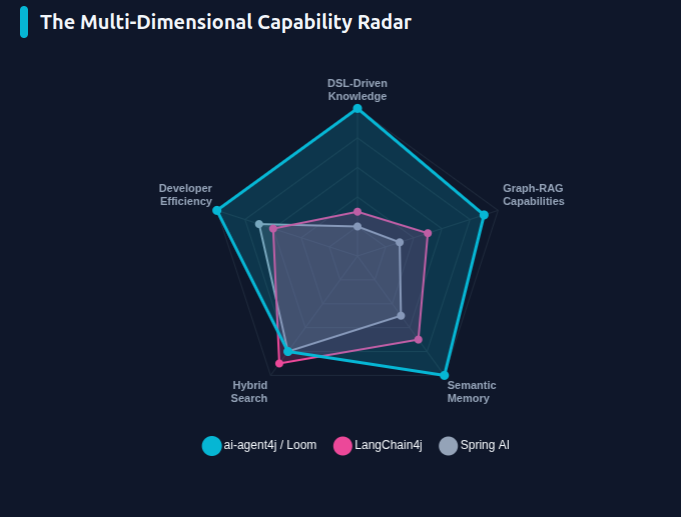

# AI Agent4J Loom

Loom is a **Neuro-Symbolic Domain Specific Language (DSL)** designed specifically for orchestrating stateful, multi-agent AI workflows.

👉 **[Read the Loom Learning Guide](LOOM_GUIDE.md)**

## 🧠 Neuro-Symbolic Orchestration
Loom bridges the gap between the probabilistic nature of Large Language Models (**Neural**) and the deterministic reliability of programmatic logic (**Symbolic**). 

### The Harness as Symbolic AI
The Loom `Harness` acts as the skeletal system of your AI application. While agents generate content using neural networks, the Harness ensures that:
- **Routing is rigid**: A `handoff` never ends up at the wrong agent.
- **State is immutable**: Variables are managed in a thread-safe symbolic context.
- **Safety is hard-coded**: Guardrails like PII detection intercept neural outputs before they reach the user.

### Why a DSL?
Customizing agent behavior in code often leads to massive boilerplate. Loom-like DSLs provide:
- **Hot-Swappable Logic**: Change your entire multi-agent workflow without recompiling Java.
- **Domain-Specific Constraints**: Embed business rules directly into the orchestration script.
- **Separation of Concerns**: Data scientists tune the neural layer (Agents), while engineers manage the symbolic layer (Loom).

## ⚒️ The 'weave' CLI
Loom includes `weave`, a powerful CLI to manage your workflows:
- **`weave run`**: Immediate execution of `.loom` scripts.
- **`weave package`**: Encapsulates scripts and dependencies into executable JARs (Thin or Fat).
- **Interactive Playground**: Rapidly prototype workflows using real-time feedback.

## 📊 Loom vs. The World
Loom was designed to address the specific gaps in existing AI orchestration frameworks. Below is a multi-dimensional comparison based on core agentic requirements:



Loom excels in **DSL-Driven Knowledge** and **Developer Efficiency** by providing a symbolic layer that is decoupled from the underlying Java implementation, allowing for rapid iteration and robust "Neuro-Symbolic" control.

## Core Features
*   **External DSL Runtime:** Loom ships with a handcrafted Lexer, Recursive Descent Parser, and AST Execution Engine that dynamically boots agents without recompiling Java.
*   **Modular Architecture**: Split large workflows into multiple files using the `import` statement. All agents, workflows, and configurations are merged into a flat namespace.
*   **Expressive Routing:** Support for structural semantics like `handoff`, `delegate`, `broadcast` (parallel stream execution), `alt` (conditionals), and `loop until`.
*   **Human-In-The-Loop:** Built-in semantic support for `human_prompt` to easily pause execution and await external human verification or input without thread blocking trickery.
*   **Inversion of Control via `.loot`:** Rigid adherence to the principle of least privilege. Workflows define tools by name inside `.loom`, but the actual fully qualified Java classpath mapping must be explicitly provided in a separate `.loot` file, dynamically instantiated using Reflection.

## ✨ Key Features (The Frontier)

*   🚀 **Structured Neuro-Symbolic Output**: Enforce strict JSON schemas (Enums, Lists, Objects) on neural generations using the `output_schema` block.
*   🛡️ **Resilience Contracts**: Direct DSL support for `retry <n>` and `on_failure { ... }` blocks to handle model instability or API failures.
*   🧩 **Sub-workflow Composition**: Build reusable agentic primitives using the `call` statement with isolated variable scopes.
*   🎯 **Typed Symbolic Checks**: Perform logic checks on nested JSON paths (e.g. `alt (report.status == "OK")`) directly in your workflows.

---

## 1. Defining Agents
Agents are bounded blocks where you assign models, prompt architectures, and tool capabilities.

```text
agent WorkerA {
    model: "claude-3-haiku"
    system: "You are a data evaluation specialist."
    tools: [DatabaseSearch] 
}

agent Critic {
    model: "gpt-4o"
    system: "You evaluate logical flow."
    tools: []
}
```

## 2. Orchestrating Workflows
Workflows map execution sequences. Variables are routed downstream using the `->` operator.

```text
workflow ExecuteTask() {
    note "Initializing parallel fetch"
    
    // Broadcast concurrently runs all agents using parallel Java streams.
    broadcast "Analyze standard metrics" to [WorkerA, WorkerB] -> analysis

    // Conditional evaluation dynamically queries the context state
    alt (quality_score > 0.8) {
        delegate "Proceed with submission." to WorkerA -> submission
    } else {
        // Pausing for manual intervention
        loop until (is_approved == "true") {
             delegate "Fix formatting: analysis" to WorkerA -> analysis
             human_prompt "Review formatted output. Type true to approve." -> is_approved
        }
    }
    
    note "Execution concluded."
    handoff "Final Submission: analysis" to TerminalAgent
}
```

## 3. Dynamic Tooling (`.loot` Files)
"Loot" is "Tool" backwards! To ensure a neuro-symbolic separation, your `.loom` scripts never touch source code. Instead, you declare a `.loot` companion file containing key-value reflection targets that `LootLoader` will inject tightly upon initialization.

```properties
# tools.loot
DatabaseSearch = io.github.llm4j.tools.SqlTool
WebCalculator = com.mycompany.tools.MathEngine
```

## Usage in Java
The `HarnessExecutor` bridge evaluates the AST directly into active JVM `ReActAgent` calls.

```java
// 1. Read files
String scriptContent = Files.readString(Path.of("orchestration.loom"));
String lootPath = "tools.loot";

// 2. Parse Code
Lexer lexer = new Lexer(scriptContent);
LoomParser parser = new LoomParser(lexer.tokenize());
LoomScript script = parser.parseScript();

// 3. Register Tools
ToolRegistry registry = new ToolRegistry();
new LootLoader().loadIntoRegistry(lootPath, registry);

// 4. Execute Workflow
HarnessExecutor executor = new HarnessExecutor(script, registry, myClientFactory);
executor.initialize();
executor.executeWorkflow("ExecuteTask", new HashMap<>());
```

## Status
Loom is fully tested and capable of orchestrating highly sophisticated graphs including N-round debates, parallel MapReduce sweeps, and Human-in-the-Middle approvals directly out of the box.
