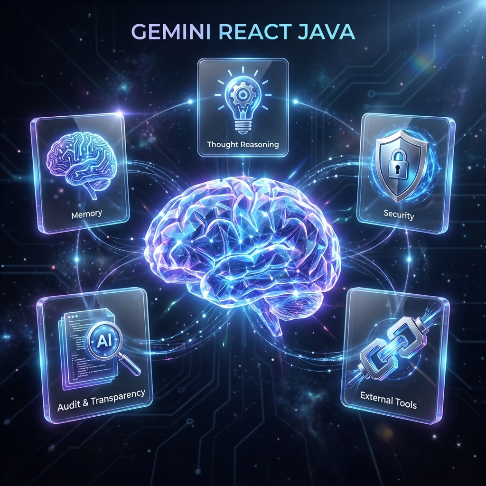
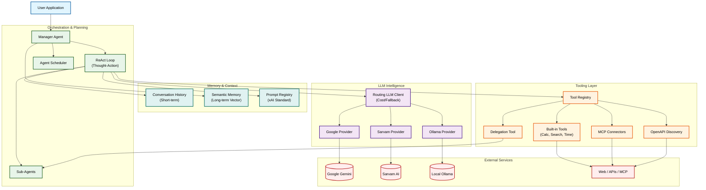

# AI Agent4J (Formerly Gemini ReAct Java)

> [!NOTE]
> This project was formerly known as `gemini-react-java`.
> **The Lightweight LLM Library for Java developers.**



**Build autonomous agents, RAG pipelines, and specialized tools with Google Gemini, Sarvam AI, and local LLMs.**

[](https://central.sonatype.com/artifact/io.github.srijithunni7182/ai-agent4j)
[](https://opensource.org/licenses/MIT)
[](https://www.oracle.com/java/technologies/downloads/#java17)

`ai-agent4j` is a high-performance, modular LLM library for Java that prioritizes simplicity and correctness. It provides a unified API for cloud providers (Gemini), regional specialists (Sarvam AI), and local models (Ollama).

---

## 📊 Project Stats

| 📏 **Lines of Code** | 🧪 **Test Cases** | ⏱️ **Development Time** | 📦 **Commits** | 🧠 **Supported LLMs** | 🪶 **Library Size** |
| :---: | :---: | :---: | :---: | :---: | :---: |
| **13,700+** | **438+** | **1.5+ Months** | **36+** | **Gemini, Sarvam, Ollama** | **~308 KB** |

---

## 📚 Documentation Hub

Explore the full capabilities of the framework through our detailed guides:

### Core Framework

- [**Quick Start Guide**](wiki/Getting-Started.md) — Get up and running in 5 minutes.
- [**ReAct Agent Guide**](wiki/ReAct-Agent-Guide.md) — Reasoning, tool-use, and the Thought-Action-Observation loop.
- [**Memory & Persistence**](wiki/Memory-and-Persistence.md) — Managing conversation history and long-term storage.
- [**Real-time Streaming**](wiki/Thought-Streaming.md) — Capturing agent "thoughts" for responsive UIs via SSE/WebSockets.
- [**Advanced Configuration**](wiki/Advanced-Configuration.md) — Retry policies, custom tools, and error handling.

### Advanced Features

- [**Agent Personas**](wiki/Agent-Personas.md) — Configuring behavioral traits and expertise.
- [**Agent Skills**](wiki/Agent-Skills-Guide.md) — Injecting domain knowledge via Markdown files.
- [**Semantic Long-Term Memory**](wiki/SEMANTIC_MEMORY.md) — Vector-backed recall of user facts.
- [**Prompt Registry (xAI Standard)**](wiki/Prompt-Registry-Guide.md) — Versioned, externalized prompt management.
- [**RAG & Embeddings**](wiki/RAG-Support.md) — Retrieval-Augmented Generation and Vector Stores.
- [**Knowledge Graphs**](wiki/Knowledge-Graphs.md) — Reasoning over structured entity-relationship data.

### Integrations

- [**🇮🇳 Sarvam AI Guide**](docs/SARVAM.md) — Indian language voice agents (TTS, STT, Translation).
- [**🏠 Ollama Integration**](docs/OLLAMA.md) — Running local models like Gemma and Llama with zero cost/internet.
- [**🔌 MCP Integration**](wiki/MCP-Integration.md) — Connecting to Model Context Protocol servers.

---

## 🚀 Key Features

- **🤖 Google Gemini Native**: Optimized support for Gemini 1.5 Flash, Pro, and 2.x.
- **🛠️ ReAct Agent Framework**: Built-in reasoning loops with self-correction.

### Steps to Create a Tool

1. **Implement the `Tool` interface**: Define the tool's name, description, and execution logic.
2. **Add to the Agent Builder**: Register your tool so the agent can discover it.

- **🧬 Autonomous Orchestration**: Manager-Worker patterns with agent delegation.
- **⏰ Scheduled Tasks**: Native support for recurring autonomous background actions.
- **🚦 Intelligent Provider Routing**: Cost-aware routing and automatic rate-limit failover.
- **🔍 xAI Standards Compliance**: Transparent reasoning and audit trails for explainable AI.
- **🔒 Private & Local**: Zero-cost, 100% private retrieval via `rag-addons`.

---

## 🏗️ Architecture



---

## Installation

### Maven

```xml
<dependency>
    <groupId>io.github.srijithunni7182</groupId>
    <artifactId>ai-agent4j</artifactId>
    <version>5.0</version>
</dependency>
```

### Gradle

```kotlin
implementation("io.github.srijithunni7182:ai-agent4j:5.0")
```

---

## Quick Start (Google Gemini)

```java
import io.github.llm4j.DefaultLLMClient;
import io.github.llm4j.LLMClient;
import io.github.llm4j.config.LLMConfig;
import io.github.llm4j.model.LLMRequest;
import io.github.llm4j.provider.google.GoogleProvider;

public class GeminiExample {
    public static void main(String[] args) {
        LLMConfig config = LLMConfig.builder()
                .apiKey(System.getenv("GOOGLE_API_KEY"))
                .defaultModel("gemini-1.5-flash")
                .build();
        
        LLMClient client = new DefaultLLMClient(new GoogleProvider(config));
        
        LLMResponse response = client.chat(LLMRequest.builder()
                .addUserMessage("What is ai-agent4j?")
                .build());
                
        System.out.println(response.getContent());
    }
}
```

---

## License

This project is licensed under the MIT License - see the [LICENSE](../LICENSE) file for details.

## Support

For issues, questions, or contributions, please use the [GitHub Issues](https://github.com/srijithunni7182/llm4j/issues) page.
