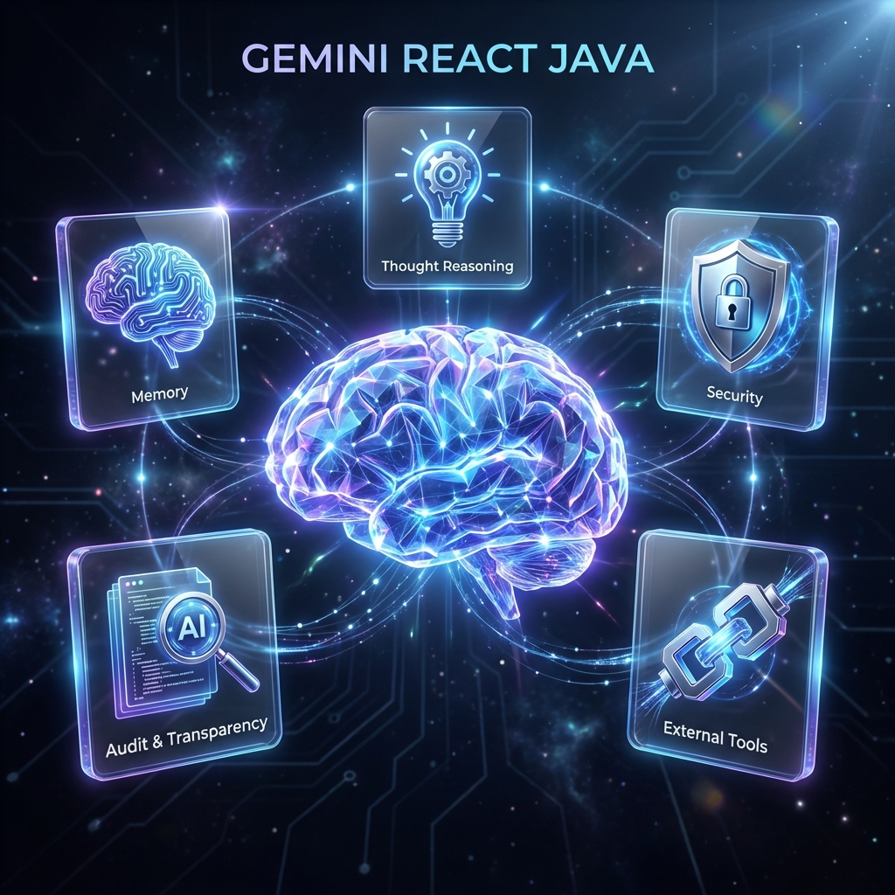
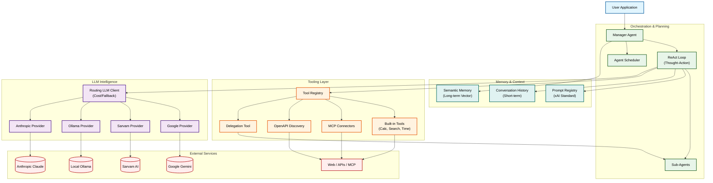

# AI Agent4J (Formerly Gemini ReAct Java)

> [!NOTE]
> This project was formerly known as `gemini-react-java`.
> **The Lightweight LLM Library for Java developers.**



**Build autonomous agents, RAG pipelines, and specialized tools with Google Gemini, Anthropic Claude, Sarvam AI, and local LLMs.**

[](https://central.sonatype.com/artifact/io.github.srijithunni7182/ai-agent4j)
[](https://opensource.org/licenses/MIT)
[](https://www.oracle.com/java/technologies/downloads/#java17)

`ai-agent4j` is a high-performance, modular LLM library for Java that prioritizes simplicity and correctness. It provides a unified API for cloud providers (Gemini, Claude), regional specialists (Sarvam AI), and local models (Ollama). Every provider meets [one contract](wiki/Providers-and-the-Uniform-Contract.md): the same requests, finish reasons, exceptions and streaming, so you switch models by changing a name.

---

## 📊 Project Stats

| 📏 **Lines of Code** | 🧪 **Test Cases** | ⏱️ **Development Time** | 📦 **Commits** | 🧠 **Supported LLMs** | 🪶 **Library Size** |
| :---: | :---: | :---: | :---: | :---: | :---: |
| **17,000+** | **650+** | **1.5+ Months** | **100+** | **Gemini, Claude, Sarvam, Ollama** | **~440 KB** |

---

## 📚 Documentation Hub

Explore the full capabilities of the framework through our detailed guides:

### Core Framework

- [**Quick Start Guide**](wiki/Getting-Started.md) — Get up and running in 5 minutes.
- [**ReAct Agent Guide**](wiki/ReAct-Agent-Guide.md) — Reasoning, tool-use, and the Thought-Action-Observation loop.
- [**Memory & Persistence**](wiki/Memory-and-Persistence.md) — Managing conversation history and long-term storage.
- [**Real-time Streaming**](wiki/Thought-Streaming.md) — Capturing agent "thoughts" for responsive UIs via SSE/WebSockets.
- [**Providers and the Uniform Contract**](wiki/Providers-and-the-Uniform-Contract.md) — Switch between Gemini, Claude, Sarvam and Ollama by changing a name; streaming, finish reasons and exceptions that mean the same everywhere.
- [**Advanced Configuration**](wiki/Advanced-Configuration.md) — Retry policies, custom tools, and error handling.
- [**Budgets and Rate Limits**](wiki/Budgets-and-Rate-Limits.md) — Cap tokens, calls or money; budgets that refill; reading 429s and pausing until the limit lifts.

### Advanced Features

- [**Agent Personas**](wiki/Agent-Personas.md) — Configuring behavioral traits and expertise.
- [**Agent Skills**](wiki/Agent-Skills-Guide.md) — Injecting domain knowledge via Markdown files.
- [**Semantic Long-Term Memory**](wiki/SEMANTIC_MEMORY.md) — Vector-backed recall of user facts.
- [**Prompt Registry (xAI Standard)**](wiki/Prompt-Registry-Guide.md) — Versioned, externalized prompt management.
- [**RAG & Embeddings**](wiki/RAG-Support.md) — Retrieval-Augmented Generation and Vector Stores.
- [**Knowledge Graphs**](wiki/Knowledge-Graphs.md) — Reasoning over structured entity-relationship data.

### Integrations

- [**🧠 Anthropic Claude**](wiki/Providers-and-the-Uniform-Contract.md#anthropic-claude) — Claude over plain HTTP, live-verified against the real API.
- [**🇮🇳 Sarvam AI Guide**](docs/SARVAM.md) — Indian language voice agents (TTS, STT, Translation).
- [**🏠 Ollama Integration**](docs/OLLAMA.md) — Running local models like Gemma and Llama with zero cost/internet.
- [**🔌 MCP Integration**](wiki/MCP-Integration.md) — Connecting to Model Context Protocol servers.

---

## 🚀 Key Features

- **🔁 One Contract, Any Provider**: Gemini, Claude, Sarvam and Ollama behave the same — requests, finish reasons, exceptions, token usage and streaming — checked by a shared conformance suite and a key-gated live suite. See [Providers and the Uniform Contract](wiki/Providers-and-the-Uniform-Contract.md).
- **🤖 Google Gemini Native**: Gemini 2.x and later, with native system instructions, thinking-aware usage and server-sent-event streaming.
- **🧠 Anthropic Claude**: `AnthropicProvider` over plain HTTP (no SDK): handles Claude's quirks (top-level system prompt, required `max_tokens`, models that reject `temperature`, refusals, 529 "overloaded") and streams.
- **🌊 Streaming Everywhere**: `chatStream` streams natively for every built-in provider (server-sent events for Gemini, Claude and Sarvam; NDJSON for Ollama): text chunks, then one final chunk with finish reason and usage. Custom providers that only implement `chat` still stream.
- **🚨 Typed Errors**: `AuthenticationException`, `InvalidRequestException`, `RateLimitException`, `ServiceUnavailableException` and `ContentBlockedException` for every provider, with the provider's message and request id, and never your key.
- **✅ Verified Live**: a key-gated live suite (`-Plive`) runs the same checks against the real APIs. Claude (`claude-opus-5-5`, `claude-haiku-4-5`) passes all of them, including one agent task run unchanged across providers.
- **🛠️ ReAct Agent Framework**: Built-in reasoning loops with self-correction. Add a tool by implementing `Tool` and registering it with `ReActAgent.builder().addTool(...)`.
- **🧬 Autonomous Orchestration**: Manager-Worker patterns with agent delegation.
- **⏰ Scheduled Tasks**: Native support for recurring autonomous background actions.
- **🚦 Intelligent Provider Routing**: Cost-aware routing and automatic rate-limit failover.
- **🔍 xAI Standards Compliance**: Transparent reasoning and audit trails for explainable AI.
- **🔒 Private & Local**: Zero-cost, 100% private retrieval via `rag-addons`.
- **💸 Cost Budgets**: Cap tokens, calls or money per agent; over-budget calls are refused before they reach the model. See below.

### Cost budgets

> The full guide — windows, `BudgetSet`, price tables, events, rate-limit parsing, recipes and API
> reference — is [**Budgets and Rate Limits**](wiki/Budgets-and-Rate-Limits.md).

Every token an agent spends goes through `LLMClient.chat()`, so that is where budgets are enforced:

```java
Budget budget = Budget.builder().tokens(50_000).calls(40).warnAt(0.8).build();

ReActAgent agent = ReActAgent.builder()
        .llmClient(client)
        .budget(budget)                 // refuse calls that can't be paid for
        .maxTokensPerCall(1500)         // and cap every answer
        .build();

AgentResult r = agent.run("Research the topic");
if (r.budgetExhausted()) {             // ran out part-way: this is its best answer so far
    System.out.println(r.getFinalAnswer() + " — " + r.getBudgetExceeded().getMessage());
}
System.out.println(budget.spent());    // tokens, calls, cost, and whether any usage was estimated
```

- **Before each call** the budget is checked and the call reserved; a call that can't fit throws
  `BudgetExceeded` without reaching the model (it is never retried). The answer's `maxTokens` is lowered
  to what is left.
- **After each call** the reservation is replaced by the provider's reported usage, or an estimate
  (about 4 characters per token) marked as estimated when a provider reports none.
- **Money** needs your own `PriceTable` (`PriceTable.load(path)`, lines of `model = input / output` per
  million tokens); none ship with the library. `ollama/*` models are free.
- **Many budgets at once** — run, agent, step — go in a `BudgetSet`; a call must fit them all and is charged
  to each. Concurrent calls can't jointly overspend. Use `BudgetedLLMClient` to meter any client directly.
- `onBudgetExhausted(BudgetPolicy.FAIL)` throws instead of returning the partial answer.
- **Budgets that refill**: `Budget.builder().tokens(100_000).window(Window.DAY)` limits spend per minute,
  hour or day; a refusal says when it refills (`BudgetExceeded.resetAt()`), and
  `onBudgetExhausted(BudgetPolicy.SUSPEND)` turns it into `RateLimited` for a harness to pause on.

### Rate limits

A provider's 429 says when to come back. The HTTP layer reads it — Gemini's error body (`RetryInfo`,
`QuotaFailure`; a per-day quota resets at midnight Pacific), Anthropic's `anthropic-ratelimit-*-reset`,
OpenAI's `x-ratelimit-reset-*`, or `Retry-After` — and:

- waits out limits that lift within 30 s, retrying exactly when they reset (plus a little jitter);
- raises `RateLimitException` for longer ones, with `info()` giving the reset **instant**, the kind of limit
  (requests, tokens, daily quota) and whether the time was estimated (no reset information: 60 s, doubling
  on repeated 429s, up to an hour).

```java
try {
    agent.run("Summarise today's papers");
} catch (RateLimited limited) {           // an AgentInterrupt: never retried, never a half answer
    scheduleRetryAt(limited.resetAt());   // e.g. 2026-09-28T07:00:00Z for Gemini's free-tier daily quota
}
```

`RetryPolicy.builder().inlineWaitThreshold(…).fallbackDelay(…).dailyResetZone(…)` tunes this. A refused call
counts as a call against a budget but costs no tokens, and `RoutingLLMClient` reports the soonest reset when
every tier is limited. Loom builds on this to pause workflows and resume them automatically.

---

## Recent Module Updates

- **Uniform provider contract**: Gemini, Claude, Sarvam and Ollama now share one set of request
  semantics (native system prompts, merged turns, settings a model rejects left out), normalised finish
  reasons (raw value in `metadata.finish_reason_raw`), typed exceptions and native streaming. Additive
  only: no public signature changed. One conformance suite checks all four against recorded wire formats
  in every build.
- **Anthropic provider**: `AnthropicProvider` talks to the Messages API over the library's own HTTP client:
  no SDK, no new dependency. It supports effort, streaming, refusals and 529 retries.
- **Live suite**: `mvn -Plive test` with `ANTHROPIC_API_KEY`, `GEMINI_API_KEY`, `SARVAM_API_KEY` or
  `OLLAMA_BASE_URL` runs the contract against the real APIs, under a token budget per provider. Default
  builds never run it.
- **ReAct protocol**: agents now ask models for a short `"plan"` note instead of a `"thought"` field.
  Claude Opus 5.5 refuses prompts that ask it to write out its reasoning; replies with `"thought"` are still
  accepted.
- **Gemini**: native `systemInstruction`, long answers split across parts kept whole, thinking tokens
  counted, and a bad key reported as `AuthenticationException` (Gemini sends a 400).
- **Budgets and rate limits**: token, call and money budgets, windows that refill, and 429 parsing with
  exact reset times. See [Budgets and Rate Limits](wiki/Budgets-and-Rate-Limits.md).
- **Human-in-the-Loop (HITL)**: an `ApprovalCallback` makes approvals explicit for sensitive tools. See
  `HumanInTheLoopTest`.

## 🏗️ Architecture


```mermaid
flowchart TB
    UserCode["User Application"]:::user

    subgraph Orchestration ["Orchestration & Planning"]
        Manager["Manager Agent"]:::agent
        SubAgent["Sub-Agents"]:::agent
        Planner["ReAct Loop<br/>(Thought-Action)"]:::agent
        Scheduler["Agent Scheduler"]:::agent
    end

    subgraph Memory ["Memory & Context"]
        History["Conversation History<br/>(Short-term)"]:::memory
        Semantic["Semantic Memory<br/>(Long-term Vector)"]:::memory
        Registry["Prompt Registry<br/>(xAI Standard)"]:::memory
    end

    subgraph Tooling ["Tooling Layer"]
        RegistryT["Tool Registry"]:::tool
        Builtin["Built-in Tools<br/>(Calc, Search, Time)"]:::tool
        MCP["MCP Connectors"]:::tool
        OpenAPI["OpenAPI Discovery"]:::tool
        Delegate["Delegation Tool"]:::tool
    end

    subgraph Core ["LLM Intelligence"]
        Router["Routing LLM Client<br/>(Cost/Fallback)"]:::core
        GoogleP["Google Provider"]:::core
        SarvamP["Sarvam Provider"]:::core
        OllamaP["Ollama Provider"]:::core
        AnthropicP["Anthropic Provider"]:::core
    end

    subgraph External ["External Services"]
        Gemini[("Google Gemini")]:::external
        Sarvam[("Sarvam AI")]:::external
        Ollama[("Local Ollama")]:::external
        Claude[("Anthropic Claude")]:::external
        Web["Web / APIs / MCP"]:::external
    end

    %% Connections
    UserCode --> Manager
    Manager --> Planner
    Planner --> SubAgent
    Planner --> Registry
    Planner --> History
    Planner --> RegistryT
    Planner --> Router

    Manager --> Scheduler
    Manager --> Semantic
    
    RegistryT --> Builtin
    RegistryT --> MCP
    RegistryT --> OpenAPI
    RegistryT --> Delegate
    Delegate --> SubAgent

    Router --> GoogleP
    Router --> SarvamP
    Router --> OllamaP
    Router --> AnthropicP

    GoogleP --> Gemini
    SarvamP --> Sarvam
    OllamaP --> Ollama
    AnthropicP --> Claude
    Builtin --> Web
    MCP --> Web
    OpenAPI --> Web

    classDef user fill:#e1f5fe,stroke:#01579b,stroke-width:2px,color:#000;
    classDef core fill:#f3e5f5,stroke:#4a148c,stroke-width:2px,color:#000;
    classDef agent fill:#e8f5e9,stroke:#1b5e20,stroke-width:2px,color:#000;
    classDef tool fill:#fff3e0,stroke:#e65100,stroke-width:2px,color:#000;
    classDef memory fill:#e0f2f1,stroke:#00695c,stroke-width:2px,color:#000;
    classDef external fill:#fee,stroke:#b71c1c,stroke-width:2px,color:#000;
```

---

## Installation

### Maven

```xml
<dependency>
    <groupId>io.github.srijithunni7182</groupId>
    <artifactId>ai-agent4j</artifactId>
    <version>5.0</version>
</dependency>
```

### Gradle

```kotlin
implementation("io.github.srijithunni7182:ai-agent4j:5.0")
```

---

## Quick Start (Google Gemini)

```java
import io.github.llm4j.DefaultLLMClient;
import io.github.llm4j.LLMClient;
import io.github.llm4j.config.LLMConfig;
import io.github.llm4j.model.LLMRequest;
import io.github.llm4j.model.LLMResponse;
import io.github.llm4j.provider.google.GoogleProvider;

public class GeminiExample {
    public static void main(String[] args) {
        LLMConfig config = LLMConfig.builder()
                .apiKey(System.getenv("GOOGLE_API_KEY"))
                .defaultModel("gemini-2.5-flash")
                .build();
        
        LLMClient client = new DefaultLLMClient(new GoogleProvider(config));
        
        LLMResponse response = client.chat(LLMRequest.builder()
                .addUserMessage("What is ai-agent4j?")
                .build());
                
        System.out.println(response.getContent());
    }
}
```

## Switching Providers

Only the provider line changes; requests, responses, streaming and exceptions stay the same:

```java
LLMProvider provider = new AnthropicProvider(LLMConfig.builder()
        .apiKey(System.getenv("ANTHROPIC_API_KEY")).defaultModel("claude-opus-5-5").build());
// or new GoogleProvider(...), new SarvamChatProvider(...), new OllamaProvider(...)

LLMClient client = new DefaultLLMClient(provider);

try (Stream<LLMResponse> chunks = client.chatStream(LLMRequest.builder()
        .addSystemMessage("Answer in one sentence.")
        .addUserMessage("What is a ReAct agent?")
        .build())) {
    chunks.forEach(c -> System.out.print(c.getContent()));   // the last chunk carries finishReason and usage
} catch (AuthenticationException | RateLimitException e) {   // the same types for every provider
    System.err.println(e.getMessage());
}
```

See [Providers and the Uniform Contract](wiki/Providers-and-the-Uniform-Contract.md) for the full contract
and how to run the live suite with your own keys.

---

## License

This project is licensed under the MIT License - see the [LICENSE](../LICENSE) file for details.

## Support

For issues, questions, or contributions, please use the [GitHub Issues](https://github.com/srijithunni7182/llm4j/issues) page.
