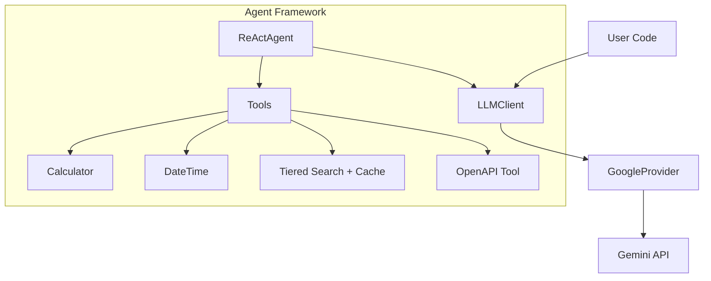

# 🚀 Gemini ReAct Java

**The Production-Ready Java Client for Google Gemini**

[](https://opensource.org/licenses/MIT)
[](https://www.oracle.com/java/technologies/downloads/#java17)
[]()

---

## 🌟 Why Gemini ReAct Java?

`gemini-react-java` is not just another API wrapper. It's a **comprehensive framework** designed to help you build intelligent, reasoning AI agents in Java.

> **"Honest, Verified Support"** — Every feature is backed by comprehensive integration tests against real Gemini endpoints.

---

👉 **[Learn more about the OpenAPI Tool](OpenAPI-Tool.md)**

---

## 🔥 Feature Spotlight: Search Optimization & Caching

**Build lightning-fast, cost-effective agents with tiered search.**

The new search framework allows you to chain multiple search providers (SerpAPI, DuckDuckGo, etc.) with a built-in **[Caching Layer](Creating-Custom-Tools.md#2-the-caching-pattern)**.

1. **🚀 Performance**: Successful search results are cached case-insensitively, serving future identical queries in milliseconds.
2. **💰 Cost Savings**: Dramatically reduces consumption of expensive search API credits by sharing results across agents.
3. **🛡️ Reliability**: Automatically falls back to secondary providers if the primary (e.g., SerpAPI) hits a quota limit.

---

## 📚 Quick Links

| Guide | Description |
|-------|-------------|
| **[🚀 Getting Started](Getting-Started.md)** | Installation, configuration, and your first "Hello World". |
| **[🤖 ReAct Agent](ReAct-Agent.md)** | Build agents that can reason, plan, and use tools. |
| **[🌐 OpenAPI Tool](OpenAPI-Tool.md)** | **NEW!** Auto-discover and use REST APIs dynamically. |
| **[🛠️ Custom Tools](Creating-Custom-Tools.md)** | Extend your agent's capabilities with custom logic. |

---

## ✨ Key Features

### 🤖 Google Gemini First

- **Full Integration**: Native support for Gemini 1.5 Flash, Pro, and 2.x models.
- **Auto-Discovery**: Automatically finds the latest available models.
- **Type-Safe**: Strongly typed request/response models.

### 🧠 Powerful ReAct Agents

- **Reasoning Loop**: Implements the "Reasoning + Acting" paradigm.
- **Pluggable Tools**: Easily add Calculator, Web Search, or custom tools.
- **Loop Detection**: Smart detection of infinite loops or repetitive actions.

### 🛡️ Production Ready

- **Robust Error Handling**: Specific exceptions for Auth, Rate Limits, and more.
- **Retry Policies**: Configurable exponential backoff strategies.
- **Thread-Safe**: Designed for high-concurrency environments.

---

## 🏗️ Architecture

Designed for simplicity and extensibility:



---

## 📦 Installation

### Maven

```xml
<dependency>
    <groupId>io.github.llm4j</groupId>
    <artifactId>gemini-react-java</artifactId>
    <version>0.1.0-SNAPSHOT</version>
</dependency>
```

### Gradle

```gradle
implementation 'io.github.llm4j:gemini-react-java:0.1.0-SNAPSHOT'
```

---

## 🤝 Support & Community

- **Found a bug?** [Open an Issue](https://github.com/srijithunni7182/llm4j/issues)
- **Have a question?** [Start a Discussion](https://github.com/srijithunni7182/llm4j/discussions)
- **Want to contribute?** Check out our [Contributing Guidelines](Contributing.md)

---

*Built with ❤️ for the Java AI Community.*
