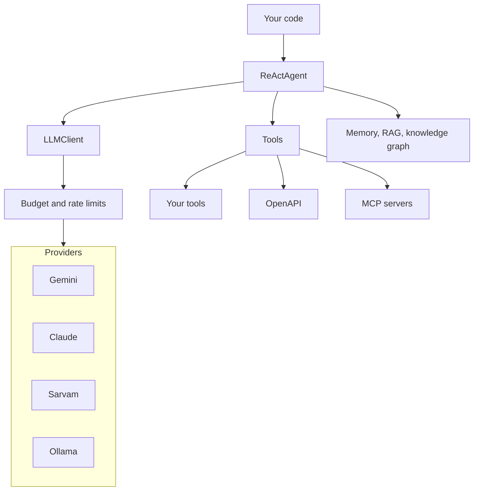

# 🚀 AI Agent4J

**AI agents, written the Java way.** A typed, testable, observable agent library with no vendor SDKs.

[](https://central.sonatype.com/artifact/io.github.srijithunni7182/ai-agent4j)
[](https://www.apache.org/licenses/LICENSE-2.0)
[](https://www.oracle.com/java/technologies/downloads/#java17)

`ai-agent4j` is the core of the [llm4j](../../README.md) stack. It gives you an `LLMClient` that speaks to
**Google Gemini, Anthropic Claude, Sarvam and Ollama** through one contract, a `ReActAgent` that reasons and
calls tools, and the building blocks around them: memory, RAG, knowledge graphs, budgets and rate limits.

> **Verified, not assumed.** Every provider passes one shared conformance suite on every build, and a
> separate live suite runs the same agent task against the real services. See
> [Providers and the Uniform Contract](Providers-and-the-Uniform-Contract.md#status-per-provider).

---

## 📚 Quick Links

| Guide | Description |
|-------|-------------|
| **[🚀 Getting Started](Getting-Started.md)** | Installation, configuration, and your first program. |
| **[🔌 Providers](Providers-and-the-Uniform-Contract.md)** | Gemini, Claude, Sarvam and Ollama behind one contract. See also the [Sarvam](../docs/SARVAM.md) and [Ollama](../docs/OLLAMA.md) guides. |
| **[🤖 ReAct Agent](ReAct-Agent.md)** | Build agents that reason, plan, and use tools. ([Short guide](ReAct-Agent-Guide.md)) |
| **[🛠️ Custom Tools](Creating-Custom-Tools.md)** | Extend an agent with your own logic, including approvals. |
| **[🔐 Secret Store](Secret-Store.md)** | Keep API keys in an encrypted file or in memory; providers and tools fetch them per request. You choose the path and the master key. |
| **[⚙️ Tasks](Creating-Tasks.md)** | Deterministic steps with no model: the code a workflow runs for the parts too important to leave to an LLM. |
| **[🌐 OpenAPI Tool](OpenAPI-Tool.md)** | Turn any REST API's spec into a tool. |
| **[🔗 MCP Integration](MCP-Integration.md)** | Use tools from any Model Context Protocol server. |
| **[💰 Budgets and Rate Limits](Budgets-and-Rate-Limits.md)** | Cap tokens and money before each call; pause on provider limits. |

### Memory and knowledge

| Guide | Description |
|-------|-------------|
| [Memory and Persistence](Memory-and-Persistence.md) | Short-term memory and what survives a restart. |
| [Semantic Memory](SEMANTIC_MEMORY.md) | Recall by meaning, with local or cloud embeddings. |
| [RAG Support](RAG-Support.md) | Retrieval over your documents. |
| [Knowledge Graphs](Knowledge-Graphs.md) | Entities and relationships agents can record and query. |

### Behaviour and prompts

| Guide | Description |
|-------|-------------|
| [Agent Personas](Agent-Personas.md) | Give an agent a consistent voice and role. |
| [Agent Skills](Agent-Skills-Guide.md) | Domain knowledge as Markdown on the classpath. |
| [Prompt Registry](Prompt-Registry-Guide.md) | Versioned prompts instead of strings in code. |
| [Thought Streaming](Thought-Streaming.md) | Stream reasoning steps, not just tokens. |
| [Advanced Configuration](Advanced-Configuration.md) | Retries, timeouts, logging and more. |

### Why this design

| Read | For |
|------|-----|
| [Build a workflow step by step](../../docs/guide/README.md) | From choosing agents to a budgeted live run. |
| [Why AI Agent4J?](WHY_AI_AGENT4J.md) | How it compares with LangChain4j and Spring AI. |
| [Why eval4j?](WHY_EVAL4J.md) | Why agents need tests, and how eval4j differs from deepeval. |
| [Explainable AI](xAI_BEYOND_BLACK_BOXES.md) | Audit trails, PII masking and confidence scores. |
| [Security](../../SECURITY.md) | Treat the model as untrusted; put the authority in code. |

---

## ✨ Key Features

### 🔌 One contract, four providers

- **Switch with one line.** Gemini, Claude, Sarvam and Ollama share request, response, error and streaming
  behaviour.
- **No vendor SDKs.** Each provider is a small HTTP client, so there is no dependency tree to manage.
- **Local models.** Run Gemma, Llama or Mistral on your own machine with [Ollama](../docs/OLLAMA.md).

### 🧠 ReAct agents

- **Reasoning loop.** Reason, call a tool, observe, and correct.
- **Tools from anywhere.** Your own classes, built-ins, OpenAPI specs and MCP servers.
- **Human approval.** A tool can require a person's yes with `requiresApproval(args)`.
- **Loop detection.** Repetitive actions are caught and stopped.

### 🛡️ Built for production

- **Budgets** are checked before every model call, so a runaway loop can't become a runaway bill.
- **Typed errors:** `AuthenticationException`, `RateLimitException` (with the exact reset time),
  `ContentBlockedException` and more.
- **Retries** with configurable backoff, and an agent that waits out a rate limit.
- **Audit and privacy.** Audit trails and PII masking are built in.

---

## 🧩 The rest of the stack

`ai-agent4j` is one module of several. Each answers the next question:

| Module | Question it answers |
|--------|---------------------|
| **[Loom](../../loom/ai-agent4j-loom/README.md)** | How do many agents work together, reliably, for days? |
| **[Engram](../../engram/engram-core/README.md)** | How does an agent remember without drowning in context? |
| **[Addons](../../ai-agent4j-addons/)** | Local ONNX and DJL embeddings, pgvector and Pinecone stores. |
| **[Tools](../../ai-agent4j-tools/docs/README.md)** | Safe `webhook`, `email`, `http`, `file`, `shell` and read-only `sql` tools. |
| **[eval4j](../../eval4j/README.md)** | How do I know it works, and keeps working? |

---

## 🏗️ Architecture


```mermaid
graph TD
    User[Your code] --> Agent[ReActAgent]
    Agent --> Client[LLMClient]
    Client --> Budget[Budget and rate limits]
    Budget --> Providers
    subgraph Providers
    G[Gemini]
    A[Claude]
    S[Sarvam]
    O[Ollama]
    end
    Agent --> Tools[Tools]
    Tools --> Own[Your tools]
    Tools --> OpenAPI[OpenAPI]
    Tools --> MCP[MCP servers]
    Agent --> Mem[Memory, RAG, knowledge graph]
```

---

## 📦 Installation

### Maven

```xml
<dependency>
    <groupId>io.github.srijithunni7182</groupId>
    <artifactId>ai-agent4j</artifactId>
    <version>5.0</version>
</dependency>
```

### Gradle

```gradle
implementation 'io.github.srijithunni7182:ai-agent4j:5.0'
```

---

## 🤝 Support & Community

- **Found a bug?** [Open an Issue](https://github.com/srijithunni7182/llm4j/issues)
- **Have a question?** [Start a Discussion](https://github.com/srijithunni7182/llm4j/discussions)
- **Want to contribute?** Read the [Contributing Guidelines](../CONTRIBUTING.md)

---

*Built with ❤️ for the Java AI community.*
