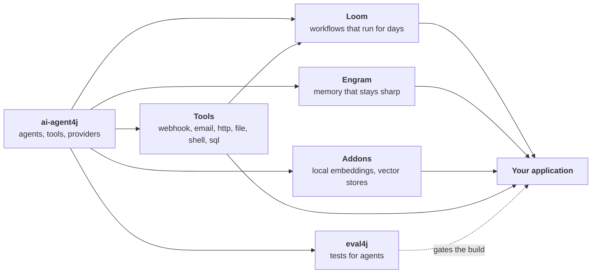

# The stack: one agent to a whole organisation of them

[← Back to the README](../README.md)


Each module answers the question the previous one raises.



### 🏗️ [ai-agent4j](../ai-agent4j/): *"How do I build an agent?"*

The core library, about 440 KB with no vendor SDKs.

- **Reasoning and acting.** ReAct agents reason, call tools, and correct themselves.
- **Where tools come from.**
  - your own classes;
  - built-ins such as a calculator and web search;
  - any REST API, via its [OpenAPI spec](../ai-agent4j/wiki/OpenAPI-Tool.md);
  - any [MCP server](../ai-agent4j/wiki/MCP-Integration.md).
- **Building blocks.**
  - Memory: [short-term and semantic](../ai-agent4j/wiki/Memory-and-Persistence.md).
  - Knowledge: [RAG](../ai-agent4j/wiki/RAG-Support.md) and [knowledge graphs](../ai-agent4j/wiki/Knowledge-Graphs.md).
  - Behaviour: [personas](../ai-agent4j/wiki/Agent-Personas.md), delegation between agents, and scheduling.
- **Voice.** Speech-to-text and text-to-speech in Indian languages, through Sarvam.
- **Built to see inside.** Every agent explains itself, with audit trails, PII masking and confidence
  scores ([xAI](../ai-agent4j/wiki/xAI_BEYOND_BLACK_BOXES.md)).
- **Built for production.** [Budgets and rate limits](../ai-agent4j/wiki/Budgets-and-Rate-Limits.md) keep
  a runaway loop from becoming a runaway bill.

### 🧵 [Loom](../loom/ai-agent4j-loom/): *"How do many agents work together, reliably, for days?"*

One agent is a function call. A business process is many agents, people and hours of waiting.
Loom is a small language for exactly that. The agents reason; **the script governs**:

```text
budget { tokens: 100000 per day  when_exhausted: suspend }

workflow Digest(topic) {
    delegate "Find today's news on {topic}" to Researcher -> findings expecting { items: list }
    for each item in findings.items { delegate "Summarise {item.url}" to Writer -> summary }
    human_prompt "Publish today's digest? (yes/no)" -> go
    alt (go == "yes") { handoff "Publish" to Publisher }
}

schedule Morning { cron: "0 7 * * *"  run: Digest(topic="AI agents") }
```

What the runtime does for you:

- journals every step, so runs survive restarts;
- waits for people without holding a thread;
- pauses on rate limits and resumes when they lift;
- enforces budgets before each call;
- runs on schedules without a hosted platform;
- runs the parts too important to leave to a model as **tasks**: plain Java behind a `run` step, no tokens, journaled, never repeated by a crash if it changes things, and never callable by a model ([Tasks](../loom/ai-agent4j-loom/LOOM_GUIDE.md#tasks-deterministic-steps-run));
- ships six generic tools usable from the script with no Java: `webhook`, `email`, `http`, `file`, `shell` and read-only `sql`, with a journal so a crash never sends the same message twice ([Generic Tools](../loom/ai-agent4j-loom/LOOM_GUIDE.md#generic-tools), [daily digest sample](../loom/ai-agent4j-loom/samples/digest/));
- lets an agent **earn its autonomy**: it proposes, a person decides, and a ledger of both moves it from `watch` to `suggest` to `act` (and back) on evidence, with a prompt change tested on your past cases before it goes live ([Earned Autonomy](../loom/ai-agent4j-loom/LOOM_GUIDE.md#earned-autonomy));
- asks you on Telegram when it needs a person, and carries on when you reply, so it can run on a machine nobody sits at ([Answering from Your Phone](../loom/ai-agent4j-loom/LOOM_GUIDE.md#answering-from-your-phone));
- finds problems with `weave check` before anything runs.

👉 [Loom overview](../loom/ai-agent4j-loom/README.md) · [**Why Loom?**](../loom/ai-agent4j-loom/WHY_LOOM.md) ·
[Language guide](../loom/ai-agent4j-loom/LOOM_GUIDE.md)

### 🧠 [Engram](../engram/engram-core/): *"How does an agent remember without drowning in context?"*

Long conversations bloat prompts and dilute attention. Engram replaces the growing transcript with a
**retrieve-and-synthesise loop**:

- it extracts the facts that matter;
- it writes a short, task-specific briefing for each turn;
- it corrects its own memories as new information arrives.

The prompt stays small and sharp however long the relationship runs.
👉 [Agentic workflows with Loom and Engram](AGENTIC_WORKFLOWS_GUIDE.md)

### 🧩 [Addons](../ai-agent4j-addons/): *"How do I keep my data private and my costs at zero?"*

The heavy-lifting pieces, kept out of the core so it stays light:

- **Local embeddings**: ONNX and DJL models on your own machine, with no API calls and no per-token cost.
- **Persistent vector stores**: PostgreSQL with pgvector, or Pinecone.

### 🔧 [Tools](../ai-agent4j-tools/): *"How do I let an agent act on the world safely?"*

Ready-made tools built for the case where the model picks the arguments: `webhook` (Slack, Discord, Teams),
`email`, `http`, `file`, `shell` and read-only `sql`. Each has allow-lists, size and time limits, secrets scrubbed from
every result, and a journal so a crash never repeats a send. Use them from Java, or from a Loom script with no Java.
The contracts they implement (`ToolKind`, `Effectful`, `EffectJournal`) live in the core `ai-agent4j`; this module is the
implementations, with [its own documentation](../ai-agent4j-tools/docs/README.md).

### 🧪 [eval4j](../eval4j/): *"How do I know it works, and keeps working?"*

Agents are non-deterministic, which is no excuse for not testing them. eval4j is a testing framework
built for Java, not ported from Python:

- **AssertJ assertions on what agents did**: which tools they called, in what order, and how confident
  they were.
- **LLM-as-judge conditions**: correctness, relevancy, groundedness, hallucination, task completion,
  bias and toxicity.
- **YAML golden datasets**, run through plain JUnit 5.
- **Pass-rate thresholds** for noisy judges.

It runs in `mvn test`, next to the rest of your suite. 👉 [Why eval4j?](../ai-agent4j/wiki/WHY_EVAL4J.md)

**Premium dashboarding capability for evaluation runs**, free and local. 👉 [See every view](../eval4j-report/docs/USER-GUIDE.md)

<a href="eval4j-report/docs/USER-GUIDE.md"></a>

### Together

**Put together**, it is a complete alternative ecosystem:

- ai-agent4j gives agents that are **objects**;
- Loom arranges them into **processes** that survive the real world;
- Engram and the addons give them **memory and knowledge**;
- eval4j turns quality into a **build gate**.

It's all Java, on the JVM you already operate, monitor and trust.

