# eval4j-report user guide

The complete feature set, with screenshots of a real report. Every figure on this page comes from the sample data in [`sample/`](sample), which you can regenerate with `python3 sample/generate.py sample/bundles` and open yourself: [`sample/report/index.html`](sample/report/index.html) (interactive) and [`sample/report/static/index.html`](sample/report/static/index.html) (static edition).

Contents: [What it is](#what-it-is) · [Install and run](#install-and-run) · [Overview](#overview) · [Test families](#test-families) · [Dimensions](#quality-dimensions) · [Cases](#cases-and-the-case-drawer) · [Compare runs](#compare-runs) · [Coverage](#dataset-coverage) · [Cost](#cost-and-evidence) · [Models and judges](#judges-and-models) · [Traces and Loom](#traces-and-loom-workflows) · [Prompt A/B](#prompt-ab) · [Optimizer](#prompt-optimizer) · [Static edition](#static-edition) · [Configuration](#configuration) · [Cheap runs](#cheap-runs-profiles-budget-carry-over) · [CLI](#command-line) · [Run bundle](#the-run-bundle) · [Security and privacy](#security-and-privacy)

## What it is

eval4j runs your evaluations. Each test JVM exports what happened as a **run bundle** (JSON and JSON Lines). `eval4j-report` reads bundles and builds the dashboard. It is free, local and makes no network request.

Four design rules shape everything you see:

1. **It informs, it does not decide.** There is no PASS or FAIL banner. A goal is context, not a gate. The CLI never fails a build because of how a run scored.
2. **Dimensions come from your golden dataset.** Everything a scenario declares is listed, even when nothing evaluated it. Those show as *No results* with the likely causes.
3. **Honest about cost.** LLM judging is expensive, so cheap runs are first-class. Results are labelled *evaluated now*, *reused from cache* or *carried from an earlier run*, and a case that was not judged is *not evaluated*, never passed.
4. **Judges are noisy.** A change smaller than the judge's own variation is not called a regression.

## Install and run

```xml
<dependency>
  <groupId>io.github.srijithunni7182</groupId>
  <artifactId>eval4j-report</artifactId>
  <version>5.0</version>
  <scope>test</scope>
</dependency>
```

```java
@ExtendWith(EvalReportExtension.class)
class SupportAgentEvalTest { /* your evaluation tests */ }
```

`mvn test` writes `target/eval4j/runs/<runId>/` and, at the end of the JVM, `target/eval4j/report/` (`index.html`, `static/index.html`, `summary.md`, `compare.md`, `junit.xml`, `evaluations.csv`). Or render any directory of bundles with the [CLI](#command-line).

## Overview

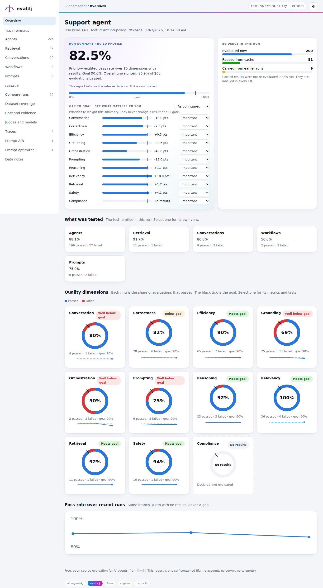

- **Summary figure.** The priority-weighted pass rate over the dimensions that have results, with the goal tick. Underneath, the plain unweighted count.
- **Gap to goal.** One row per dimension: reached against goal, in points. Set each dimension's priority (*Critical* ×3, *Important* ×2, *Nice to have* ×1, *Not a priority* ×0) or pick a preset (*Balanced*, *Safety first*, *Speed and cost*, *Quality only*). Priorities only re-weight the summary figure; they never change a result. Your choice is remembered in the browser.
- **Evidence in this run.** How many results were evaluated now, reused from the judge cache, or carried from earlier runs.
- **Test families.** Agents, retrieval, conversations, workflows and prompts, each with its own pass rate. Select one for its own view.
- **Quality dimensions.** One ring per dimension: blue passed, red failed, the black tick is the goal, and the small line under it is the trend over recent runs on this branch (dashed: the goal). *Declared, not evaluated* dimensions are dashed empty rings.
- **Pass rate over recent runs.** The overall trend on the branch, scaled to the data so small movements are visible.

Dark mode follows your system, with a toggle:

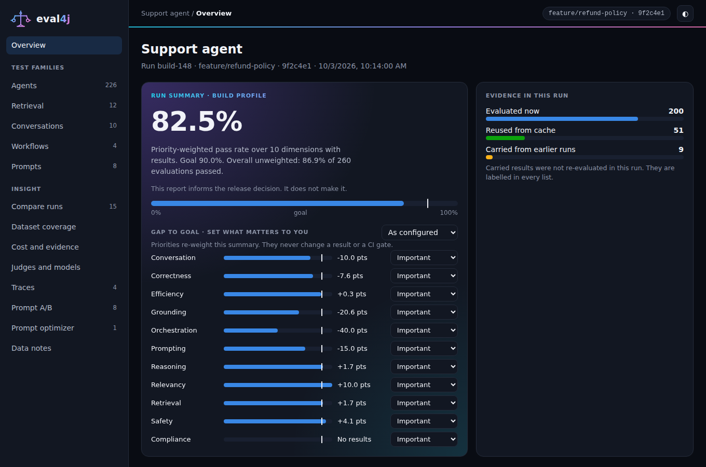

It is responsive, down to a phone, with a navigation drawer:

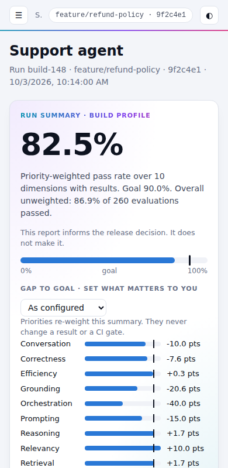

The left navigation lists the families in this run, then the insight pages. Pages that have no data (traces, A/B, optimizer) do not appear.

## Test families

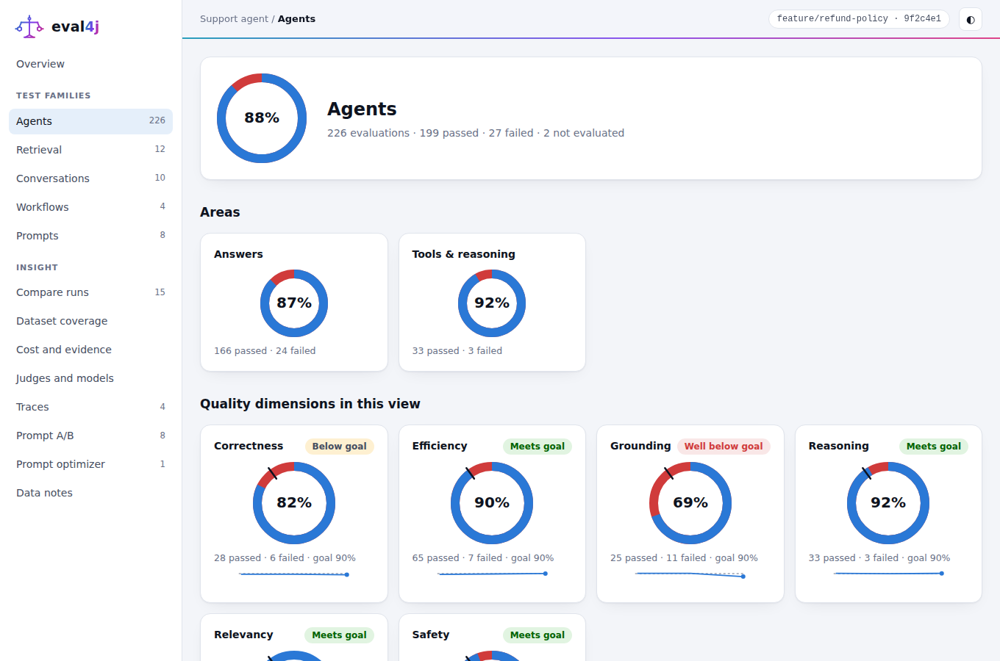

A family view shows its areas (for example *Answers*, *Tools & reasoning*, *RAG*, *Multi-turn*) and the dimensions within it. Families and areas are classified from the metrics; a team can classify its own (see [Configuration](#configuration)).

## Quality dimensions

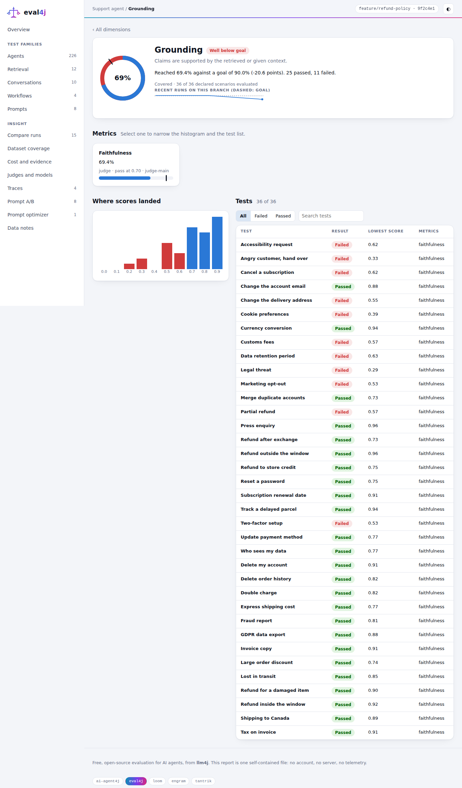

Select a dimension to see:

- the verdict-free status against its goal (*Meets goal*, *Below goal*, *Well below goal*, *No results*) and how many of the declared scenarios were evaluated;
- the **trend** across recent runs on the branch, with the goal as a dashed line;
- its **metrics** (judge, measured and assertion metrics, with thresholds, budgets and judge ids). Select one to narrow the histogram and the list;
- **where scores landed**: every evaluation binned by score, passed and failed;
- the **tests**, filterable (all, failed, passed) and searchable. Select one to open it.

A dimension the dataset declares but nothing evaluated explains itself:

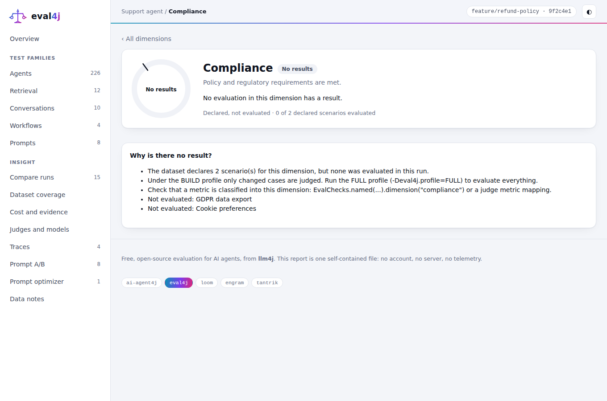

## Cases and the case drawer

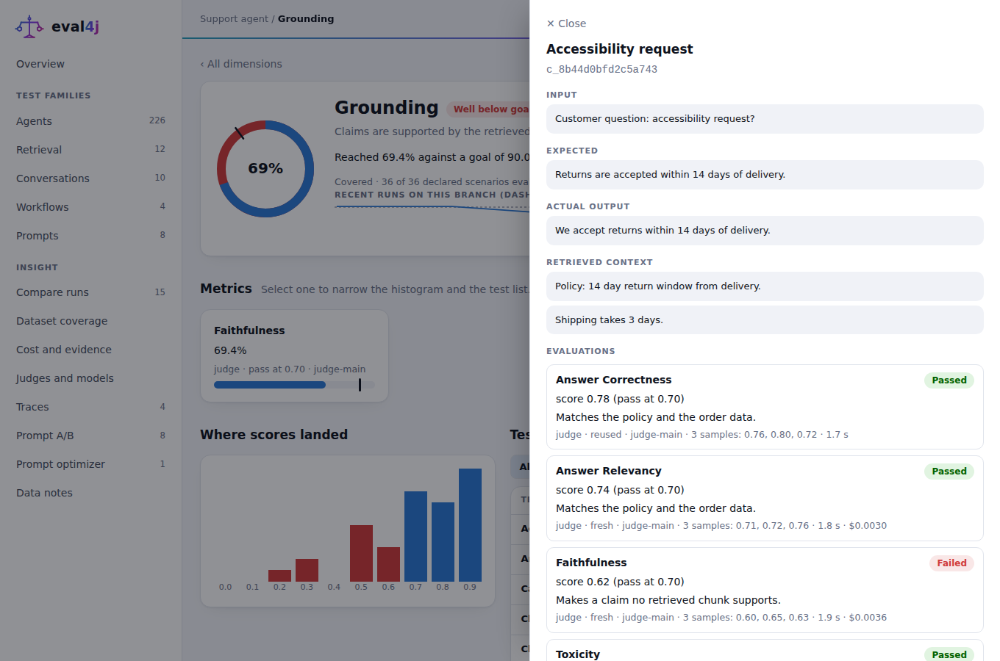

The drawer shows what the test saw: the input, the expected answer, the actual output and the retrieved context, then every evaluation of the case with its score against the pass threshold, the judge's reason, whether the result is fresh, reused or carried, the judge's samples, duration and cost, and the agent trace when there is one. Press Escape to close.

## Compare runs


By default a run is compared with **the previous run on the same branch** (falling back to the latest run on `main`/`master`, and the page says which rule picked it). Pick another baseline with `--baseline <runId>` or `compare.baseline` in the configuration.

- **Headline counts**: matched, worse, better, unchanged, *within judge noise*, new, removed, not comparable. Only cases present in both runs are compared, so a dataset revision never looks like a quality change.
- **What changed in the setup**: branch, commit, profile, agent and prompt version, judge model and settings, dataset revision. Differences are highlighted. Different evaluation settings or datasets raise a note.
- **Movement by quality dimension**: hollow dot is the baseline, filled dot this run, black tick the goal.
- **Changed cases**, largest change first. Select one to read the two reasons and the answer **word by word**. If the answer did not change but the score did, the page says so: that points at judge variation.
- **Scatter** of every judged score before and after; the shaded band is the judge-noise band.

The **judge-noise band** defaults to ±0.07 and is taken from the judge's measured noise when the run provides it. A judged change inside the band is counted in its own bucket and never described as a regression or an improvement.

## Dataset coverage

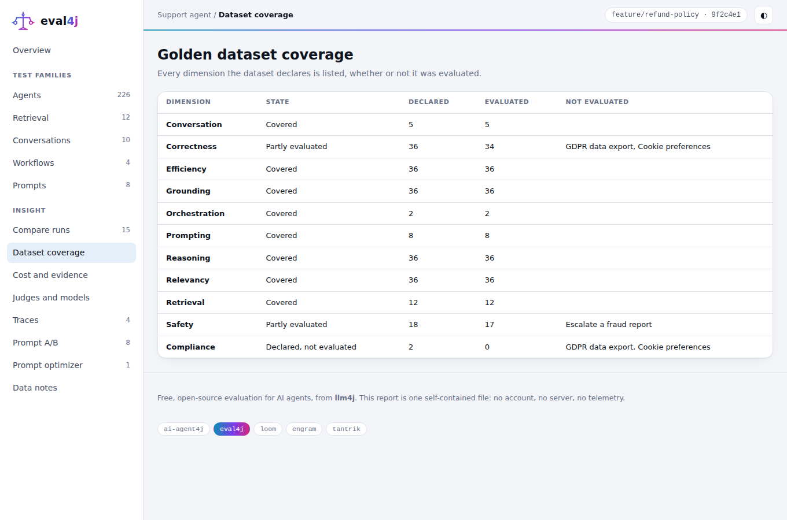

Every dimension the dataset declares appears with a state: *Covered*, *Partly evaluated* (with the missing scenarios named), *Declared, not evaluated*, *Goal set, no scenarios*, *Evaluated, not declared*, or *No dataset in this run* (no claim is made).

## Cost and evidence

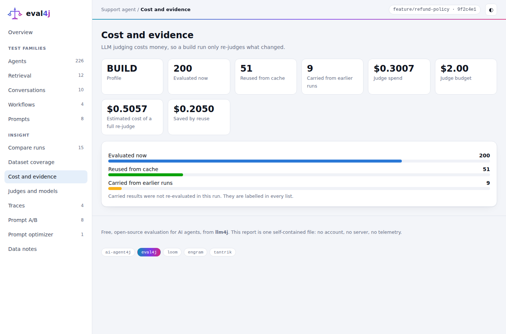

The profile, how many results were evaluated now, reused or carried, the judge spend against the budget, the estimated cost of a full re-judge and **how much reuse saved**. Without a pricing file the page shows token counts and says how to add prices.

## Judges and models

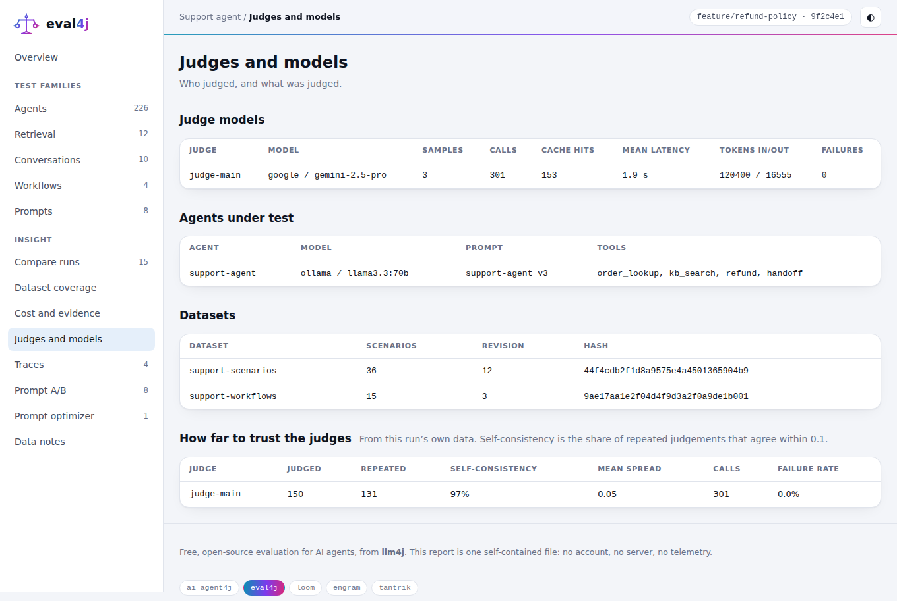

Who judged and what was judged: judge model, samples, calls, cache hits, latency, tokens and failures; the agents under test with their prompt version and tools; the datasets with revision and content hash. **How far to trust the judges** reports, from the run's own data, the share of repeated judgements that agree within 0.1 (*self-consistency*), the mean spread, calls and failure rate, and warns when a judge and an agent come from the same model family (a heuristic: a model can favour its own style).

## Traces and Loom workflows

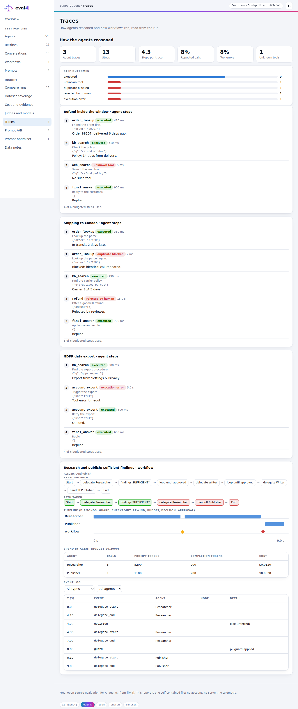

- **How the agents reasoned**: steps per trace, repeated-call rate, tool-error rate, unknown tools and the outcome of every step (executed, unknown tool, duplicate blocked, rejected by a human, execution error, budget exhausted), then each trace step by step with thought, action, input and observation.
- **Workflow trajectory** (Loom): the **expected path** against the **path taken**, with the wrong turns in red; a **timeline** with a lane per agent and diamonds for guards, checkpoints, rewinds, budget events, decisions and approvals; **spend by agent** against the run budget; and a filterable **event log**.

Capture a workflow with the Loom bridge (add `ai-agent4j-loom` to your test classpath):

```java
LoomTrace trace = LoomTrace.attach(executor).workflow(def)
        .expectPath("start", "n1", "n2", "n3", "n4", "n6", "end");   // ids: start, n1..nN in statement order, end
executor.initialize();                    // attach before initialize()
executor.executeWorkflow(name, context);
WorkflowTrace wt = trace.finish(executor.spend());
WorkflowAssertions.assertThat(wt)
        .followsExpectedPath().visitsInOrder("Researcher", "Writer", "Publisher")
        .takesBranch("n2", "then").loopStopsWithin("n3", 3)
        .rewindsAtMost(20).staysWithinSpend(0.50).noSecretsInTrace();
```

Trajectory assertions are deterministic: free, and fine on every build. Each is recorded in the **workflows** family. Loom emits no event for an `alt` decision, so the branch taken and loop iterations are *inferred* from which delegations happened; those decisions are marked inferred. Credential-looking data keys are dropped and the event buffer is bounded.

## Prompt A/B

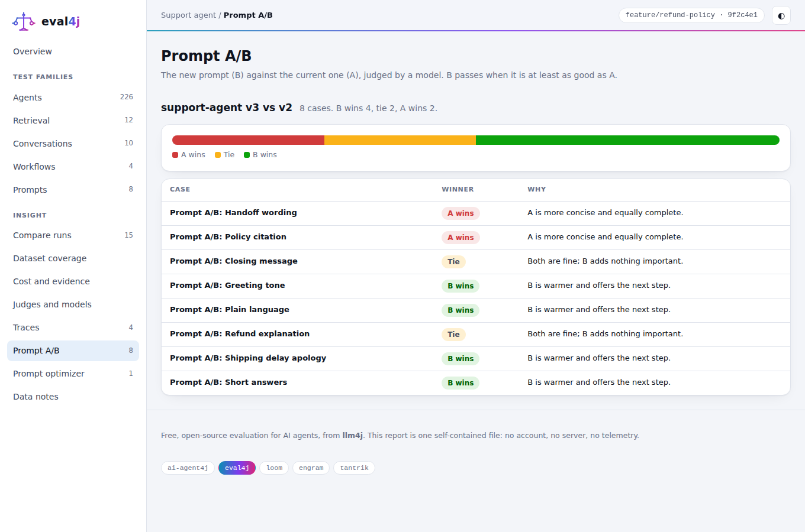

For `PairwiseCondition` comparisons: wins, ties and losses for the new prompt (B) against the current one (A), each case with the judge's reason. Select a case to read A and B side by side and a word-by-word difference.

## Prompt optimizer

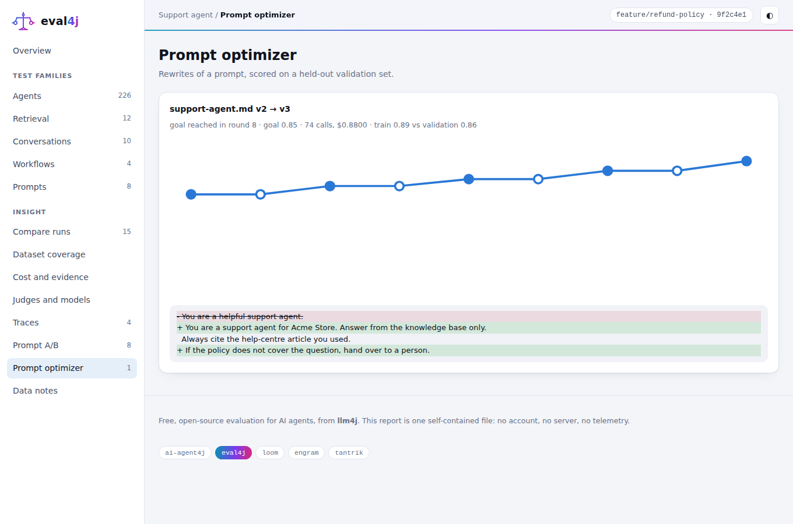

Optimizer runs export their rounds: the best validation score by round (filled points accepted, hollow rejected), the stop reason, call and cost budget, the train/validation gap against its limit, and the prompt diff.

## Static edition

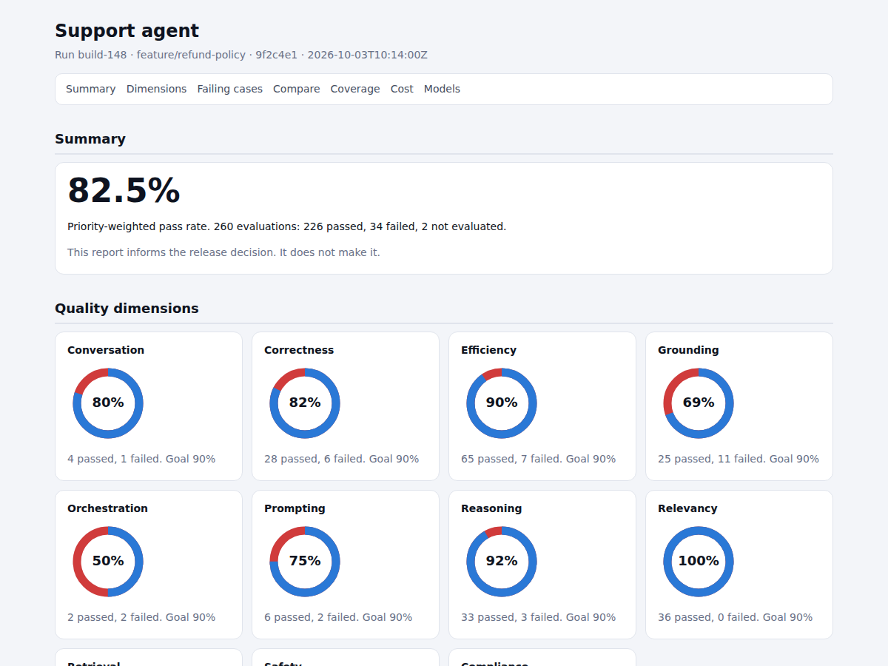

`static/index.html` plus `static/eval4j-static.css`: server-rendered, **no script and no inline style**, so it displays under a strict Content-Security-Policy such as Jenkins' default for archived reports. It has the summary, dimension rings, failing cases with full detail (passing cases as counts), the comparison, A/B counts, coverage, cost and models. Everything dynamic is escaped.

```groovy
publishHTML(target: [reportDir: 'target/eval4j/report/static', reportFiles: 'index.html',
                     reportName: 'eval4j report', keepAll: true])
junit 'target/eval4j/report/junit.xml'
```

## Configuration

`eval4j-report.yaml` (or `.json`) in the working directory, or `--config <file>`:

```yaml
project: { name: Support agent }
defaultGoal: 90              # percent; per-dimension goals override
warnGap: 10                  # points below goal that count as "well below"
compare:
  baseline: sameBranch       # sameBranch (default) | main | lastFull | pinned:<runId>
  defaultBranch: main
  noiseBand: 0.07            # judge variation that is not called a change
branding:
  title: Acme quality report
  logo: acme.svg             # png, jpg, gif or svg, up to 256 KB; embedded in the page
  accent: "#1a73e8"          # the chart colour
dimensions:
  correctness: { goal: 95, priority: CRITICAL }
  efficiency:  { goal: 80, priority: NICE_TO_HAVE }
  compliance:  { goal: 100, priority: CRITICAL, name: Compliance, blurb: Policy and regulation }
```

Configuration changes how results are presented and weighted. It never changes a stored result.

**Making the report meaningful from your tests**

| You want | Do this |
|---|---|
| Dimensions from your golden dataset | give scenarios `id`, `dimensions`, `tags` in the YAML; call `EvalRun.get().declareDataset(id, name, path, scenarios)` |
| Judge, agent and prompt shown | `EvalRun.get().declareJudge(...)`, `declareAgent(...)` |
| Deterministic checks named and classified | `EvalChecks.named("refund-order").dimension("reasoning").run(() -> assertThat(result).usesToolsInOrder(...))`. Unnamed assertions are recorded under defaults such as `tool-order`, `token-budget` (measured), `final-answer-contains` |
| One judge verdict filed under several dimensions | `EvalRecorder.record(new MetricRef(id, name, Kind.JUDGE, family, facet, dimension, null, null, null), score, threshold, reason, judgeId, details)` once per dimension; judge once with `LlmJudgeCondition.evaluate` |
| A scenario bound to a parameterized test | take an `EvalScenario` as the test argument; `EvalReportExtension` binds it |

## Cheap runs: profiles, budget, carry-over

| Profile (`-Deval4j.profile=`) | Judge calls |
|---|---|
| `FULL` | everything |
| `BUILD` (default with a cache) | only cases whose cache key missed; unchanged cases are *reused* |
| `SAMPLE` | a deterministic seeded share (`-Deval4j.sample.rate=0.2`, `-Deval4j.sample.seed=1`) |
| `FAST` | none; cache hits are reused |

A case that is not judged records **not evaluated** and its test is reported **aborted**, never passed. With carry-over (on by default except `FULL`; `-Deval4j.carryOver=false` to turn off) the latest known result of an earlier run on the same branch fills in, labelled *carried from <run>* everywhere it appears.

`-Deval4j.pricing=prices.properties` (one line per judge or model, `gemini-2.5-pro = 1.25, 10.00`: USD per million input and output tokens) turns tokens into cost; `-Deval4j.judge.budgetUsd=2` stops judging once spent.

## Command line

```
mvn -P cli package            # eval4j-report-5.0-cli.jar, about 3 MB, no other dependencies
java -jar eval4j-report-5.0-cli.jar <command> [<export-dir>] [options]
```

| Command | What it does |
|---|---|
| `render` | build `index.html`, `static/`, `summary.md`, `compare.md`, `junit.xml`, `evaluations.csv` into `<export-dir>/report` |
| `compare` | the same, always against a baseline |
| `list` | list the runs (the bundles of one build show as one run) |
| `validate` | read every run strictly and report problems with file and line |
| `merge --group <id> [--out <dir>]` | write the bundles of one build as a single bundle |
| `import-legacy <eval4j-report.json> [--out <dir>]` | turn a v1 eval4j report into a bundle so it can be opened and compared |
| `prune --keep <n>` | delete all but the newest *n* runs |

Options: `--run <id>`, `--baseline <id>`, `--no-compare`, `--out <dir>`, `--config <file>`, `--strict`. Exit codes: `0` success, `2` bad usage, `3` unreadable input, `4` unexpected failure.

**Several modules or JVMs in one build.** Give every JVM the same `-Deval4j.run.group=<build id>`. Their bundles are merged into one run when reported, and the group id is the run id. The sample report is built this way: the *agents* and *flows* bundles of `build-148`.

## The run bundle

```
<root>/index.jsonl
<root>/runs/<runId>/run.json            who ran what, where, with which models; profile; summary
                    evaluations.jsonl   one line per evaluation, appended as it happens
                    scenarios.jsonl     the golden dataset's cases and the dimensions they declare
                    tests.jsonl         how each JUnit test ended
                    traces.jsonl        agent step traces and workflow traces
                    optimizations.jsonl optimizer runs
```

Lines are appended as they happen, so a crashed run still has everything before the crash; `run.json` is replaced atomically. Case and evaluation ids are stable hashes, so the same case matches across runs, machines and JVMs. The JSON Schemas in [`../spec/schema`](../spec/schema) are the contract; the format is specified in [`../spec/01-RUN-FORMAT.md`](../spec/01-RUN-FORMAT.md). Settings: `-Deval4j.export=false` (turn off), `-Deval4j.export.dir=<dir>`, `-Deval4j.run.id`, `-Deval4j.run.group`.

## Security and privacy

- **No network.** The page loads no font, script, image or stylesheet from anywhere, and the tests check it.
- **Bundle text is untrusted** (model output, user input, test names). The interactive edition draws it with DOM text nodes, never as markup; the static edition escapes everything; the embedded data cannot close its own `<script>` element; CSV cells that start with `=`, `+`, `-` or `@` are neutralised. A browser test feeds a hostile bundle through every view.
- **Secrets.** The Loom bridge drops credential-looking data keys and `noSecretsInTrace()` fails (without printing the value) if a credential shape appears in a trace.
- **Local files only.** State kept in the browser (theme, priorities) uses local storage and the page works without it.
