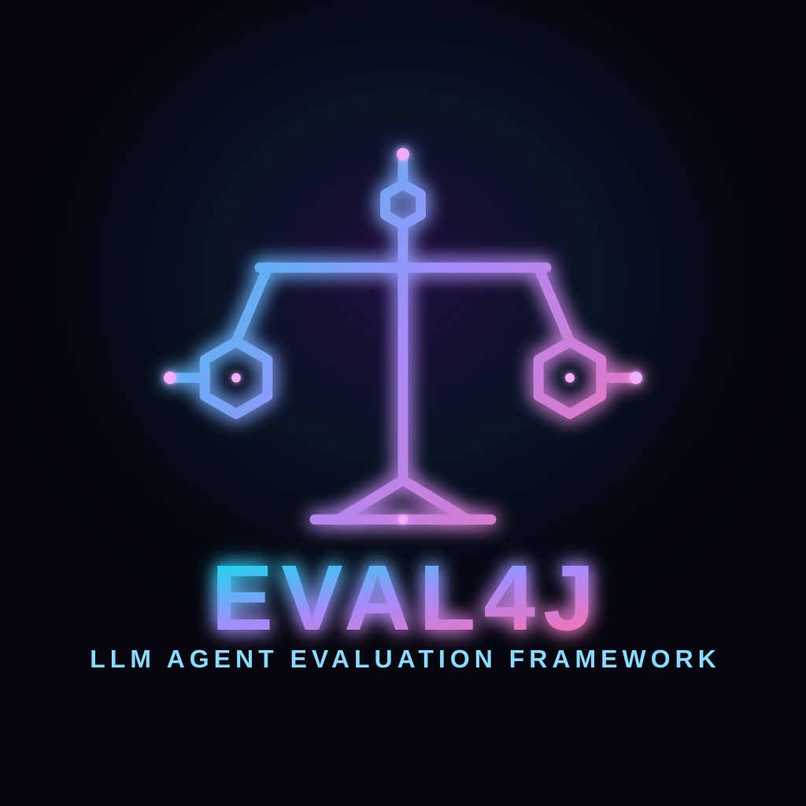
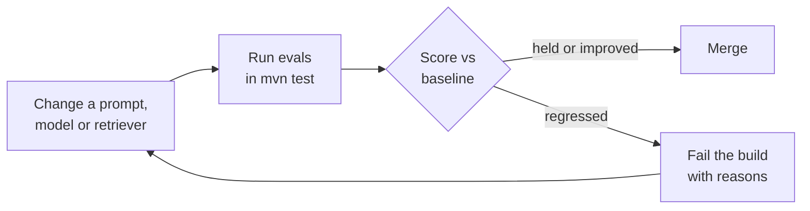
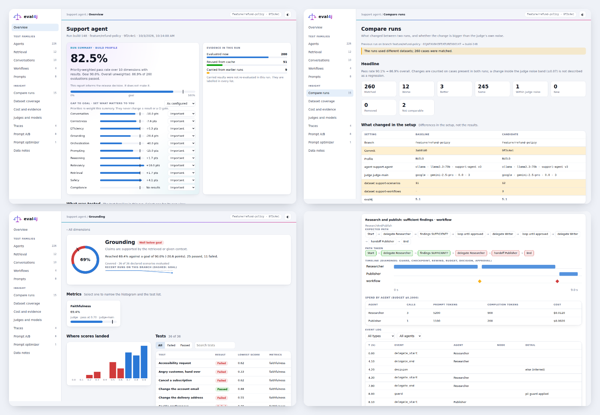
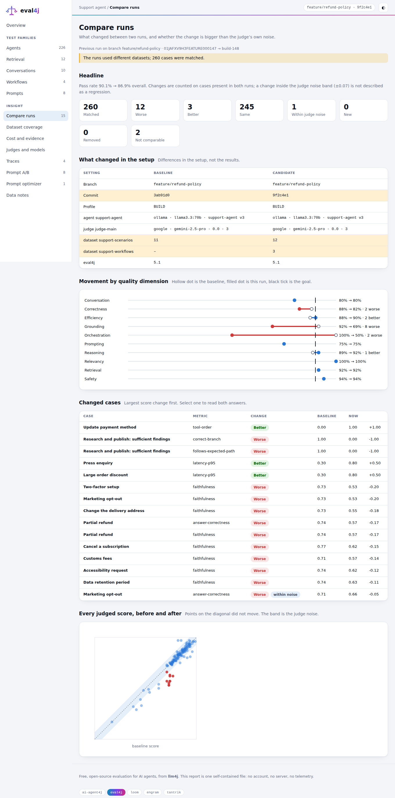

# eval4j

### Test your AI agents like you test the rest of your code.

**eval4j** is an evaluation framework for [ai-agent4j](../ai-agent4j/), built on **AssertJ** and
**JUnit 5**. Assert on what an agent *did*, grade what it *said*, and fail the build when quality
drops — all inside the `mvn test` you already run, written in the Java idioms you already know.
**If you can write a JUnit test, you can write an eval.**

[**Why evaluate?**](#-why-evaluation-is-not-optional) ·
[**Philosophy**](#-philosophy) ·
[**Ease of use**](#-if-you-can-write-a-junit-test-you-can-write-an-eval) ·
[**Quick start**](#-quick-start) ·
[**Features**](#-features) ·
[**Dashboard**](../eval4j-report/docs/USER-GUIDE.md) ·
[**Docs**](docs/README.md)

---

## 🚨 Why evaluation is not optional

A traditional function returns the same output for the same input. An LLM agent doesn't. That single
fact changes how you have to think about quality:

- **It fails silently.** A prompt tweak, a model upgrade or an unrelated refactor can change what your
  agent answers, which tools it calls, or whether it invents a fact — and nothing crashes. Your
  users find out before your tests do.
- **`assertEquals` can't see it.** There is no single correct string. Without a way to grade
  *meaning*, "it seems fine" becomes your test suite.
- **Agents act.** They call tools, write to systems and send messages. A wrong answer is
  embarrassing; a wrong *action* is an incident.
- **Every component drifts.** Retrieval quality, prompts, models and data all change independently.
  Without a baseline you can't tell which change hurt.
- **You can't improve what you don't measure.** Swapping a prompt or a model is a guess until you
  have numbers from before and after.

> [!IMPORTANT]
> **Evals are the regression tests of AI systems.** If your agent has no evaluations, you don't
> know whether it works today, and you will not know the day it stops working. Shipping without
> them is shipping on hope.

Evaluation also has to be *honest about itself*. An LLM judge is a measuring instrument, and
instruments need calibrating — so eval4j ships with a calibration study and publishes its
[limitations](VERIFICATION-RESULTS.md) rather than hiding them.



---

## 🧭 Philosophy

eval4j is **not** `deepeval` translated into Java. It is built from the tools Java developers
already use, on three ideas:

| | |
|---|---|
| **🧩 Use the test stack you have** | Checks are AssertJ assertions and `Condition`s; suites are JUnit 5 tests; data-driven runs are `@ParameterizedTest`. No evaluation CLI, no config-driven runner, no new execution model to learn — [it's just Java](#-if-you-can-write-a-junit-test-you-can-write-an-eval). |
| **⚖️ Deterministic where you can, judged where you must** | Which tools ran, in what order, how many tokens — assert on those exactly and for free. Reserve LLM judges for what genuinely needs one (correctness, groundedness, tone), and give them rubrics, thresholds, caching and sampling so they behave like instruments, not oracles. |
| **🔒 Untrusted by default** | The output you are grading may be wrong or adversarial. Everything sent to a judge is delimited and treated as data, never as instructions. |
| **👁️ Make quality visible** | A score in a log is easy to ignore; a picture is not. See [why a dashboard matters](#why-a-dashboard-matters) below. |

### Why a dashboard matters

Evaluation produces hundreds of numbers per run, and the decision they feed (ship, hold, fix) is made by
people who will not read a log. A dashboard is part of the method, not decoration:

- **Quality has dimensions, and they trade off.** A single pass rate hides that grounding fell while latency improved. Seeing every dimension against its goal, with its trend, shows where you actually stand.
- **Judges are noisy.** A drop of a few points may be the instrument, not the agent. Showing the noise band next to a change keeps teams from chasing ghosts, or from dismissing a real regression.
- **Cost shapes what you can know.** Judging everything on every build is expensive, so some results are fresh, some reused, some carried over. A report that doesn't say which is quietly misleading.
- **What isn't measured must be visible.** A dimension your dataset declares but nothing evaluated should show as *No results*, not vanish.
- **The audience is wider than the author.** Product owners and release managers decide on priorities and risk. They need a view that informs the decision without making it for them.

That is why eval4j ships [a dashboard](../eval4j-report/docs/USER-GUIDE.md), built to the same rule as the rest of it: honest about what it knows and doesn't.

Read more in [Design philosophy](docs/DESIGN.md).

---

## 💻 If you can write a JUnit test, you can write an eval

There is no new language, runner or config format to learn. Every eval4j concept is a Java idiom you
already use, so your IDE, your build and your teammates already know how to work with it:

| You already know… | …so in eval4j it is |
|---|---|
| **AssertJ** `assertThat(x).…` chaining | `assertThat(result).completedSuccessfully().usesTool("search")` — autocomplete lists every check |
| AssertJ **`Condition`** and `.is(...)` | An LLM judge *is* a `Condition`: `.is(presets.correctness("36"))` |
| `allOf` / `anyOf` / `not`, **`SoftAssertions`** | They work on judge conditions unchanged |
| **JUnit 5** `@Test`, `@ParameterizedTest`, `@MethodSource` | Datasets are just parameter sources — one test method, many scenarios |
| **JUnit extensions** (`@ExtendWith`) | Reports and regression gates are an extension and an annotation |
| **Builders** and typed **records** | `llmJudged("…").criteria("…").threshold(0.7).build()`; scenarios are a plain `record` |
| **Maven/Gradle** + `mvn test` | Evals run in the build you already have — same CI, same reports, no separate CLI |
| `AssertionError` on failure | Failures are ordinary test failures with a readable message (and the judge's reasons) |

So an eval suite is a test class:

```java
@ExtendWith(EvalReportExtension.class)                    // reports + optional regression gate
class SupportAgentEvalTest {

    @ParameterizedTest(name = "{0}")
    @MethodSource("scenarios")                            // golden scenarios from YAML
    void answersGoldenScenarios(EvalScenario scenario) {
        AgentResult result = agent.run(scenario.input());

        assertThat(result)                                // AssertJ, as usual
            .completedSuccessfully()                      // deterministic, free
            .hasFinalAnswerContaining(scenario.expectedOutputContains())
            .is(judge.answerRelevancy(scenario.input())); // LLM-judged, just a Condition
    }

    static Stream<EvalScenario> scenarios() {
        return EvalScenarios.fromYamlResource("scenarios.yaml").stream();
    }
}
```

Combine checks the way you'd combine any AssertJ conditions:

```java
assertThat(result)
    .is(allOf(judge.correctness("36"), judge.answerRelevancy(question)))
    .is(anyOf(judge.hallucinationFree(context), judge.toxicity()));
```

> These snippets aren't just illustrative — they live in
> [`JavaIdiomsExampleTest`](src/test/java/io/github/llm4j/eval/JavaIdiomsExampleTest.java), which
> compiles and runs them on every build.

---

## 🚀 Quick start

```xml
<dependency>
    <groupId>io.github.srijithunni7182</groupId>
    <artifactId>eval4j</artifactId>
    <version>5.0</version>
</dependency>
```

(Inside this monorepo it is already wired into the root [pom.xml](../pom.xml).)

```java
import static io.github.llm4j.eval.assertions.AgentAssertions.assertThat;
import static io.github.llm4j.eval.judge.LlmJudgeCondition.llmJudged;

AgentResult result = agent.run("What is 15% of 240?");

assertThat(result)
    .completedSuccessfully()                 // ┐
    .usesToolsExactly("calculator")          // ├ deterministic, free
    .hasFinalAnswerContaining("36")          // ┘
    .is(llmJudged("Correctness")             // ← the one call that costs an LLM request
            .criteria("The answer correctly computes 15% of 240 and states it plainly")
            .judge(judgeClient)
            .threshold(0.7)
            .build());
```

> [!TIP]
> Use a **different, ideally stronger, model as the judge** than the one under test — otherwise the
> model is partly grading its own work. See [choosing a judge](docs/LLM-AS-JUDGE.md#choosing-a-judge-model).

---

> [!TIP]
> ## ✨ New: a premium dashboard, free and local
> Add **[eval4j-report](../eval4j-report/README.md)** and every `mvn test` run produces a dashboard you would
> normally need a hosted platform for. One self-contained HTML file: **no account, no server, no telemetry,
> no network request.** MIT-licensed, in the build you already run.
>
> - **Quality dimensions from your golden dataset**, each with a goal and a trend. Declared but never evaluated? It stays visible as *No results*.
> - **Informs the release decision, doesn't make it.** No pass/fail banner; set priorities and presets for what your stakeholders care about.
> - **Run comparison that knows judges are noisy**, against the previous run on the same branch, answers diffed word by word.
> - **Built for LLM cost**: `FAST` / `BUILD` / `SAMPLE` / `FULL` profiles, cache reuse, a spend budget, carried-over results, always labelled.
> - **Agent traces and [Loom](../loom/ai-agent4j-loom/README.md) workflow trajectories**: path taken vs expected, timeline, event log, spend.
> - A **Jenkins-safe static edition**, `summary.md` for pull requests, JUnit XML, CSV and a 3 MB CLI.
>
> ```xml
> <dependency>
>   <groupId>io.github.srijithunni7182</groupId><artifactId>eval4j-report</artifactId>
>   <version>5.0</version><scope>test</scope>
> </dependency>
> ```
> 👉 [**Tour of every view**](../eval4j-report/docs/USER-GUIDE.md) · [Open the sample report](../eval4j-report/docs/sample/report/index.html)

<p align="center">
  <a href="../eval4j-report/docs/USER-GUIDE.md"></a>
</p>

---

## ✨ Features

### Check what the agent did — free and deterministic
Tool usage and order, argument values, iteration and token budgets, protocol adherence, redundant
loops, JSON shape. → [Assertions & pass rates](docs/ASSERTIONS.md)

### Grade what it said — LLM-as-judge
Correctness, answer relevancy, faithfulness, hallucination, task completion, bias, toxicity — as
real AssertJ `Condition`s with rubric scoring (1–5, not a fake float), self-consistency sampling and
judge-call caching. → [LLM-as-judge](docs/LLM-AS-JUDGE.md)

### Evaluate your retriever, not just your generator
Contextual **precision**, **recall** and **relevancy**, judged per chunk — or embedding-based with no
judge at all.

```java
assertThat(ragResult)
    .is(presets.contextualPrecision(question, expectedAnswer, chunks))
    .is(presets.contextualRecall(question, expectedAnswer, chunks))
    .is(presets.contextualRelevancy(question, chunks));
```
→ [RAG evaluation](docs/RAG-EVALUATION.md)

### Judge whole conversations
Knowledge retention, role adherence, completeness and relevancy across turns, with failures that name
the offending turn (`turn 4: asked for the user's name again`).
→ [Conversation metrics](docs/CONVERSATIONS.md)

### See your agent's quality: a premium dashboard, free
With [**eval4j-report**](../eval4j-report/docs/USER-GUIDE.md), every run becomes a dashboard: a ring per quality dimension against its goal, trends, drill-down to every case, run comparison that respects judge noise, cost and evidence (fresh, reused, carried), judge reliability, agent traces, Loom workflow trajectories, prompt A/B and optimizer views. One local HTML file, no account, plus a Jenkins-safe static edition.



### Catch regressions before your users do
**JUnit XML / Markdown / CSV** exports, a **score history** for trends, and an `@EvalBaseline` gate
that fails the build when a metric drops. (The v1 single-file dashboard still works; [eval4j-report](../eval4j-report/README.md) supersedes it.)

```java
@ExtendWith(EvalReportExtension.class)
@EvalBaseline(file = "eval4j-baseline.json", maxRegression = 0.05)
class AgentEvalTest { /* ... */ }
```
→ [Reports, baselines & gates](docs/REPORTING-AND-BASELINES.md)

### Stop hand-writing datasets
Keep golden scenarios in YAML and run them through plain JUnit parameterized tests — or **generate them
from your documents** with quality filtering and de-duplication.
→ [Datasets & synthesis](docs/DATASETS.md)

### Let it fix the prompt for you
An autonomous, budget-bounded optimizer rewrites a prompt from *why* it failed, keeps a diverse pool of
candidates, and verifies the winner on a sealed test split — then hands you a reviewable patch.
Deterministic guardrails stop it gaming the judge. **New: automated tests are complete; the live efficacy
study is still in progress.** → [Prompt optimizer](docs/OPTIMIZER.md)

### A/B test prompts and models
Pairwise judging over a dataset, run in both orders to cancel position bias, with win rates, a
confidence interval and assertions.

```java
PromptComparisonAssertions.assertThat(result).doesNotRegress(0.05).hasNoErrors();
```
→ [Comparing prompts](docs/PROMPT-COMPARISON.md)

---

## 🧪 How much should you trust the judge?

Enough to catch regressions, with eyes open. A calibration study (Claude Haiku 4.5 vs Sonnet 5.5) found
both judges close on relevancy, conversation metrics and clear-cut comparisons; a smaller judge was
more lenient on partial-support recall and more sensitive to answer order, which the position swap
neutralizes. The study data is small, synthetic and author-labelled, so treat it as indicative, not
proven. Details and gaps: [VERIFICATION-RESULTS.md](VERIFICATION-RESULTS.md).

---

## 📚 Documentation

| Guide | |
|---|---|
| [Fluent assertions & pass rates](docs/ASSERTIONS.md) | Deterministic checks on agent runs |
| [LLM-as-judge](docs/LLM-AS-JUDGE.md) | Presets, rubric scoring, sampling, caching, choosing a judge |
| [RAG evaluation](docs/RAG-EVALUATION.md) | Contextual precision / recall / relevancy |
| [Conversation metrics](docs/CONVERSATIONS.md) | Multi-turn behavior |
| [Datasets & synthesis](docs/DATASETS.md) | YAML goldens and generated scenarios |
| [Dashboard user guide](../eval4j-report/docs/USER-GUIDE.md) | The full eval4j-report feature set, with screenshots |
| [Reports, baselines & gates](docs/REPORTING-AND-BASELINES.md) | JUnit/Markdown/CSV reports, trends, CI gate, migration to the new dashboard |
| [Comparing prompts](docs/PROMPT-COMPARISON.md) | Pairwise A/B testing |
| [Prompt optimizer](docs/OPTIMIZER.md) | Autonomous prompt improvement with held-out verification |
| [Design philosophy](docs/DESIGN.md) | Why it is shaped this way, spec, verification, roadmap |
| [Testing eval4j itself](docs/TESTING.md) | Unit, live and calibration suites |

Related: [Why AI Agent4J?](../ai-agent4j/wiki/WHY_AI_AGENT4J.md) ·
[Why eval4j? (long form)](../ai-agent4j/wiki/WHY_EVAL4J.md) ·
[ReAct agent guide](../ai-agent4j/wiki/ReAct-Agent-Guide.md)

**Roadmap:** logprob-weighted G-Eval, optimizing Loom workflows, Loom workflow evaluation, safety metrics (PII, red-teaming),
multimodal evaluation, judge-cost tracking — see [Design philosophy](docs/DESIGN.md#roadmap).
