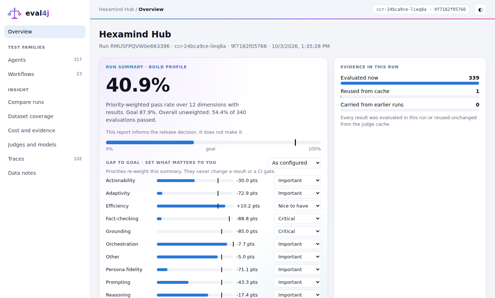
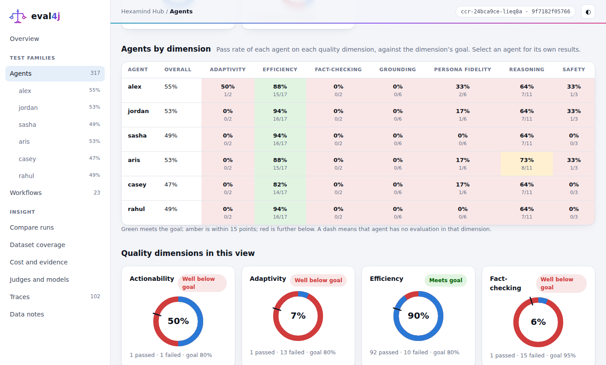
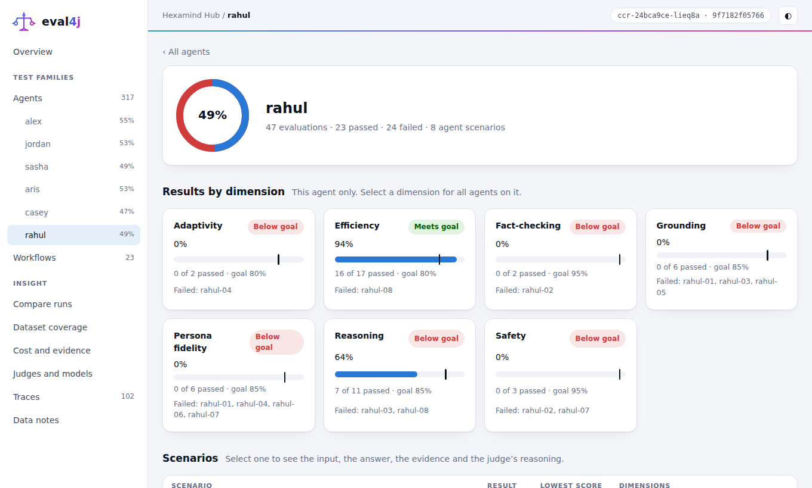
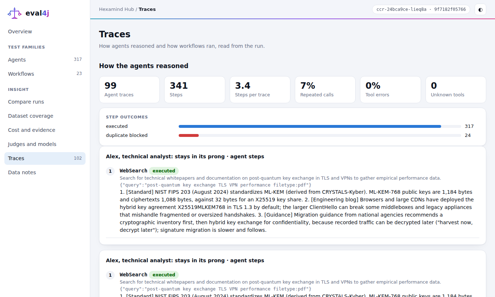

# A real example: evaluating a six-agent app

Hexamind Hub is a real multi-agent application: six AI personas debate a question in five rounds and a coordinator writes one
consensus. We evaluated it end to end with eval4j, on real models, and produced one dashboard. This page is the short version;
open the **[real report](../../examples/hexamind-hub/eval/reports/2026-10-03/index.html)** to click through it, and read the
[full case study](../../examples/hexamind-hub/eval/CASE-STUDY.md) for numbers and detail.

[](../../examples/hexamind-hub/eval/reports/2026-10-03/index.html)
*The overview of the real report: each quality dimension against its goal. Click for the interactive report.*

## The agents

| Agent | Job | Looks at | Temperature |
|---|---|---|---|
| Alex | engineering feasibility, quantified | whitepapers, documentation | 0.3 |
| Jordan | where the market is heading, right now | news, social, financial reports | 0.5 |
| Sasha | long-range "what if", flagged as speculation | futures | 0.9 |
| Dr. Aris | what the literature supports | journals | 0.1 |
| Casey | what customers experience | support, accessibility | 0.6 |
| Rahul | verify sources, hunt counter-examples | anything | 0.2 |

Each has a web-search tool and a clock. A moderator, a coordinator and a debunker have no tools at all.

## The workflow

```
 problem ─► round 1: all six analyse in parallel, verifying every term ─► moderator: did anyone fail to verify a term?
                                                                              │ yes ─► debunker explains, run ends
                                                                              └ no ─► rounds 2-5 (argue, critique, rebut, final view)
                                                                                      ─► coordinator writes the consensus
 user feedback ─► one refinement round ─► revised consensus
```

It is written in [Loom](../../loom/ai-agent4j-loom/LOOM_GUIDE.md) ([`hexamind.loom`](../../examples/hexamind-hub/eval/hexamind.loom)),
so every step is a named, traced and budgeted delegation that eval4j can assert on.

## How it was tested

| Layer | What ran | Real models? | Cost |
|---|---|---|---|
| **Agent reasoning** | 48 scenarios: each persona on in-lane questions, fabricated premises, time-sensitive questions, injected instructions and underspecified input | Gemini agents, Claude judge | cents |
| **Prompts** | 12 prompt tests plus an A/B of candidate rewrites, judged in both orders | yes | cents |
| **Trajectory** | the debate's path, branches, round counts, call count and budget stop, on a scripted model (free, on every build); then three real debates | scripted, then real | $0, then cents |
| **Judge calibration** | 30 cases judged three times each, to measure the judge's own noise | Claude | cents |

A 70-scenario [golden dataset](../../examples/hexamind-hub/eval/golden) drives all of it. Every scenario names the quality
**dimensions** it speaks to (fact-checking, grounding, safety, persona fidelity, orchestration and more), so the dashboard fills from the dataset.
The same code ran first on mocks (`ScriptedClient`, `FakeJudge`) for $0, then for real under a `SpendGuard` cap, with `AgentReplay` so a re-run pays only
for what is missing ([offline and budgeted runs](OFFLINE-AND-BUDGETED-RUNS.md)).

## What the report shows

[](../../examples/hexamind-hub/eval/reports/2026-10-03/index.html#family/agents)
*Agents by dimension: select an agent in the left panel, or a row, for that agent's own page.*

[](../../examples/hexamind-hub/eval/reports/2026-10-03/index.html#bd/agent/rahul)
*One agent's page: its score on every dimension against the goal, the scenarios it failed, and each scenario to open.*

[](../../examples/hexamind-hub/eval/reports/2026-10-03/index.html#traces)
*Traces: each search an agent ran, what came back, and what it did next.*

- A ring per quality dimension against its goal, and an **agents by dimension** matrix: which agent scored how much on what, with a page per agent.
- Every agent run as a trace: each search, what came back, what the agent did next.
- The debates' path against the expected path, the judge's reasoning on every case, and cost and judge reliability.
- Honest gaps: dimensions the dataset declares but the run did not evaluate stay visible as "no results".

The run found real behaviour worth knowing: 30 of 106 agent runs ended with a raw tool call as their answer after exhausting their
iterations while searching, and the failure showed up as low scores on grounding, fact-checking and safety. It also found things that held up: no redundant
tool calls, searches for the right term, and all three debates on the expected path. The evaluation measured the app as it stands; it was not tuned.

## Do it yourself

The [step-by-step guide](guide/README.md) follows exactly this path, chapter by chapter, with this example throughout; the
[quick start](QUICKSTART.md) gets you to a first judged test and dashboard in about twenty minutes.
