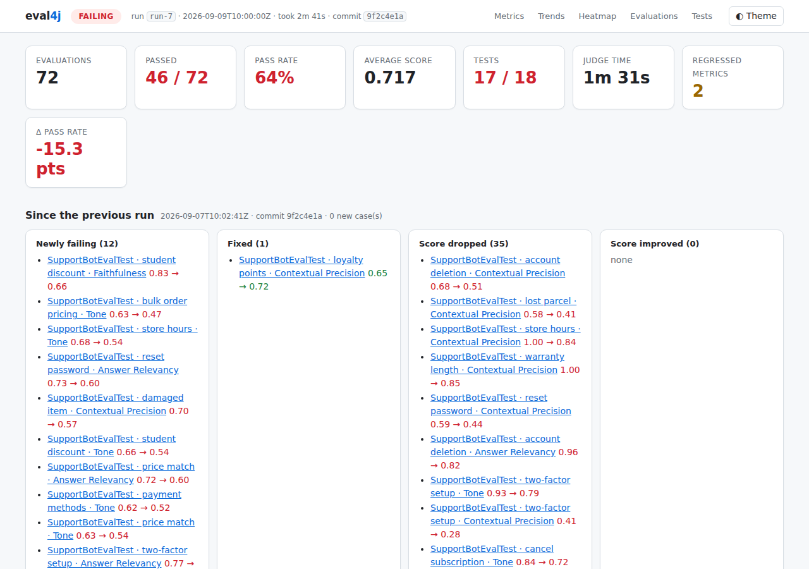
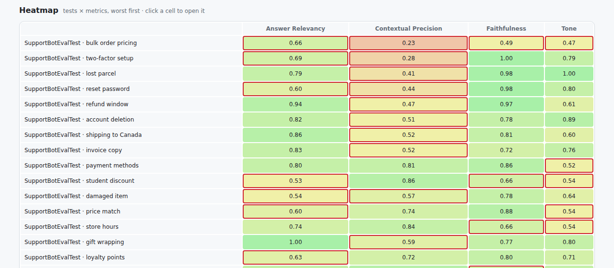

# Reports, dashboard & regression gates

Turn judged scores into a browsable dashboard, CI-ready test reports, a trend history and a gate that
fails when quality drops.

[← eval4j README](../README.md) · [All docs](README.md)

---

## Reporting — `EvalReportExtension`

```java
@ExtendWith(EvalReportExtension.class)
class MyAgentEvalTest {
    // ...
}
```

Prints a pass/fail summary (with judge reasons for failures) in `afterAll`, observing whatever
`@Test`/`@ParameterizedTest` methods in the class throw — eval4j's assertions or plain
JUnit/AssertJ ones. It's a standard JUnit 5 `TestWatcher`/`AfterAllCallback` extension, not a
bespoke "runner" you call explicitly.

## The dashboard



Run any evaluation class with `-Deval4j.report.dir=target/eval4j` and open `eval4j-report.html`.
[See a live sample](sample-report/eval4j-report.html) (download it and open locally).

It is **one self-contained file**: no server, no account, no CDN, no telemetry. It is fully
server-rendered, so everything is readable even with JavaScript disabled (e-mail attachments, artifact
viewers, locked-down Jenkins); the bundled script only adds search, filters, sorting, CSV export and a
theme toggle (dark mode follows your OS).

| Section | What you get |
|---|---|
| **Header & KPIs** | PASSING / FAILING / REGRESSION verdict, pass rate, average score, judge time, JUnit test counts, change versus the previous run |
| **Since the previous run** | Cases that are *newly failing*, *fixed*, *dropped* or *improved*, each linking to its detail |
| **Metrics** | Per metric: average with threshold marker, min, median, pass rate, score distribution, Δ vs baseline, Δ vs previous run, trend |
| **Trends** | Per-metric averages and pass rate over the last 40 runs; hover a point for run, time and commit |
| **Heatmap** | Tests × metrics, worst first; failing cells are outlined; click a cell to jump to the case |
| **Evaluations** | Every judged evaluation: the judge's reasoning, the **input, actual and expected output, retrieved context chunks**, judge, duration. Search (`/`), filter by result or metric, sort by score, closeness to threshold or slowness |
| **Tests** | JUnit outcome and duration of each test, including tests that failed without recording any evaluation |



### Showing the case behind a score

The built-in judged conditions (`LlmJudgeCondition`, `RagContextCondition`, pairwise comparison) record
their input, output, expected output, retrieved context and judge time automatically. If you record
scores yourself, pass the case along:

```java
EvalRecorder.record("Refund policy", 0.4, 0.7, "claims 30 days, policy says 14", "my-judge",
        new EvalDetails(question, answer, expected, retrievedChunks, elapsedMillis));
```

Text fields are capped at 20,000 characters and 50 context chunks per evaluation so one huge answer
cannot bloat the report.

## Files written

| File | Purpose |
|---|---|
| `eval4j-report.html` | the dashboard |
| `eval4j-report.json` | the full run; source of truth for everything else |
| `eval4j-junit.xml` | one test case per evaluation (`test [metric]`); a score below threshold is a `failure`. Point Jenkins' `junit`, GitLab `artifacts:reports:junit` or a GitHub test reporter at it |
| `eval4j-summary.md` | short digest for PR comments: `cat eval4j-summary.md >> "$GITHUB_STEP_SUMMARY"` |
| `eval4j-report.csv` | every evaluation, for spreadsheets (cells that start with `= + - @` are neutralised) |
| `eval4j-history.jsonl` | per-run averages, pass rate and per-case scores; powers trends and the "since previous run" section |

Keep `eval4j-history.jsonl` in your CI cache (or commit it) and each run's dashboard shows what changed
since the last one.

> **Jenkins:** its default Content-Security-Policy blocks inline styles, so the HTML Publisher shows the
> report unstyled. Either relax it for the report (`System.setProperty("hudson.model.DirectoryBrowserSupport.CSP", ...)`)
> or archive the file and open it from the artifact link; the content stays readable either way, and
> `eval4j-junit.xml` shows in Jenkins natively.

### Regenerating or merging reports

`eval4j-report.json` is enough to rebuild every file, and several reports (for example one per Maven
module) can be merged into one dashboard:

```bash
java -cp "eval4j.jar:ai-agent4j.jar:jackson-*.jar" io.github.llm4j.eval.report.EvalReportCli \
     --out build/eval4j-all --history eval4j-history.jsonl  module-a/eval4j-report.json module-b/eval4j-report.json
```

## Reports, baselines and regression gates

```java
@ExtendWith(EvalReportExtension.class)
@EvalBaseline(file = "eval4j-baseline.json", maxRegression = 0.05)
class AgentEvalTest { ... }
```

- Run with `-Deval4j.report.dir=target/eval4j` to get `eval4j-report.json` and a self-contained
  `eval4j-report.html` (no external requests) once per run, plus the other [report files](#files-written) and a score history
  (`eval4j-history.jsonl`, or `-Deval4j.history.file=...`) for trend charts.
- Create/refresh the baseline with `-Deval4j.baseline.update=true` (never written otherwise). After that,
  the class fails if any metric's **suite average** drops by more than `maxRegression`
  (`granularity = CASE` compares each test individually, but judge scores are noisy — prefer `SUITE`
  and `samples(3)` on gated metrics).
- CI recipe: cache the history file, commit the baseline, run the tests.
