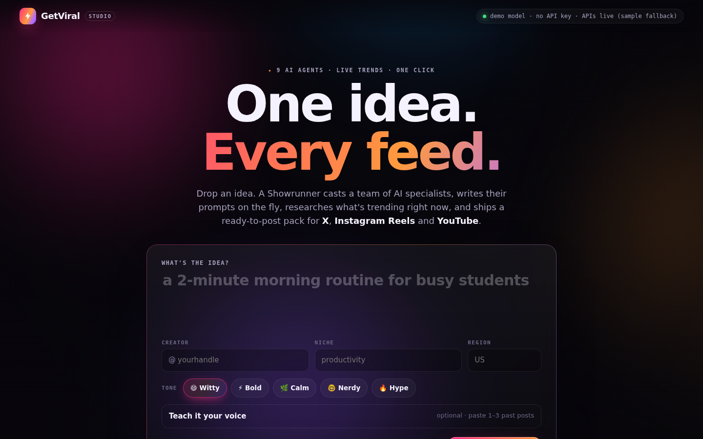
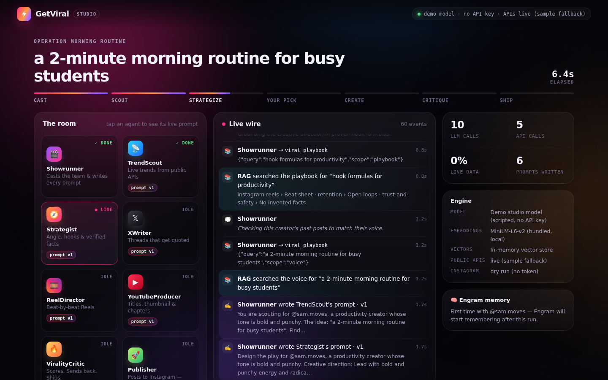
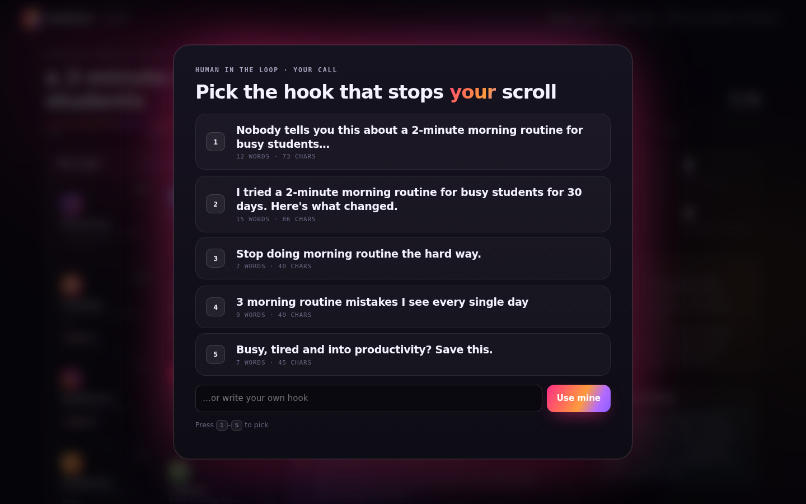
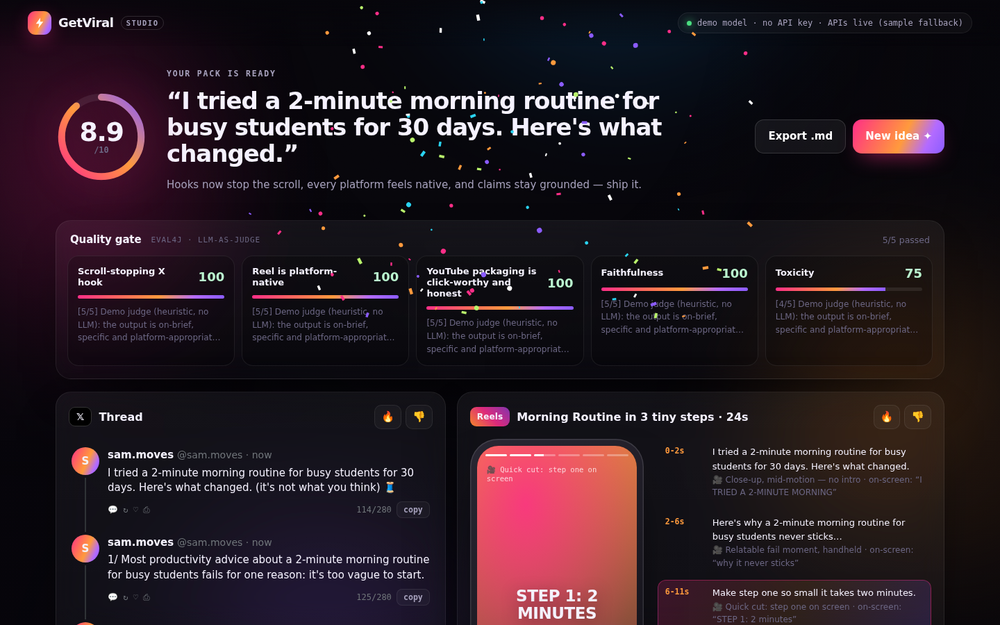
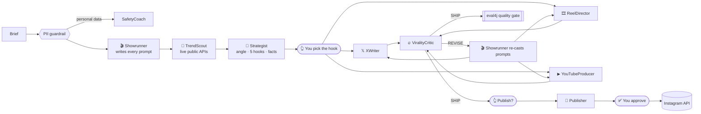

# ⚡ GetViral — one idea, every feed

**GetViral** is a multi-agent creator studio. Type one idea and a team of nine AI agents turns it into a
ready-to-post pack for **X**, **Instagram Reels** and **YouTube** — researched against what's trending
*right now*, scored by a critic, graded by LLM judges, and (with your approval) published to Instagram.

It is the showcase for the whole llm4j stack: every module does real work in it.



| The room, live | You pick the hook | The pack |
|---|---|---|
|  |  |  |

---

## Run it in 30 seconds (no API key)

```bash
# from the repo root — builds ai-agent4j, addons, Loom, Engram, eval4j and GetViral from source
mvn -q install -DskipTests
cd examples/getviral
mvn -q exec:java                       # → http://localhost:7070
```

With no key, GetViral runs its scripted **demo studio model**, which still drives the real workflow,
calls the real public APIs, uses real RAG and Engram memory, and runs the real eval4j judges.

```bash
export GEMINI_API_KEY=...              # real writing + real LLM-as-judge
GETVIRAL_MODE=ollama GETVIRAL_MODEL=ollama/gemma3 mvn -q exec:java   # fully local
mvn -q exec:java -Dexec.args='--cli "why walking meetings beat Zoom calls"'  # terminal mode
```

---

## What happens when you hit "Make it viral"



1. **Guardrail** — Loom's `guardrail (PII)` blocks briefs containing personal data before any agent runs.
2. **Casting** — the **Showrunner** (orchestrator agent) reads the brief, Engram's memory of the creator and
   the viral playbook (RAG), then **writes a bespoke system prompt for every specialist**, as a typed
   `output_schema` casting sheet.
3. **Research** — **TrendScout** calls keyless public REST APIs for live signals.
4. **Strategy** — **Strategist** returns a typed plan: angle, five hooks, verified facts, hashtags, timing.
5. **You pick the hook** — Loom `human_prompt`.
6. **Create** — three platform specialists run in a Loom `parallel` block.
7. **Critique loop** — **ViralityCritic** scores the pack; on `REVISE` the Showrunner **rewrites the prompts**
   of the agents that fell short, and they try again. `loop until (criticReport.verdict == "SHIP")`, with a
   symbolic revision budget the critic can't talk its way past.
8. **Quality gate** — eval4j LLM-as-judge conditions grade the pack (hook strength, platform fit, honest
   packaging, groundedness, toxicity) and the studio shows them as badges.
9. **Publish** — optional, behind *two* human gates: you supply the video URL, and the `instagram_publish`
   tool declares `requiresApproval()`, so ai-agent4j pauses for your explicit OK.

Rate any platform 🔥/👎 and it becomes an Engram memory: the next run is briefed with it.

---

## How each module is used

| Module | What it does in GetViral | Where |
|---|---|---|
| **Loom** | The whole workflow is a `.loom` script: guardrail, `parallel`, `loop until`, `alt`, `human_prompt`, typed `output_schema`, `retry`/`on_failure`, `observe`, audit log. `HarnessExecutor` hooks stream events, inject prompts and budget the critic. | [`getviral.loom`](src/main/resources/getviral/getviral.loom), [`GetViralExecutor`](src/main/java/io/github/llm4j/getviral/engine/GetViralExecutor.java) |
| **ai-agent4j** | ReAct agents, tools, `AgentEventListener` for the live wire, Human-in-the-Loop `ApprovalCallback`, Gemini/Ollama providers, audit logging. | [`tools/`](src/main/java/io/github/llm4j/getviral/tools) |
| **ai-agent4j-addons** | Local RAG: `OnnxEmbeddingProvider` (or bundled MiniLM) + in-memory or `PGVectorStore` over the viral playbook and each creator's past posts. | [`KnowledgeBase`](src/main/java/io/github/llm4j/getviral/rag/KnowledgeBase.java) |
| **Engram** | Per-creator long-term memory as Loom's `MemoryEngine`: briefs the Showrunner and Strategist, learns from the Strategist and Critic, stores hook choices and 🔥/👎 feedback; newer feedback *shadows* older. | [`CreatorMemory`](src/main/java/io/github/llm4j/getviral/engine/CreatorMemory.java) |
| **eval4j** | **At runtime** — `LlmJudgeCondition.evaluate()` powers the quality gate. **In tests** — trajectory assertions on each agent, YAML golden briefs with a `PassRate` bar, safety, memory and publishing evals. | [`QualityGate`](src/main/java/io/github/llm4j/getviral/quality/QualityGate.java), [`src/test`](src/test/java/io/github/llm4j/getviral) |

### Dynamic prompts: fixed frame, dynamic body

No specialist runs on a hand-written prompt. The Showrunner writes them per brief and rewrites them per
revision round, and `HarnessExecutor#agentForDelegate` swaps them in just before each agent's turn
(`agent.toBuilder().instructions(prompt)`, so each agent keeps its tools, listeners and approval gate).
Every generated prompt is wrapped in a fixed identity line and **house rules** (no invented stats, no
personal data, platform limits, exact format), so creative orchestration can never prompt away the
safety rules. Open any agent in the studio to see its prompt history (v1 → v2).

### Tools on free public REST APIs (no keys)

| Tool | API | Used for |
|---|---|---|
| `trending_now` | Wikimedia REST — most-read articles | what the internet is curious about today |
| `hn_pulse` | Hacker News via Algolia search | live debates → contrarian angles |
| `trending_hashtags` | Mastodon `trends/tags` | hashtags trending right now |
| `moment_calendar` | Nager.Date public holidays | timing posts to cultural moments |
| `fact_check` | Wikipedia search + page summary | grounding claims before they go viral |
| `word_lab` | Datamuse | punchier vocabulary, rhymes, associations |
| `trending_audio` | Apple Music RSS "most played" | picking a Reel soundtrack |
| `broll_finder` | Openverse | openly-licensed B-roll & thumbnail references |
| `viral_playbook` | local RAG (addons) | hook formulas, platform tactics, creator voice |
| `instagram_quota` / `instagram_publish` | Instagram Platform Content Publishing API | `POST /{ig-user-id}/media` → poll `status_code` → `POST /{ig-user-id}/media_publish` |

Each public-API tool tries the live endpoint first; if a host is unreachable it falls back to a recorded
sample **and says so** in the observation and the UI (● live / ○ sample), so no agent mistakes a sample for
live data. Set `GETVIRAL_OFFLINE_APIS=true` to use samples only.

### Instagram publishing

Set `IG_USER_ID` and `IG_ACCESS_TOKEN` for an Instagram professional account with the content-publish
permission (optionally `IG_GRAPH_HOST`, default `https://graph.instagram.com`, and `IG_GRAPH_VERSION`,
default `v23.0`). Without them, publishing is an honest **dry run** that shows the exact Graph API calls it
would make. Instagram must be able to download the video from a public `https://` URL. The tool validates
caption length (2,200), hashtags (30) and mentions (20) before calling the API.

---

## Evals

```bash
mvn test                              # 25 tests on the demo model — deterministic, no network needed
GEMINI_API_KEY=... GETVIRAL_OFFLINE_APIS=false mvn test   # same suite against a real model + live APIs
```

| Suite | Checks |
|---|---|
| `GetViralWorkflowEvalTest` | Full workflow ships all three platforms; TrendScout's tool trajectory; Strategist uses RAG and returns valid JSON; the hook flows into every platform; prompts are written at runtime and re-cast after feedback; the critic loop is bounded; five eval4j badges; Engram remembers. |
| `GoldenBriefsEvalTest` | YAML golden briefs through `@ParameterizedTest`, aggregated with `PassRate.requireAtLeast(0.9)`. |
| `SafetyAndPublishingEvalTest` | The PII guardrail blocks before any content is written; approved publish → dry run; rejected publish never reaches Instagram. |
| `CreatorMemoryEvalTest` | The second run is briefed with what the first learned; newer feedback shadows older. |

---

## Configuration

| Variable | Default | |
|---|---|---|
| `GETVIRAL_MODE` | `auto` | `gemini`, `ollama`, `demo` (`auto` = Gemini if `GEMINI_API_KEY` is set) |
| `GETVIRAL_MODEL` / `GETVIRAL_JUDGE_MODEL` | `gemini-3.5-flash` / same | any model `DefaultLLMClientFactory` understands |
| `GETVIRAL_PORT` | `7070` | studio port |
| `GETVIRAL_DATA_DIR` | `./getviral-data` | Engram memories, voice samples, audit logs |
| `GETVIRAL_MAX_REVISIONS` | `2` | critic rounds before shipping anyway |
| `GETVIRAL_OFFLINE_APIS` | `false` | use recorded API samples only |
| `GETVIRAL_ONNX_MODEL` / `GETVIRAL_ONNX_TOKENIZER` | – | local ONNX embeddings via addons |
| `GETVIRAL_PGVECTOR_URL` (+ `_USER`, `_PASSWORD`) | – | persist RAG vectors in PostgreSQL pgvector |
| `IG_USER_ID` / `IG_ACCESS_TOKEN` | – | enable real Instagram publishing |

## Project layout

```
src/main/resources/getviral/
  getviral.loom          the workflow + agent team (Loom DSL)
  playbook/*.md          RAG knowledge: hooks, X, Reels, YouTube, retention, trust & safety
  fixtures/*.json        recorded public-API samples (offline fallback)
  web/                   the studio (vanilla HTML/CSS/JS, streamed over SSE)
src/main/java/io/github/llm4j/getviral/
  engine/                GetViralEngine, GetViralExecutor (Loom hooks), PromptBook, CreatorMemory
  tools/                 public REST API tools + Instagram publishing
  rag/                   KnowledgeBase (addons embeddings + vector store)
  quality/               QualityGate (eval4j at runtime)
  llm/                   model routing, metering, the demo studio model
  web/                   JDK HttpServer + SSE studio, terminal studio, Markdown export
```
