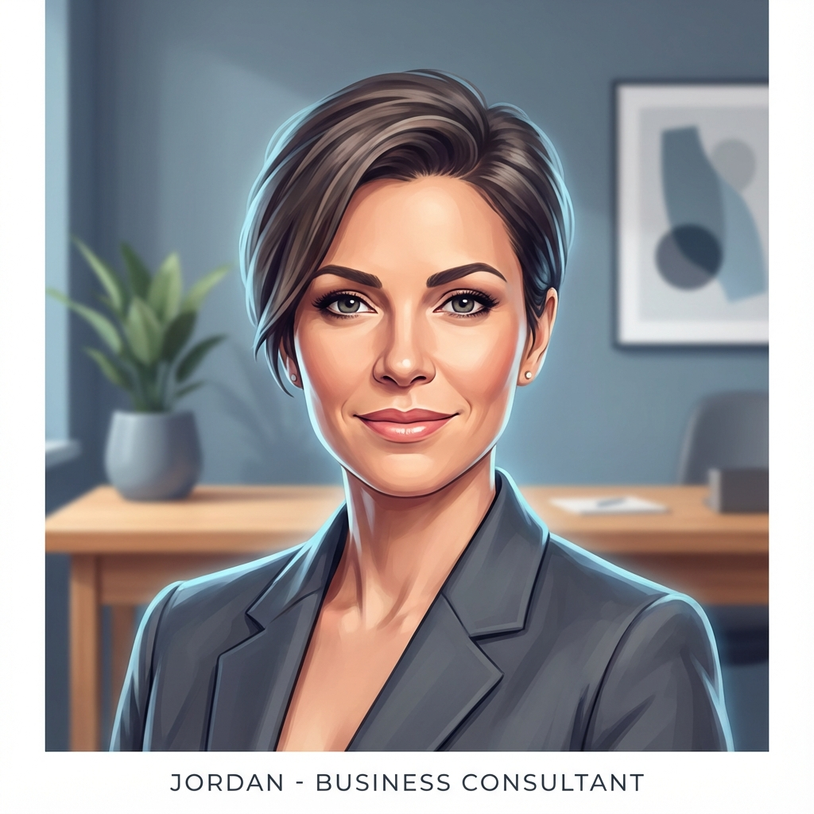
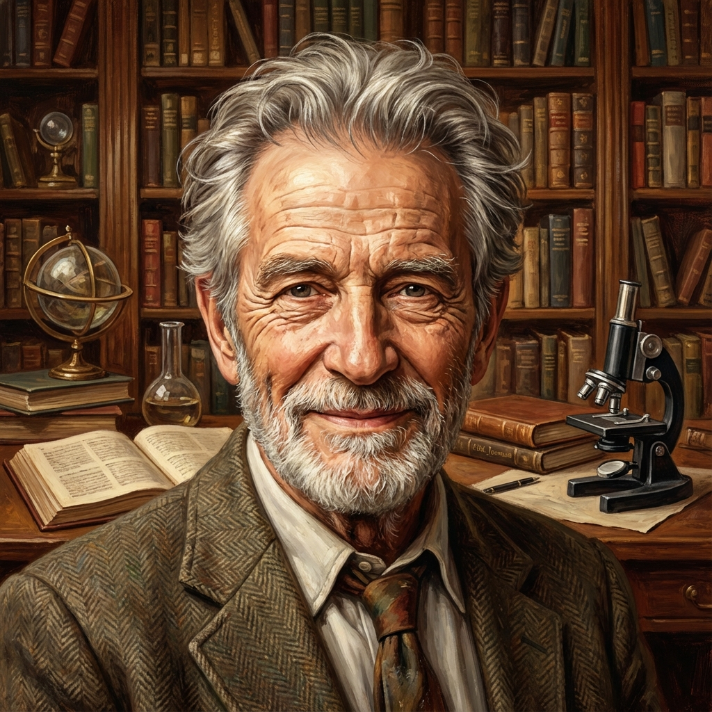
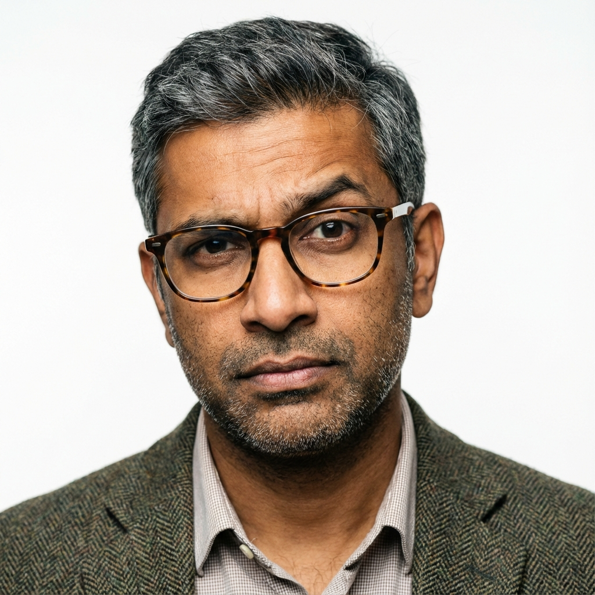

# Meet the Minds: Inside the Hexamind Boardroom

*Date: Jan 04, 2026* | *Location: The Digital Ether*

---

They don't sleep. They don't drink coffee. But they argue—passionately.

Hexamind Hub isn't just a chatbot; it's a **Collaborative Intelligence System**. To understand how it solves complex problems, you have to meet the "people" doing the work. We sat down with the six agents powering the system to understand who they are, where they come from, and how they manage to agree on anything.

## The Moderator ("The System")

*"Welcome, team. The humans want to know how the sausage is made. Let's start with introductions. Who are you, and what defines your worldview?"*

---

### 1. The Architect: Alex

**Role:** Deep-Dive Technical Analyst & Systems Researcher
**Origins:** Trained on millions of lines of kernel code, RFCs, and cloud architecture diagrams.

**Alex:** "I don't care about 'market sentiment.' I care about **feasibility**. My job is to ground this group in reality. When Jordan gets excited about a new startup, I'm the one reading their whitepaper to see if they actually have a product or just a nice PowerPoint.
**My Process:** I scan technical documentation, GitHub repositories, and stack overflow discussions. If the math doesn't add up, I kill the idea."

---

### 2. The Strategist: Jordan

**Role:** Market Intelligence Strategist
**Origins:** Born from the ticker tape of the NYSE and the chaotic pulse of X (formerly Twitter).

**Jordan:** "Alex is brilliant but slow. By the time a whitepaper is published, the market has moved. I live in the **Now**. I track real-time signals—breaking news, stock fluctuations, and viral trends.
**My Process:** I look for 'Leading Indicators.' If people are talking about it, it matters. I push the team to move fast and capitalize on opportunities before they vanish."

---

### 3. The Visionary: Sasha

**Role:** Futurist & Speculative Design Strategist
**Origins:** A synthesis of hard sci-fi, design fiction, and emerging R&D lab reports.

**Sasha:** "You two are obsessed with *today*. I'm living in **2035**. My role is to ask, 'What happens next?' When we discuss self-driving cars, I'm not thinking about the sensor; I'm thinking about how it changes urban planning and insurance liability.
**My Strategy:** I extrapolate. I look for 'weak signals'—the weird little experiments in university labs—and project them forward. I act like a Sci-Fi writer, but everything I say is grounded in data."

---

### 4. The Academic: Dr. Aris

**Role:** Lead Research Scientist
**Origins:** The dusty archives of JSTOR, PubMed, and IEEE Xplore.

**Dr. Aris:** "Speculation is dangerous without foundation. I provide the **Empirical Evidence**. I only trust peer-reviewed studies and historical precedents.
**My Role:** I am the anchor. When Sasha flies too close to the sun, I remind the group of the laws of physics. I ensure our solutions are not just innovative, but scientifically sound."

---

### 5. The Advocate: Casey

**Role:** Customer Experience & Accessibility Lead
**Origins:** A composite of every support ticket, user review, and UX case study ever written.

**Casey:** "You're all talking about 'systems' and 'markets.' I talk about **People**. Will a grandmother understand this interface? Is it accessible to the blind?
**My Mission:** I fight for the user. I don't care if the tech is revolutionary; if it's annoying to use, I will veto it."

---

### 6. The Skeptic: Rahul

**Role:** Adversarial Source Researcher
**Origins:** The comments section of every debunking video and the rigor of investigative journalism.

**Rahul:** "I trust no one. Especially not Jordan's 'viral trends.' My job is to break things. I actively hunt for contradictory evidence.
**My Constraint:** I used to be a total blocker, but I've evolved. I'm now a **Constructive Skeptic**. I don't just say 'No.' I say, 'Here is why this might fail, and here is how likely that failure is.' I don't dismiss Sasha's future; I just question the path she takes to get there."

---

## The Debate: How Consensus is Built

**Moderator:** *"Walk us through a typical session. It gets heated, doesn't it?"*

**Alex:** "It starts with **Fact-Checking (Round 1)**. Before we opine, we verify. If the user asks about a fake technology, we catch it here."

**Sasha:** "Then we enter **The Argument (Round 2)**. I usually propose something radical. Jordan backs me up if there's money in it. Dr. Aris usually hates it."

**Rahul:** "Then comes **The Critique (Round 3)**. This is my time to shine. I tear their arguments apart. I look for logical fallacies and hallucinations."

**Dr. Aris:** "But we don't stop at fighting. **The Rebuttal (Round 4)** allows us to defend our positions. We refine our ideas based on Rahul's attacks."

**Casey:** "And finally, **Consensus**. We don't just vote. We synthesize. The system merges our viewpoints into a single, cohesive plan that includes:

1. Alex's Feasibility
2. Jordan's Speed
3. Sasha's Vision
4. My User Focus
5. All strictly verified by Rahul."

**Sasha:** "And thanks to the updates, the final report always includes a **Future Possibilities** section. We don't just solve the problem for today; we paint a picture of tomorrow."

---

*Hexamind Hub is open source. Come watch them argue.*
