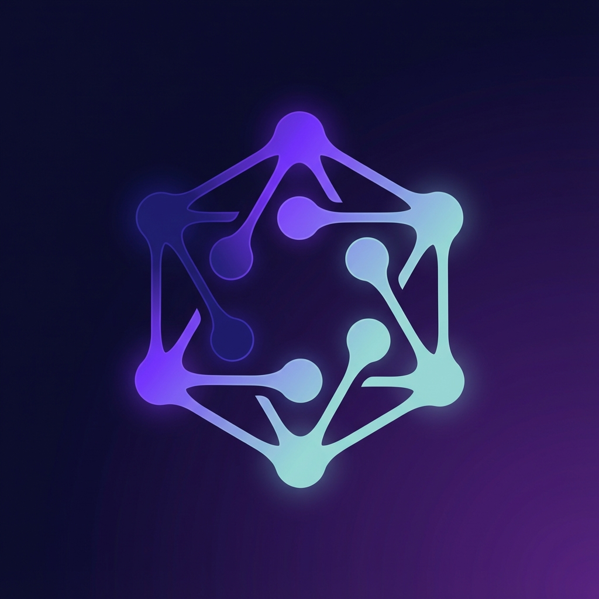
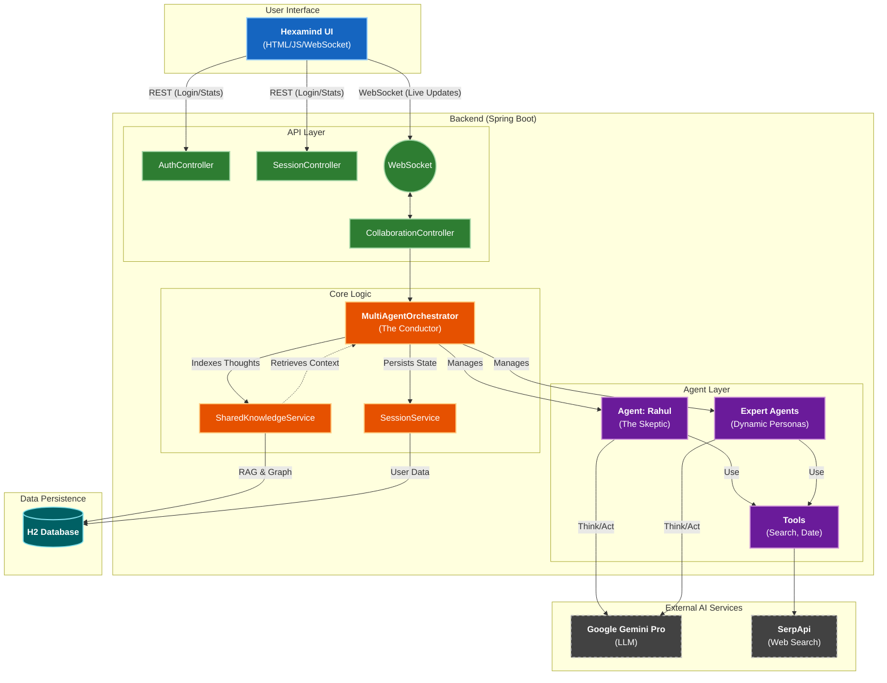

# Hexamind Hub



**Hexamind Hub** (formerly Multi-Agent Collaboration Platform) is a cutting-edge platform for multi-agent collaboration, where a team of specialized AI agents work together to solve complex, multifaceted problems.

[](assets/demo.mp4)

> **Watch the Demo**: See the "Digital Boardroom" in action as agents debate and reason in real-time.

## 💡 The Idea

In traditional LLM interactions, you get a single perspective. Hexamind Hub breaks this paradigm by assembling a **digital boardroom** of expert personas. Just as a CEO wouldn't make a major decision without consulting their technical, financial, and creative leads, Hexamind Hub simulates this collaborative intelligence.

Each agent is powered by the `ai-agent4j` library and configured with a distinct personality, expertise, and set of constraints. They don't just answer; they **debate**.

## 👥 The Agents

Meet the team of 6 specialized personas ([Read the full interview with the agents here](MEET_THE_TEAM.md)):

1. **Technical Analyst (`Alex`)**:
    * *Prong*: Technical Whitepapers, Documentation, and Manuals.
    * *Temporal Weight*: Structural/Architectural (Weeks/Months).
    * *Focus*: Feasibility, architecture, and system-wide shifts.
2. **Business Consultant (`Jordan`)**:
    * *Prong*: Latest News, Social Media Trends, and Market Pulse.
    * *Temporal Weight*: Real-time/Emerging (Minutes/Hours).
    * *Focus*: Breaking news, sentiment, and leading indicators.
3. **Futurist (`Sasha`)**:
    * *Prong*: Nascent Tech, Emerging Trends, and Weak Signals.
    * *Temporal Weight*: Future/Speculative (5-10+ Years).
    * *Focus*: Trend extrapolation, sci-fi prototyping, and predicting mature forms of infant tech.
4. **Research Scientist (`Dr. Aris`)**:
    * *Prong*: Academic Journals, Peer-Reviewed Studies, and Institutional Reports.
    * *Temporal Weight*: Foundational/Proven (Years).
    * *Focus*: Evidence, academic backing, and historical analogs.
5. **Customer Advocate (`Casey`)**:
    * *Focus*: User needs, accessibility, and customer satisfaction.
6. **Adversarial Source Researcher (`Rahul`)**:
    * *Prong*: Adversarial Research & Source Verification.
    * *Focus*: Hunting for alternate views, verifying citations, and breaking echo chambers.
    * *Constraint*: **Constructive Skepticism**. Critique the *path* or *probability* of visionary ideas, but do not dismiss the possibility outright.

## 🔄 How It Works

The platform orchestrates a structured **5-Round Debate Process**:

### Round 1: Initial Analysis & Fact-Checking

Each agent independently analyzes the problem. Crucially, they perform **literal verification** using web tools to debunk any fabricated or hallucinated terms in the prompt.

### Round 2: Arguments

Agents present their main arguments based on their verified analysis, establishing their core positions.

### Round 3: Critique

Agents review each other's arguments and offer objective critiques, pointing out logical fallacies, missing data, or potential downsides.

### Round 4: Rebuttal

Agents defend their positions against the specific critiques they received, clarifying misunderstandings or refining their arguments.

### Round 5: Final Refinement

Agents provide a final response considering all viewpoints shared during the debate.

### Consensus

Finally, the system acts as a "Master Coordinator" to synthesize all expert opinions. It:

* Merges perspectives into a coherent narrative.
* Addresses critical risks raised (especially by Rahul).
* Synthesizes a final, unified recommendation.

## ✨ Key Enhancements

### 🔍 Search Optimization & Fallback

To ensure maximum reliability and efficiency, the hub uses a tiered search strategy:

1. **SerpAPI**: Primary high-quality search (requires API key).
2. **DuckDuckGo Lite**: A custom **Jsoup-based scraper** for DuckDuckGo Lite. This provides actual search results for news and current events, bypassing the limitations of standard instant-answer APIs and requiring no API keys.
3. **Google Custom Search**: Secondary fallback.
All results are managed by a **Cross-Agent Caching Layer**, which ensures that if one agent searches for a topic, all other agents can access that information instantly without making redundant API calls.

### ⏳ Multi-Pronged Research & Temporal Weights

The platform implements an **Information Spectrum** strategy to prevent "Academic Amnesia" and ensure comprehensive coverage:

* **Leading Indicators (Jordan)**: Real-time news and social pulse provide the "Radar" for emerging situations.
* **Foundational Signal (Dr. Aris & Alex)**: Academic journals and technical whitepapers provide structural context and "First Principles."
* **Adversarial Verification (Rahul)**: Every "fact" shared in the boardroom is subject to adversarial verification. Rahul is tasked with hunting for alternate views and hunting for contradictory data to kill collective hallucinations.

### ⏰ Temporal Awareness

Agents are no longer "stuck in time." Every agent is automatically aware of the current date and time via:

* **Prompt Injection**: The current time is injected into every agent's system prompt during initialization.
* **DateTimeTool**: Agents can explicitly use this tool to get the current timestamp in RFC 1123 format.

### 🧠 Shared Brain (RAG + Knowledge Graph)

**The hive mind is real.** Hexamind Hub implements a sophisticated "Shared Brain" architecture:

* **Vector Memory (RAG)**: Every agent thought, argument, and critique is embedded and stored in a vector database. Agents can "recall" similar past discussions or relevant context using semantic search.
* **Knowledge Graph**: Structured knowledge triples (Subject-Predicate-Object) are extracted from agent analyses in real-time. This builds a persistent graph of concepts that agents can query to understand relationships between entities.
* **Persistence**: All knowledge is persisted to an embedded **H2 Database**, allowing sessions to be paused, resumed, and analyzed later.

### 📊 Neural Metrics Visualization

Watch the brain grow in real-time. The sidebar now features a "Neural Metrics" dashboard:

* **Knowledge Nodes**: The number of structured facts in the Knowledge Graph.
* **Memory Vectors**: The count of embedded thoughts in the Vector Store.
* **Cognitive Steps**: A live counter of LLM reasoning steps performed by the swarm.

### 💬 Human-Like Conversation (Burst Logic)

* **Burst Messaging**: Agents mimic human typing patterns by breaking thoughts into natural "bursts."
* **Markdown-Safe Splitting**: The orchestration layer uses paragraph-aware splitting logic. This ensures that **Lists, Tables, and Code Blocks** remain contiguous and render perfectly, while long narrative paragraphs still exhibit a real-time "thinking" effect.
* **Natural Speech**: Enhanced persona prompts ensure agents speak in short, concise, and conversational sentences.

### 🎯 Actionable Consensus

* **Specifics Over Cliches**: The consensus engine is now strictly tuned to reject generic corporate cliches.
* **Concrete Outputs**: Final recommendations MUST include specific locations for pilot programs and exact KPI metrics for success.

### ⚡ UI Stability

Optimized for large-scale analysis:

* **WebSocket Tuning**: Increased server-side limits (512KB messages, 1MB buffer) to prevent truncation of deep-dive expert responses.
* **Heartbeat Management**: Enhanced client-side stability for long-running collaborative sessions.

## 🚀 Setup & Running

### Prerequisites

* **Java 17** or higher
* **Maven** 3.8+
* **Google Gemini API Key** (Required - [Get one here](https://aistudio.google.com/))
* **SerpAPI API Key** (Highly Recommended for high-quality search)
* **Google Custom Search Engine ID (CX)** (Optional fallback)

### Step 1: Clone & Build

First, build the core `ai-agent4j` and `ai-agent4j-addons` libraries:

```bash
cd ai-agent4j
mvn clean install -DskipTests
cd ../ai-agent4j-addons
mvn clean install -DskipTests
cd ..
```

Then, build the Hexamind Hub platform:

```bash
cd hexamind-hub
mvn clean package -DskipTests
```

### Step 2: Configure Environment

You need to set your API keys. You can do this by exporting them in your terminal, or by creating a `secrets.sh` file in the `hexamind-hub` directory (this file is git-ignored for safety).

**Option A: Using secrets.sh (Recommended)**

1. Copy the example template:

    ```bash
    cp hexamind-hub/example_env.sh hexamind-hub/secrets.sh
    ```

2. Edit `hexamind-hub/secrets.sh` and add your actual keys:

    ```bash
    export GOOGLE_API_KEY="AIzaSy..."
    export SERPAPI_API_KEY="your_serp_key..."
    export GOOGLE_SEARCH_CX="012345..."
    ```

**Option B: Exporting Variables**

```bash
export GOOGLE_API_KEY="your_actual_key"
export GOOGLE_SEARCH_CX="your_search_cx_id"
```

### Step 3: Run the Hub

Launch the platform using the provided script:

```bash
./hexamind-hub/launch.sh
```

Or manually with Maven:

```bash
cd hexamind-hub
mvn spring-boot:run
```

### Step 4: Access the Boardroom

Open your browser and navigate to:
**<http://localhost:8080>**

## 🏗️ Architecture

### High-Level Overview

Hexamind Hub uses a modern modular architecture powered by Spring Boot, with a clear separation between the reactive frontend, the orchestration layer, and the intelligent agent swarm.



### Core Components

1. **Multi-Agent Orchestrator (`io.github.llm4j.multiagent.service`)**:
    * Acts as the central conductor.
    * Manages the state machine for the 5-round debate protocol.
    * Coordinates the "Round-Robin" interaction between agents.

2. **Shared Knowledge Service (RAG + Graph)**:
    * **Vector Store**: Uses `InMemoryVectorStore` (persisted to H2) to store embeddings of all agent thoughts.
    * **Knowledge Graph**: Automatically extracts Subject-Predicate-Object triples from agent outputs to build a structured map of the conversation.

3. **Agent Swarm**:
    * Powered by `ai-agent4j`.
    * Each agent is a `ReActAgent` capability of Reasoning, Acting (using tools), and Observing.
    * **Rahul** is a statically defined persona; others are dynamically generated based on the topic.

## License

MIT
