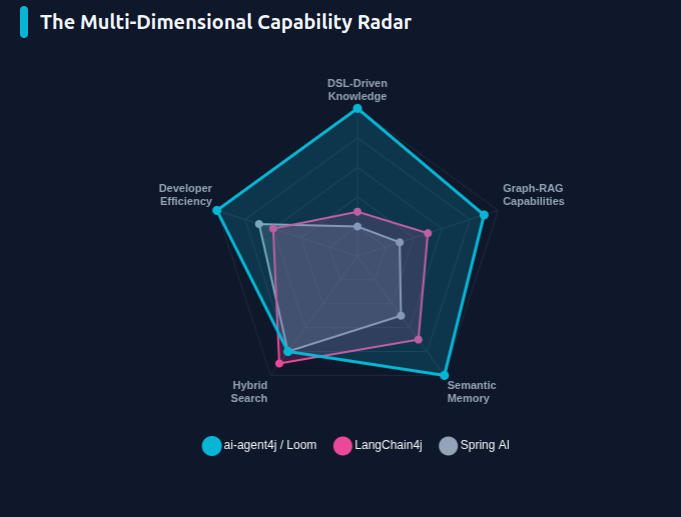

# Loom DSL

**A neuro-symbolic orchestration DSL for multi-agent AI workflows.**

Most multi-agent frameworks ask you to express coordination logic in Python code,
YAML config, or worse — in natural language inside a prompt. None of these belong
in the trust-critical layer of your system.

Loom gives you a purpose-built external DSL where routing, sequencing, branching,
and safety rules are interpreted by a symbolic runtime — not inferred by a model.
**The model reasons. The harness governs.**

```text
workflow ResearchAndPublish(topic) {

    delegate "Research: {topic}" to Researcher -> findings

    alt (findings.status == "SUFFICIENT") {
        delegate "Write report: {findings}" to Writer -> draft
        handoff "Publish: {draft}" to Publisher
    } else {
        loop until (approved == "true") {
            delegate "Expand research: {findings}" to Researcher -> findings
            human_prompt "Approve findings? (true/false)" -> approved
        }
    }
}
```

The `alt`, `loop until`, and `handoff` above are not instructions to a model.
They are symbolic control flow — evaluated by the Loom runtime, enforced
regardless of what any agent produces.

---

## Why this exists

Every serious multi-agent system eventually builds a harness — the code that
decides who gets called, in what order, under what conditions, and when to stop.

Most teams write this in imperative Python, scattering coordination logic across
files and framework callbacks. Others embed it in prompts and hope the model
self-regulates. Neither approach gives you the thing you actually need: a symbolic
layer with a hard trust boundary, where the routing rules are code and the model
only does what models are good at — reasoning about content.

Loom is that layer, designed as a first-class language.

👉 **[Why Loom?](./ai-agent4j-loom/WHY_LOOM.md)** How Loom runs long-running, autonomous workflows, and how it compares with LangGraph.

---

## The primitive set

| Primitive | What it does |
|---|---|
| `delegate` | Call one agent, await result, bind to variable |
| `broadcast` | Fan out to multiple agents in parallel, collect combined result |
| `handoff` | Terminal node — pass control to an agent and end the current branch |
| `alt` / `else` | Symbolic conditional branching on typed context variable values |
| `loop until` | Repeats a block until a symbolic condition is met; `max N … on_exhausted` bounds it |
| `for each` | Runs a block per list item (`parallel for each` for all at once); targets may come from the item |
| `human_prompt` | Asks a person; with a run journal the run suspends (no thread held) and resumes on the answer |
| `budget` | Caps a run, an agent or a step in tokens, calls or money; enforced before each LLM call. `per day` makes it refill |
| `checkpoint` / `rewind` | Name a point and go back to it when a late check fails, carrying what was learned and keeping the old attempt as history: `rewind to collected when (review.score < 7) at most 2 times carrying feedback = "{review.notes}"`. Identical side effects and answers are never repeated; `weave timeline`, `rewind`, `reset` and `fork` do the same from outside |
| `tool` | Declare and configure a tool in the script (`use: webhook`, `email`, `http`, `file`, `shell`, `sql`, `serpapi`, `openapi`, …); secrets only from `env.NAME`; side effects are journaled so a resume never repeats a send |
| `knowledge` | A knowledge base: source files, embedding model, index store; agents get the relevant passages |
| `approve` | On an agent: which tool calls need a person's yes (durable, journaled per call) |
| `memory` | On an agent: its conversations per session and long-term facts, kept across runs |
| `voice` | On an agent: hear audio tasks and speak answers (Sarvam); `translate`, `speak`, `transcribe`, … are tools |
| `guard` | On an agent: `pii: mask \| block \| warn`, `bias: warn \| block` |
| `provider` | A model endpoint with its own key: `provider Box { use: ollama base_url: "…" }`, then `model: "Box/llama3"` |
| `persona` | A persona declared in the script; an agent's `persona:` combines it with its `system:` prompt |
| `rate_limits` | Pause a run when a provider limit or quota is hit, and resume it when the limit lifts |
| `schedule` | Run a workflow or agent task on a cron or interval — stored, so it survives restarts |
| `guardrail` | Wraps a block — intercepts output before it escapes (e.g. PII detection) |
| `call` | Invoke a sub-workflow with isolated variable scope |
| `parallel { }` | Concurrent execution block — every statement runs on its own branch thread |
| `observe` | Emit a structured trace event without affecting control flow |
| `note` | Log a line, with variables filled in (`note "Total: {total}"`); no effect on control flow |
| `graph` tools | `tool Graph { use: knowledge_graph store: "graphs/c.json" }`: agents record and query entities and relations |
| `skills:` | Markdown skills from files or URLs; `use: skill_registry` lets an agent find skills itself |
| `import` | Split large workflows across files — merged into a flat namespace at load time |

---

## The Frontier — what makes the symbolic guarantee real

The hard problem in neuro-symbolic design is the boundary: model output is free
text, but symbolic conditions need typed values. Loom addresses this directly.

**Typed output schemas** — enforce structured output per agent at the harness level:

```text
agent Auditor {
    model: "gemini-2.5-pro"
    system: "Audit the code for security vulnerabilities."
    output_schema {
        status: enum["SECURE", "VULNERABLE"]
        issues: list
    }
}
```

Now `alt (audit.status == "SECURE")` is a typed symbolic check, not a string
match against free model output. The harness coerces the model's response before
any condition is evaluated.

**Resilience contracts** — expressed in the DSL, not in application code:

```text
delegate "Analyze data" to AnalystAgent -> result
    retry 3 backoff 2s timeout 60s
    on_failure { handoff "Escalate" to AdminAgent }
```

**Sub-workflow composition** — build reusable, scope-isolated primitives:

```text
call ValidateAndApprove(draft) -> approved_draft
```

---

## Everything ai-agent4j can do, from the script

Tools, knowledge, approvals, memory, voice, guards and providers are declared next to the agents that use
them. Secrets only ever come from the environment (`env.NAME`), and nothing is silently ignored: `weave check`
reports every problem with its line before anything runs.

```text
tool Search          { use: serpapi  api_key: env.SERPAPI_KEY }
tool Refunds         { use: openapi  spec: "specs/refunds.json"  auth_header: "X-API-Key"  auth_value: env.REFUNDS_KEY }
knowledge Handbook   { source: "docs/"  embedding: "gemini/text-embedding-004" }
provider Box         { use: ollama  base_url: "http://gpu-box:11434" }

agent Support {
    model: "gemini-2.5-flash"
    tools: [Search, Refunds, calculator]
    knowledge: [Handbook]                                      // grounded answers from your documents
    approve: [Refunds]                                         // these tool calls wait for a person
    memory { conversation: "chats"  session: "{user_id}"       // remembers each user
             facts: "facts.json"  embedding: "gemini/text-embedding-004" }
    voice  { speak: "sarvam/bulbul:v2" }                       // answers aloud, in Indian languages (SARVAM_API_KEY)
    guard  { pii: mask  bias: warn }                           // personal data never reaches the model
}
```

- **Approvals are durable.** An approval is journaled per tool call and holds no thread while it waits.
- **Voice and language tools.** `translate`, `transcribe` and `speak` are tools too.
- **More in the script.** Knowledge graphs, personas declared in the script, and skills fetched from a URL.
- **See it live.** `weave run --trace` shows every plan, tool call and token spent as it happens.

The [Language Guide](./ai-agent4j-loom/LOOM_GUIDE.md#tools-knowledge-and-approvals) covers each block in detail.

---

## Any model, one line

Every agent picks its model by name, and every provider behaves the same underneath (ai-agent4j's
[uniform provider contract](../ai-agent4j/wiki/Providers-and-the-Uniform-Contract.md)), so switching is a one-word change:

```text
agent Writer   { model: "gemini-2.5-flash" }          // GEMINI_API_KEY
agent Indic    { model: "sarvam/sarvam-m" }           // SARVAM_API_KEY
agent Local    { model: "ollama/llama3" }             // OLLAMA_BASE_URL, default localhost
agent Planner  { model: "claude-opus-5-5" }           // ANTHROPIC_API_KEY

provider Box   { use: ollama  base_url: "http://gpu-box:11434" }
provider Team  { use: sarvam  api_key: env.TEAM_SARVAM_KEY }
agent Reviewer { model: "Team/sarvam-m" }
```

- **Checked before running**: `weave check app.loom` reports an unknown model, a missing key or any other
  problem with its line, before any model is called.
- **Watched while running**: `weave run app.loom --trace` streams every plan, tool call, observation and
  token spent (`--trace=json` for machines).
- **Checked against the real services**: the live suite (`mvn -Plive test`) runs a Loom script with a tool
  and an `output_schema` on every provider you have credentials for.

---

## New: durable, data-driven workflows in one file

These features came out of building [GetViral](../examples/getviral/), a 12-agent content studio that
runs as a hosted website. Each is one keyword in the script. None needs a graph builder, a state class
or callback code.

**Runs that survive restarts and wait for people for free.** Every `delegate`, `broadcast` and
`human_prompt` records its result in a *run journal* (in memory, a file, or any SQL database). Run the
workflow again with the same journal and Loom replays what already happened, so no model is called twice,
then continues. A `human_prompt` can suspend the run instead of blocking a thread; record the answer days
later and resume it on any server. A crashed process resumes from its last step. The script doesn't
change at all:

```java
executor.setJournal(new JdbcRunJournal(dataSource, runId));
try { executor.executeWorkflow("Main", inputs); }
catch (RunSuspended waiting) { askTheUser(waiting.stepId(), waiting.prompt()); }   // thread is free
// …later, on any instance:
journal.answer(stepId, "yes");  executor.executeWorkflow("Main", inputs);        // replays, then continues
```

**`for each`, with routing decided by data.** Iterate over any list an agent returned, sequentially or
with `parallel for each`. The target agent and the output variable can come from the item, so one line
replaces a chain of `alt` branches:

```text
for each fix in review.fixes {
    delegate "Fix this: {fix.problem}" to {fix.owner} -> {fix.output}
}
```

**Loops that can't run away.** `loop until … max N { } on_exhausted { }` bounds the rounds, so a model
that never satisfies the condition can't spin (and bill) forever.

```text
loop until (review.verdict == "COMPLETE") max 5 {
    delegate "Review round {_loopRound}" to Lead -> review
    for each fix in review.fixes { delegate "{fix.task}" to {fix.owner} -> {fix.output} }
} on_exhausted {
    note "Shipping with open issues after {_loopRounds} rounds"
}
```

**Resilience you can read.** Exponential backoff and a per-attempt timeout sit next to the retry count:

```text
delegate "Summarise {doc}" to Writer -> summary retry 2 backoff 2s timeout 90s
    on_failure { handoff "Writer unavailable: {_error}" to Supervisor }
```

**A contract for each step, not just each agent.** `expecting { }` gives one delegate its own output schema,
so a single agent can cast a team in one step and return a verdict in another:

```text
delegate "Review the build" to Showrunner -> review expecting {
    verdict: enum["COMPLETE", "INCOMPLETE"],
    fixes: list
}
```

**Budgets you can't overspend.** Cap a run, an agent or a single step in tokens, calls or money. The
runtime refuses a call *before* it reaches the model if it can't be paid for, caps each answer to what is
left, and reports where every token went. On a hobby budget, a runaway loop can't run up a bill:

```text
budget { tokens: 200000  warn_at: 80% }
agent Writer { model: "gemini/gemini-2.5-flash"  budget { tokens: 20000  per_call: 2000 } }

loop until (review.verdict == "OK") max 5 budget 30000 tokens { ... } on_exhausted { ... }
alt (_budget.remaining < 20000) { delegate "Polish {draft}" to CheapWriter -> final }
```

`weave run app.loom --max-tokens 50000` caps any script from the command line. See
[Cost Budgets](./ai-agent4j-loom/LOOM_GUIDE.md#cost-budgets).

**Agents that keep going in the background.** Rate limits and daily quotas lift at a known time, so a
long-running workflow shouldn't fail on them. Loom reads the reset time from the provider (Gemini, Anthropic,
OpenAI, `Retry-After`), **pauses the run** — no thread held — and **resumes it when the limit lifts**,
replaying everything already done. Budgets can refill per minute, hour or day, and schedules run on cron:

```text
rate_limits { on_limit: suspend  max_wait: 24h }
budget { tokens: 100000 per day  when_exhausted: suspend }

schedule MorningDigest { cron: "0 7 * * *"  timezone: "Asia/Kolkata"  run: DailyDigest(topic="AI agents") }
```

Resumes and schedules live in a trigger store (files or SQL). Something wakes Loom to fire them: `weave
daemon`, or — so nothing has to stay running — **your OS**: `weave triggers install <store> --apply` adds a
cron line, systemd timer, launchd agent or Windows task that runs `weave tick`; on Cloud Run, Cloud
Scheduler calls a tick endpoint. See [Pausing and Resuming on Limits](./ai-agent4j-loom/LOOM_GUIDE.md#pausing-and-resuming-on-limits)
and [Schedules and Triggers](./ai-agent4j-loom/LOOM_GUIDE.md#schedules-and-triggers). The complete guide is
[**Budgets, Pausing and Scheduling**](./ai-agent4j-loom/BUDGETS_AND_SCHEDULING.md).

**Smaller things that make scripts shorter:**

- `temperature:` on an agent (creative roles high, checkers low);
- `{plan.hooks.0}` paths into structured results inside any payload;
- `parallel` branches that really run in parallel, on their own thread pool;
- block-local variables that don't leak out of a `for each`.

See the [Language Guide](./ai-agent4j-loom/LOOM_GUIDE.md#-5-the-frontier-advanced-orchestration) for each
feature in detail.

---

## 📊 Loom vs. The World

Loom was designed to address specific gaps in existing AI orchestration frameworks.



Loom excels in **DSL-Driven Knowledge** and **Developer Efficiency** by providing
a symbolic layer decoupled from the underlying runtime, allowing for rapid
iteration and robust neuro-symbolic control.

---

## The Ecosystem

This directory contains all Loom components, designed to work together:

### [ai-agent4j-loom](./ai-agent4j-loom/) — Java Runtime
The reference implementation. A handcrafted **Lexer → Parser → AST → HarnessExecutor**
pipeline that drives real LLM calls via ai-agent4j. The model never sees the routing
logic — it receives a task string and returns output. The harness handles everything else.

Tools are wired via a companion `.loot` file — a key-value mapping of logical tool names
to Java classpaths, resolved via reflection at runtime:

```properties
# tools.loot
WebSearch = io.github.llm4j.tools.BraveSearchTool
SqlQuery  = com.mycompany.tools.DatabaseTool
```

### [vscode-loom](./vscode-loom/) — IDE Support
First-class authoring experience for `.loom` and `.loot` files:
- Syntax highlighting via TextMate grammars
- LSP-backed diagnostics, hover, go-to-definition, and completion
- Workflow Outline tree view for navigating large scripts
- Run Workflow command that invokes `weave` directly from the editor

### [ctk](./ctk/) — Conformance Test Kit
The behavioral contract for all Loom runtimes. Any implementation — Java, Python,
or future — must pass the CTK to be considered conformant:
- 15 canonical test scripts covering every statement type
- Expected execution traces as ground truth
- Mock agent server for deterministic, isolated testing
- Trace comparison algorithm that ignores non-deterministic output values

### loom4py _(Coming Soon)_ — Python Runtime
A native Python port of the Loom runtime for the AI/ML community:
- Character-by-character Lexer (no regex, structural parity with Java)
- Recursive descent Parser
- AST nodes as Python dataclasses
- HarnessExecutor with `concurrent.futures` for parallel blocks
- CTK-validated behavioral parity with the Java reference implementation

---

## Getting Started

**Run a workflow (Java CLI):**

```bash
cd ai-agent4j-loom
mvn clean install
alias weave='java -cp "target/classes:target/lib/*" io.github.llm4j.loom.cli.WeaveCLI'
weave run research.loom --loot tools.loot --input topic="Neuro-Symbolic AI"
```

**Embed in a Java application:**

```java
LoomScript script = new LoomParser(new Lexer(source).tokenize()).parseScript();

ToolRegistry registry = new ToolRegistry();
new LootLoader().loadIntoRegistry("tools.loot", registry);

HarnessExecutor executor = new HarnessExecutor(script, registry, clientFactory);
executor.initialize();
executor.executeWorkflow("ResearchAndPublish", Map.of("topic", "AI Agents"));
```

**Run conformance tests:**

```bash
cd ctk
mvn test
mvn exec:java -Dexec.mainClass=io.github.loom.ctk.CtkMain
```

---

## Further Reading

- [Loom Language Guide](./ai-agent4j-loom/LOOM_GUIDE.md) — deep technical reference and advanced patterns
- [VS Code Extension Guide](./vscode-loom/README.md)
- [CTK Usage Guide](./ctk/README.md)
- [Contributing](../CONTRIBUTING.md)
