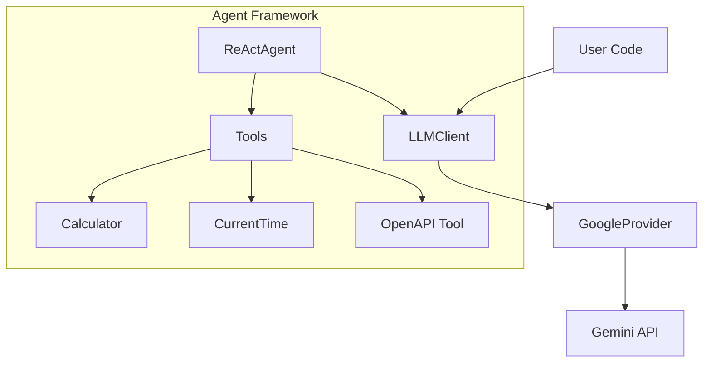

# 🚀 Gemini ReAct Java

**The Production-Ready Java Client for Google Gemini**

[](https://opensource.org/licenses/MIT)
[](https://www.oracle.com/java/technologies/downloads/#java17)
[]()

---

## 🌟 Why Gemini ReAct Java?

`gemini-react-java` is not just another API wrapper. It's a **comprehensive framework** designed to help you build intelligent, reasoning AI agents in Java.

> **"Honest, Verified Support"** — Every feature is backed by comprehensive integration tests against real Gemini endpoints.

---

## 🔥 Feature Spotlight: The OpenAPI Tool

**Turn any REST API into an AI Tool instantly.**

The **[OpenAPI Tool](OpenAPI-Tool.md)** is a game-changer for building connected agents. Instead of writing manual tool code for every API endpoint, simply point the agent to an OpenAPI (Swagger) spec, and it will:

1.  **🔍 Auto-Discover**: Find all available endpoints (GET, POST, etc.).
2.  **🧠 Auto-Understand**: Parse parameter requirements and descriptions.
3.  **⚡ Auto-Execute**: Handle authentication and HTTP requests automatically.

```java
// 1. Define the Tool
OpenAPITool aviationTool = OpenAPITool.builder()
    .name("AviationStack")
    .specLocation("https://api.aviationstack.com/openapi.json")
    .apiKeyAuth("access_key", "YOUR_KEY")
    .build();

// 2. Add to Agent
ReActAgent agent = ReActAgent.builder()
    .llmClient(client)
    .addTool(aviationTool)
    .build();

// 3. Magic!
agent.run("What is the status of flight AA100?");
```

👉 **[Learn more about the OpenAPI Tool](OpenAPI-Tool.md)**

---

## 📚 Quick Links

| Guide | Description |
|-------|-------------|
| **[🚀 Getting Started](Getting-Started.md)** | Installation, configuration, and your first "Hello World". |
| **[🤖 ReAct Agent](ReAct-Agent.md)** | Build agents that can reason, plan, and use tools. |
| **[🌐 OpenAPI Tool](OpenAPI-Tool.md)** | **NEW!** Auto-discover and use REST APIs dynamically. |
| **[🛠️ Custom Tools](Creating-Custom-Tools.md)** | Extend your agent's capabilities with custom logic. |

---

## ✨ Key Features

### 🤖 Google Gemini First
- **Full Integration**: Native support for Gemini 1.5 Flash, Pro, and 2.x models.
- **Auto-Discovery**: Automatically finds the latest available models.
- **Type-Safe**: Strongly typed request/response models.

### 🧠 Powerful ReAct Agents
- **Reasoning Loop**: Implements the "Reasoning + Acting" paradigm.
- **Pluggable Tools**: Easily add Calculator, Web Search, or custom tools.
- **Loop Detection**: Smart detection of infinite loops or repetitive actions.

### 🛡️ Production Ready
- **Robust Error Handling**: Specific exceptions for Auth, Rate Limits, and more.
- **Retry Policies**: Configurable exponential backoff strategies.
- **Thread-Safe**: Designed for high-concurrency environments.

---

## 🏗️ Architecture

Designed for simplicity and extensibility:



---

## 📦 Installation

### Maven
```xml
<dependency>
    <groupId>io.github.llm4j</groupId>
    <artifactId>gemini-react-java</artifactId>
    <version>0.1.0-SNAPSHOT</version>
</dependency>
```

### Gradle
```gradle
implementation 'io.github.llm4j:gemini-react-java:0.1.0-SNAPSHOT'
```

---

## 🤝 Support & Community

- **Found a bug?** [Open an Issue](https://github.com/srijithunni7182/llm4j/issues)
- **Have a question?** [Start a Discussion](https://github.com/srijithunni7182/llm4j/discussions)
- **Want to contribute?** Check out our [Contributing Guidelines](Contributing.md)

---

*Built with ❤️ for the Java AI Community.*
